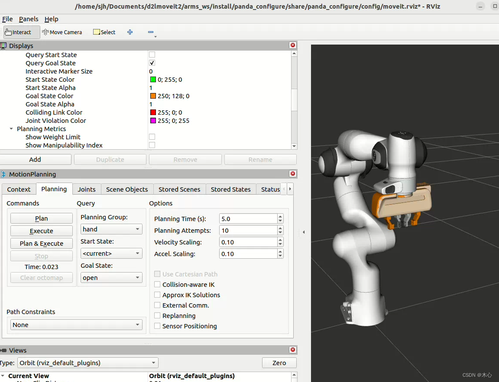
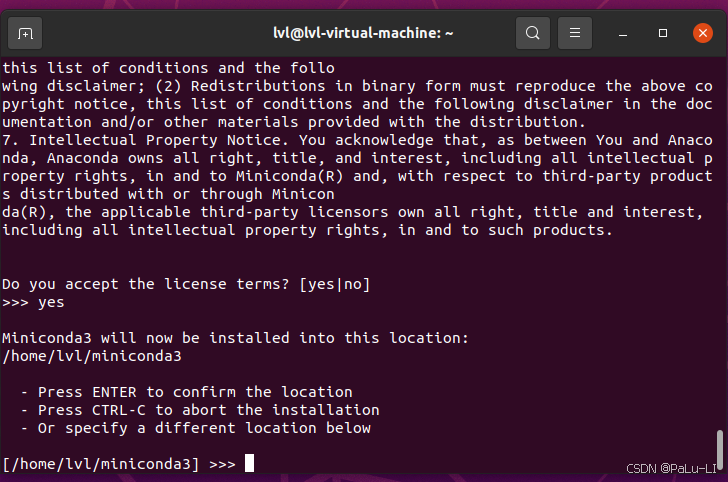
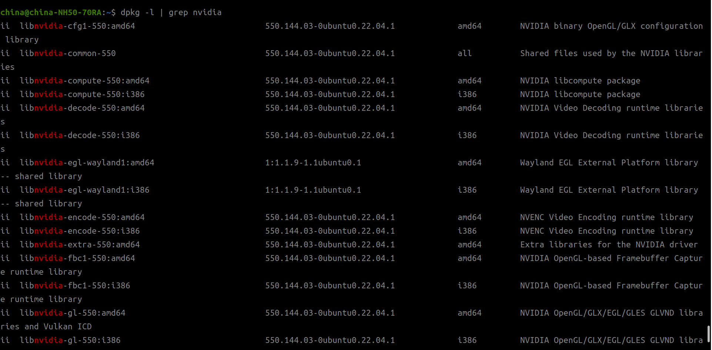

## 一、Ubuntu22.04卸载软件中心

```bash
sudo snap remove snap-store
sudo snap install snap-store
```

## 二、安装gdebi、Vim、新德立（synaptic）

```bash
sudo apt install gdebi
sudo apt install -y synaptic
sudo apt install vim		#编辑器
```

### 在Ubuntu中，完全卸载软件可以通过以下几种方法实现：

### 方法1：使用APT卸载
1. **卸载软件包**：
   ```bash
   sudo apt remove 软件包名		#可以加个通配符*
   ```
   这会卸载软件包，但保留配置文件。

2. **卸载软件包并删除配置文件**：
   ```bash
   sudo apt purge 软件包名
   ```
   这会卸载软件包并删除相关配置文件。

3. **删除不再需要的依赖包**：
   ```bash
   sudo apt autoremove
   ```
   这会删除不再需要的依赖包。

### 方法2：使用Synaptic包管理器
1. 安装Synaptic：
   ```bash
   sudo apt install synaptic
   ```
2. 打开Synaptic，搜索要卸载的软件包，右键选择“标记为完全删除”，然后点击“应用”。

### 方法3：使用Snap卸载
如果软件是通过Snap安装的：
1. 卸载Snap软件包：
   ```bash
   sudo snap remove 软件包名
   ```

### 方法4：手动删除残留文件
如果仍有残留文件，可以手动删除：
1. 查找相关文件：
   ```bash
   sudo find / -name "*软件包名*"
   ```
2. 删除找到的文件和目录。

### 总结
- **`apt remove`**：卸载软件包，保留配置文件。
- **`apt purge`**：卸载软件包并删除配置文件。
- **`apt autoremove`**：删除不再需要的依赖包。

通过这些步骤，你可以完全卸载Ubuntu中的软件。


## 三、常用命令

```bash
locale									#查看系统编码（./etc/default/locale）
sudo apt update							#更新
sudo apt autoremove						#删除无用的依赖
mkdir -p ~/ur5_ws/src					#递归建立文件夹，不加sudo则是“当前用户权限”
sudo mkdir -p ~/ur5_ws/src				#加上sudo后建立的文件夹就只有root用户才有全部权限
```

### 3.1 右键新建文档

在主目录下的**模板**里加入你想要的类型的文档类型即可


## 四、ROS安装配置

### 4.1 传统安装

> 参考：https://blog.csdn.net/weixin_44733606/article/details/132576418

1.安装，我是Ubuntu22.04，安装ROS2的humble桌面版

```bash
sudo apt install ros-humble-desktop
```

2.配置环境变量

```bash
source /opt/ros/humble/setup.bash
echo " source /opt/ros/humble/setup.bash" >> ~/.bashrc
```

3.安装和初始化rosdep

```bash
sudo apt update
sudo apt install -y python3-rosdep		#这个rosdep装不好就用鱼香ROS
sudo rosdep init
rosdep update
```

4.测试

示例一
先来试试ROS2最为重要的底层通信系统DDS是否正常吧。
启动第一个终端，通过以下命令启动一个数据的发布者节点：

```cobol
ros2 run demo_nodes_cpp talker
```

 

启动第二个终端，上一个终端不能关闭，通过以下命令启动一个数据的订阅者节点：

```cobol
ros2 run demo_nodes_py listener
```


如果“Hello World”字符串在两个终端中正常传输，说明通信系统没有问题。

示例二：小海龟仿真示例
再来试一试ROS中的经典示例——小海龟仿真器。
启动两个终端，分别运行如下指令：

```cobol
ros2 run turtlesim turtlesim_node
ros2 run turtlesim turtle_teleop_key
```

第一句指令将启动一个蓝色背景的海龟仿真器，第二句指令将启动一个键盘控制节点，在该终端中点击键盘上的“上下左右”按键，就可以控制小海龟运动了。


### 4.2 卸载

(1)、卸载全部ros:

```bash
sudo apt-get remove --purge ros-*
```

卸载某个ros版本(ros版本可以共存，每次需要切换)
如humble:

```bash
sudo apt-get remove --purge ros-humble
```

或者先卸载包

```bash
sudo apt-get purge ros-*
```

然后删除依赖，配置

```bash
sudo apt-get autoremove
```

**示例：**

```bash
sudo apt remove ros-humble*
sudo apt autoremove

#purge这个参数可以查查
```

(2)、检查 ~/.bashrc文件夹是否有ROS相关字眼在 以及 /opt 目录是否有ros文件夹存在，有，则删除

另一种方法：

```bash
sudo apt-get purge ros-*
sudo rm -rf /etc/ros
```

```bash
gedit ~/.bashrc
```

找到：带有humble（你的ros版本名）的那一行删除，保存，然后：

```bash
source ~/.bashrc
```


### 4.3 鱼香ROS一键安装

首选建议使用鱼香ROS社区“一键安装”（UP：鱼香ROS机器人）

```bash
#执行如下命令，直到弹出第二张图：
wget http://fishros.com/install -O fishros && . fishros
```


```
如下界面选择“1”
```


```
下面的选项视情况而定(最好选择1，之后选择2,刚开始选了1,然后报错，无法安装)
```


```
视系统版本而定
```


```
安装成功！！！！！
```


```
输入ros2测试
```


```bash
#查看ros2安装位置命令：
whereis 包名
whereis ros2
```


**注意：这个界面要选择1，之后选择2！！不换源，选择2就会出现下边的报错（ubuntu22.04）**


```
出现错误（原因在上边）
```


```
点回车并输入Y（无法解决）
```


## 五、Moveit2相关

#### 5.1 安装方式

- 源码编译（繁琐但全面）
- 二进制（推荐）

> 加*号表示全部包，不加则是核心组件

```bash
sudo apt install ros-humble-moveit		#核心组件

sudo apt install ros-humble-moveit*		#下载全部
```

- 安装的位置在如下目录（特别多的）

```bash
/usr/share/doc
```

- rViz启动

```bash
rviz2	#启动界面
ros2 launch moveit_resources_panda_moveit_config demo.launch.py		#启动demo
```

#### 5.2  卸载

```bash
sudo apt remove ros-humble-moveit*

sudo apt autoremove
```

#### 5.3 配置助手

- 首先，新建一个功能空间命名为`arms_ws`，创建一个`panda_robot`作为功能包

```bash
mkdir -p arms_ws/src
cd arms_ws/src
mkdir panda_robot
cd ..
cd ..
```

- 如果你安装过`moveit2_tutorials`，你可以在你的功能包中找到这个文件夹`.../your_workspace/src/moveit_resources/panda_description `，拷贝这个文件夹`panda_description`到`arms_ws/src/panda_robot`中。如果你没有使用过`moveit2_tutorials`，你可以在这里找到这个文件夹：https://github.com/ros-planning/moveit_resources/tree/ros2/panda_description，下载这个文件夹然后放置在`arms_ws/src/panda_robot`中。放置完毕后记得进行构建，然后`source`

```
colcon build
source install/setup.bash
ros2 launch moveit_setup_assistant setup_assistant.launch.py 
```

- 这里一定要记得`source`，不然后面会导致找不到`.urdf`文件
- 要先`colcon build`项目之后在`source install/setup.bash`然后在打开配置助手

- 启动后的界面如下：


- 选择`Create New Moveit Configuration Package`，创建一个新的moveit配置功能包。

- 然后选中机械臂的描述文件，这里应该选择`panda_description/urdf/panda.urdf`这个文件，然后选择`Load Files`，就可以看到右边加载出来了机械臂的模型。


- 然后我们配置`Self-Collisions`，这个是配置机械臂关节碰撞矩阵的，我们点击`Generate Collision Matrix`既可自动生成。


- 然后我们配置`Virtual Joints`，这是用于配置虚拟的关节，用于指定我们将机械臂放置在哪里，我们这里直接将机械臂放置在`world`坐标系中，取名为`virtual_joints`


- 然后我们需要添加机械臂的`Planning Groups`，规划组是用来规划机械臂运动的，这里我们主要分为两个组，一个是我们的机械臂的各个关节部分`panda_arm`，另一个是我们的夹具部分`hand`，首先添加`panda_arm`组，动力学求解器`Kinematic Solver`选择`kdl_kinematics_plugin/KDLKinematicsPlugin`，然后默认的规划器`Group Default Planner`随便选就行。然后点击`Add Joints`为这个规划组添加关节。


- `panda_arm`的关节： 按住`shift`可以进行多选，然后点击`>`进行添加


- 再添加另一个`hand`规划组，`hand`规划组不需要选择动力学求解器和默认规划器，直接选择`Add Joints`即可


- `hand`规划组：


- 定义好的规划组如下所示：


- 然后我们定义`Robot Poses`，为每个规划组定义一些预设的姿态，首先我们为`panda_arm`定义一个`home`位姿态，这个姿态可以随意选择，我的设置如下：


- 然后我们定义`hand`规划组的预设位姿，首先需要选中已经给`panda_arm`预设好的位姿，然后点击`Add Pose`


- 然后按照类似的方式，我们给`hand`规划组设定两个位姿，分别为`open`和`close`，如下所示：


- 最终我们预设了三个位姿，如下所示：


- 然后我们定义我们的`End Effectors`，末端执行机构，如果没有末端执行机构这一步可以跳过，末端执行机构的规划组为`hand`，然后默认连接的`parent_link`是`panda_link8`


- 然后配置`ros2_control URDF Modifications`，这里使用默认，然后直接`Add interfaces`即可。


- 然后我们配置`ROS 2 Controllers`，为每个规划组配置控制器，我们点击`Auto Add JointTrajectoryController Controllers For Each Planning Group`即可，然后修改`hand`组的控制器如下：


- 同理，配置`Moveit Controllers`


- 然后配置`Launch Files`，这个使用默认配置即可


- 然后配置一下作者的信息


- 最后我们就可以生成package了，我们需要选择一个生成的位置，建议在`src/panda_robot`文件路径下放置一个文件夹`panda_configure`用于存放我们的配置文件，然后选择生成


- 生成完毕后的文件目录应该为：

```
.
├── build
├── install
├── log
└── src
    └── panda_robot
        ├── panda_configure
        │   ├── CMakeLists.txt
        │   ├── config
        │   │   ├── initial_positions.yaml
        │   │   ├── joint_limits.yaml
        │   │   ├── kinematics.yaml
        │   │   ├── moveit_controllers.yaml
        │   │   ├── moveit.rviz
        │   │   ├── panda.ros2_control.xacro
        │   │   ├── panda.srdf
        │   │   ├── panda.urdf.xacro
        │   │   ├── pilz_cartesian_limits.yaml
        │   │   ├── ros2_controllers.yaml
        │   │   └── sensors_3d.yaml
        │   ├── launch
        │   │   ├── demo.launch.py
        │   │   ├── move_group.launch.py
        │   │   ├── moveit_rviz.launch.py
        │   │   ├── rsp.launch.py
        │   │   ├── setup_assistant.launch.py
        │   │   ├── spawn_controllers.launch.py
        │   │   ├── static_virtual_joint_tfs.launch.py
        │   │   └── warehouse_db.launch.py
        │   └── package.xml
        └── panda_description

97 directories, 291 files

```

##### **注意1：**

- **在运行前检查下配置文件，是小鱼发现生成的配置文件还有一个小bug，关于Moveit2的Action客户端所要连接的服务的命名空间名称的。**
- **打开文件`src/your_robotname_moveit_config/config/moveit_controllers.yaml`，检查配置文件中是否有action_ns这一项配置，若无则手动添加一个，其值设置为`follow_joint_trajectory`即可**

```yaml
# MoveIt uses this configuration for controller management

moveit_controller_manager: moveit_simple_controller_manager/MoveItSimpleControllerManager

moveit_simple_controller_manager:
  controller_names:
    - test_group_controller

  test_group_controller:
    type: FollowJointTrajectory
    joints:
      - joint1
      - joint2
      - joint3
      - joint4
      - joint5
      - joint6
    action_ns: follow_joint_trajectory				#非常重要
    default: true
```

##### 注意2：

- 类似如下错误

```
[ERROR] [move_group-2]: process has died [pid 3781, exit code -6, cmd '/opt/ros/humble/lib/moveit_ros_move_group/move_group --ros-args --params-file /tmp/launch_params_0po_76sy --params-file /tmp/launch_params_phxz5i14'].
[rviz2-3] [ERROR] [1708364415.896293002] [moveit_ros_visualization.motion_planning_frame]: Action server: /recognize_objects not available
[rviz2-3] [INFO] [1708364415.939207163] [moveit_ros_visualization.motion_planning_frame]: MoveGroup namespace changed: / -> . Reloading params.
[rviz2-3] [ERROR] [1708364426.208655867] [rviz]: Could not find parameter robot_description_semantic and did not receive robot_description_semantic via std_msgs::msg::String subscription within 10.000000 seconds.
[rviz2-3] Error:   Could not parse the SRDF XML File. Error=XML_ERROR_EMPTY_DOCUMENT ErrorID=13 (0xd) Line number=0
[rviz2-3]          at line 715 in ./src/model.cpp
[rviz2-3] [ERROR] [1708364426.215948137] [moveit_rdf_loader.rdf_loader]: Unable to parse SRDF
[rviz2-3] [ERROR] [1708364426.255967822] [moveit_ros.planning_scene_monitor.planning_scene_monitor]: Robot model not loaded
```

- 应该是机械臂模型文件的问题，把`urdf`文件中`velocity`的值改为`double`类型，而且比如`velocity="2.0"` 也需要改成 `velocity="2.000001"`，然后重新进行`moveit_setup_assistant`的配置，重新编译再运行应该就可以了。


- 其中其他文件夹的内容就省略了。然后我们就能对这个功能包进行构建

```bash
colcon build --packages-select panda_configure
source install/setup.bash
```

- 然后直接运行我们刚才配置好的包

```bash
ros2 launch panda_configure demo.launch.py 
```

- 可以实现一些运到到预设位姿的功能




### 5.4 URDF配置相关


## 六、VsCode相关

> 配置conda时想要code runner插件自动适配解释器则在**settings.json**中编辑

```json
"python": "set PYTHONIOENCODING=utf8 && $pythonPath -u $fullFileName",
```


这样Code Runner运行的时候就会使用你vs code当前设置的环境解释器，如果是虚拟环境就会加载虚拟环境


## 七、Gazebo相关

> 官网：https://gazebosim.org/home
> 注意：这个地址的Gazebo是多个分支的，比如[Gazebo Garden](https://gazebosim.org/docs/garden/install_ubuntu) and [Gazebo Fortress](https://gazebosim.org/docs/fortress/install_ubuntu) (recommended if using ROS 2 Humble or Iron)
> **我们ROS2常用的Gazebo（Gazebo11，两者安装方式不同）是如下图1所示的界面，如果是按照官网的教程安装的Gazebo界面如图二所示。**
> 关于为什么，此博客中有所讲解Gazebo的发展史：http://www.lxshaw.com/tech/iginition/2021/06/29/ignition-gazebo%E4%BB%8B%E7%BB%8D/

```bash
sudo apt install ros-humble-gazebo-ros-pkgs			#gazebo11安装方法（以集成包的方式安装）-经典版

sudo apt-get install ros-${ROS_DISTRO}-ros-gz		#官网的安装方法-新版（自动与ros版本匹配）

sudo apt remove ros-${ROS_DISTRO}-ros-gz*			#装的谁卸载谁，加通配符*卸载全面
sudo apt autoremove									#删除不需要的依赖
```

- 这两个命令分别用于安装 **Gazebo 经典版（Gazebo Classic）** 和 **Gazebo 的新版本（ROS-Gz）**

### 7.1 Gazebo官网安装：


```
gz sim shapes.sdf  # Fortress and Citadel use "ign gazebo" instead of "gz sim"

启动方式要看你安装的gazebo版本，Fortress and Citadel就是两个不同的版本
```

### 7.2 Gazebo11安装


## 八、VMware相关

### 8.1 推拽问题

- VMware Tool对高版本的Ubuntu已经失效

- 可执行如下命令

```bash
sudo apt-get autoremove open-vm-tools
sudo apt-get install open-vm-tools
sudo apt-get install open-vm-tools-desktop
```

- 安装完VMware Tools后不要点重新启动客户机，需要先关闭客户机，然后再启动客户机就可以实现windows和虚拟机互相复制粘贴


## 九、Linux安装Coda

#### 9.1 安装MiniConda

- 请检查一下你是否安装python以及你python的版本,一般来说Ubuntu22.04自带了python3.10

```cpp
python3 --version
```

- 下载安装包


- 进入下载目录，执行脚本

  ```
  bash Miniconda3-latest-Linux-x86_64.sh
  ```

- 运行后：

  

- 点击ENTER进入即可。之后会出现一个用户协议，按**空格**键直到协议最底部，然后输入“yes”接受协议，开始安装。之后需要确认想要安装的目录。

  

- 一般就是安在主目录下就行（如上图那种格式），我就是将它安装在主目录下，如果你想更改路径**请输入路径后在按回车键。**


- 之后输入yes或者no都行

  - **输入yes是表示每次打开终端自动激活conda环境（会显示base，python环境也是conda对应的版本）**

  - **输入no则与yes反之，需要输入`conda init`**`**才能激活conda环境**

- 退出conda init
- 可输入如下命令查看auto_activate_base的状态

```bash
conda config --show
```


```bash
conda config --set auto_activate_base false			#退出操作
    
conda config --set auto_activate_base true			#进入操作
```

如果上述命令不好使，也可使用下述命令，**执行后再次进入终端**就能进入 `conda init`模式了。

```cpp
conda init bash 
```

> 说明：
>
> conda init 会实现以下功能：
>
> 自动加载Conda：在每次打开终端时，自动加载 Conda 的功能，让你能够直接使用 conda 命令。
>
> 激活环境：允许你通过 conda activate <environment_name> 命令轻松地切换到指定的 Conda 环境。
>

#### 9.2 卸载MininConda

- 直接删除MininConda这个文件夹以及相关配置文件和.bashrc中的环境变量即可


## 十、PyBullet

- Linux安装，用conda创建虚拟环境时，要安装如下依赖

```bash
conda install -c conda-forge libgcc=5.2.0
conda install -c anaconda libstdcxx-ng
conda install -c conda-forge gcc=12.1.0
```

## 十一、Linux NVIDIA驱动

### 方法一：图形界面

- 先查看一下

```
dpkg -l | grep nvidia
```



- 选对应版本带NVIDIA的


- 这个是集成显卡


### 方法二：命令行

- 查看显卡型号以及推荐的驱动程序

```bash
ubuntu-drivers devices
```


- 驱动安装

```bash
sudo ubuntu-drivers autoinstall					#推荐安装
```

```bash
sudo apt install nvidia-driver-535				#安装特定版本
```

> 安装完成后重启

### 卸载驱动

```
sudo apt-get --purge remove nvidia*

sudo apt autoremove

```

- 字符匹配卸载(干净)

```bash
sudo apt-get --purge remove "*nvidia*"

sudo apt-get --purge remove "*cublas*" "cuda*"

```


## 十二、串口配置

- 安装驱动

```
pip install pyserial				#安装py库

sudo dmesg | tail -n 20				#查看设备

ls /dev/ttyUSB*						#查看串口是否可用

sudo chmod 666 /dev/ttyUSB0			#赋予权限（重启需要重新赋权）

#测试是否打开
python3 -c "import serial; ser=serial.Serial('/dev/ttyUSB0', 9600); print('串口打开成功')"
```

- 卸载盲文终端设备（Braille display）

```
python3 -c "import serial; print(serial.__file__)"			#查看 pyserial位置

sudo apt remove brltty				#卸载

udo apt autoremove
```

> 注意：如果不卸载，会出现如下错误
>
> "serial has no attribute 'Serial'"
>
> 就算安装了pyserial且正确加载了，也无法识别

- 查看串口是否被识别

```
sudo dmesg | tail -n 20
```

- 列出usb设备

```
lsusb
```

- 查看是否有串口设备

```
ls /dev/ttyUSB*
```

- 串口需要权限

```
sudo chmod 666 /dev/ttyUSB0			#赋予权限（重启需要重新赋权）
```

- 查看串口是否正常打开

```python
import serial
import time 
    
# 替换为你的串口号
ser = serial.Serial('/dev/ttyUSB0', 9600, timeout=1)
print("✅ 串口打开成功")
```

