# 注意安装在D盘的Anaconda3目录下，要把user权限打开。

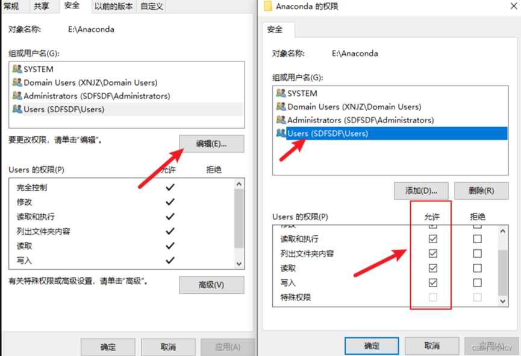

# 常用conda命令

**查看conda源：conda config --show-sources**

**添加conda源：conda config --add channels url**

**删除conda源：conda config --remove channels url**

**查看已有的虚拟环境，选择你要切换到的虚拟环境**

**conda info --envs**

**\# 或者**

**conda env list**

**\# 在命令行中切换到想要的虚拟环境，我这里切换到paddle**

**conda activate paddle**

**\# 在当前的paddle环境中安装好ipykernel**

**conda install ipykernel**

**\#切换回base**

**conda deactivate**

**conda activate base**

**\#增删改**

**增加方法：**

**conda create -n MyEnv python=3.7**

**\# conda create -n (name) python=版本**

**删除方法：**

**conda remove -n 虚拟环境的名 --all（需要管理员权限）**

**终极方法：（通过路径删除）**

**conda remove -p d:/venv_conda_py37 --all**

**修改/克隆方法：**

**新版方法：conda rename -n OldName NewName**

**旧版方法：**

**conda create -n newName（新环境名） --clone oldName（旧环境名）**

**conda remove -n oldName（旧环境名） --all**

**PS：也可以直接修改对应文件夹名字，之后conda env list查看是否更改**

**`conda clean -p` 这个命令会检查哪些包没有在包缓存中被硬依赖到其他地方，并删除它们**

**`conda clean -t` 清理缓存的压缩包文件**

# 问题一：pip换源

**注意：前提是Python配置了环境变量Path**

**查看pip源：pip config list**

## 临时换源：

**清华源**

`pip install xxxx -i https://pypi.tuna.tsinghua.edu.cn/simple`

**阿里源**

`pip install xxxx -i https://mirrors.aliyun.com/pypi/simple/`

**腾讯源**

`pip install xxxx -i http://mirrors.cloud.tencent.com/pypi/simple`

**豆瓣源**

`pip install xxxx -i http://pypi.douban.com/simple/`

将xxxx换成需要安装的包的名字

## 永久换源：

**清华源**

`pip config set global.index-url https://pypi.tuna.tsinghua.edu.cn/simple`

**阿里源**

`pip config set global.index-url https://mirrors.aliyun.com/pypi/simple/`

**腾讯源**

`pip config set global.index-url http://mirrors.cloud.tencent.com/pypi/simple`

**豆瓣源**

`pip config set global.index-url http://pypi.douban.com/simple/`

## 换回默认源

`pip config unset global.index-url`

e.g:

C:\Users\pyx29\>pip config set global.index-url https://pypi.tuna.tsinghua.edu.cn/simple

Writing to C:\Users\pyx29\AppData\Roaming\pip\pip.ini

写在了C:\Users\pyx29\AppData\Roaming\pip\pip.ini目录下

这里开管理员权限可能会写在python安装目录下

# 问题二：配置文件

## .condarc镜像配置文件

```
conda config --add channels r			#添加.condarc文件
```

channels:

\- https://mirrors.tuna.tsinghua.edu.cn/anaconda/cloud/conda-forge/

\- https://mirrors.tuna.tsinghua.edu.cn/anaconda/pkgs/msys2

\- https://mirrors.tuna.tsinghua.edu.cn/anaconda/pkgs/pro

\- https://mirrors.tuna.tsinghua.edu.cn/anaconda/pkgs/main

\- https://mirrors.tuna.tsinghua.edu.cn/anaconda/pkgs/free

\- defaults

show_channel_urls: true

default_channels:

\- https://mirrors.tuna.tsinghua.edu.cn/anaconda/pkgs/main

\- https://mirrors.tuna.tsinghua.edu.cn/anaconda/pkgs/r

\- https://mirrors.tuna.tsinghua.edu.cn/anaconda/pkgs/msys2

custom_channels:

conda-forge: https://mirrors.tuna.tsinghua.edu.cn/anaconda/cloud

msys2: https://mirrors.tuna.tsinghua.edu.cn/anaconda/cloud

bioconda: https://mirrors.tuna.tsinghua.edu.cn/anaconda/cloud

menpo: https://mirrors.tuna.tsinghua.edu.cn/anaconda/cloud

pytorch: https://mirrors.tuna.tsinghua.edu.cn/anaconda/cloud

pytorch-lts: https://mirrors.tuna.tsinghua.edu.cn/anaconda/cloud

simpleitk: https://mirrors.tuna.tsinghua.edu.cn/anaconda/cloud

envs_dirs:

\- D:\Anaconda3\envs

**\# 上边这个是创建环境的位置**

channels:下的是通过命令行实现的，即在可视化管理里边的channels

**下边的是自己添加的镜像源。**

## Jupyter_lab/notebook_config.py配置文件

[jupyter](https://so.csdn.net/so/search?q=jupyter&spm=1001.2101.3001.7020) lab/notebook --generate-config

## C盘下的.conda文件夹占用越来越大

1.更改目录：[Windows解决.conda文件夹占用C盘空间过大的问题-CSDN博客](https://blog.csdn.net/qq_41175905/article/details/135498913)

2.[关于conda占C盘内存的问题_anaconda占用c盘空间-CSDN博客](https://blog.csdn.net/qq_39991776/article/details/138083191?spm=1001.2101.3001.6650.4&utm_medium=distribute.pc_relevant.none-task-blog-2%7Edefault%7EYuanLiJiHua%7ECtr-4-138083191-blog-135498913.235%5Ev43%5Epc_blog_bottom_relevance_base9&depth_1-utm_source=distribute.pc_relevant.none-task-blog-2%7Edefault%7EYuanLiJiHua%7ECtr-4-138083191-blog-135498913.235%5Ev43%5Epc_blog_bottom_relevance_base9&utm_relevant_index=7)

3\. [修改conda环境安装路径，解决环境默认安装在C盘问题_conda可执行文件路径怎么选-CSDN博客](https://blog.csdn.net/QH2107/article/details/126246310)

4\. 清理垃圾：[一篇文章教你清理 Anaconda 的 pkgs_conda clean -p-CSDN博客](https://blog.csdn.net/Robin_Pi/article/details/115004870)

`conda clean -p` 这个命令会检查哪些包没有在包缓存中被硬依赖到其他地方，并删除它们

`conda clean -t` 清理缓存的压缩包文件

5\. [【anaconda】彻底解决windows下anaconda3占用C盘问题（改了envs、pkgs安装路径依旧占用C盘）\_anaconda安装到其他盘c盘还有-CSDN博客](https://blog.csdn.net/qq_43426078/article/details/128027978)

`conda config –show \#查看环境配置`

`conda info \#同上`

# 问题三：jupyter插件nbextensions

## 卸载

插件目录为C:\Users\pyx29\AppData\Roaming\Python\Python311\site-packages

`pip uninstall jupyter_contrib_nbextensions`

`pip uninstall jupyter_nbextensions_configurator`

**注意：开管理员权限不会出现警告。如果不开管理员权限会将插件安装在C:\Users\pyx29\AppData\Roaming\Python\Python311\site-packages文件夹下**

**开了管理员权限会安装在D:\Anaconda3\Lib\site-packages**

安装命令如下：

`pip3 install jupyter_contrib_nbextensions`

`python3 application.py install`

## 改中文的方式

如果jupyter版本7.0+可以下载插件

如果7.0以下，可以通过配置**用户环境变量**来实现，如下：

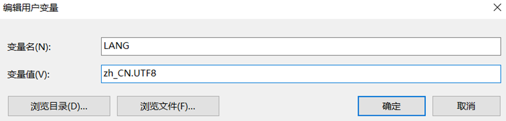

## Jupyter随意切换conda环境

**注意：方法三为了conda环境随意切换，使用6.5版本(不知为何自动降级了)，改中文方式为添加环境变量（用户环境变量）**

1.  **在 conda 环境中运行 Jupyter 服务器和内核**

`conda create -n my-conda-env \# creates new virtual env`

`conda activate my-conda-env \# activate environment in terminal`

`conda install jupyter \# install jupyter + notebook`

`jupyter notebook \# start server + kernel`

> 这种方法就是为每一个 conda 环境 都安装 jupyter。
>
> Jupyter 将完全安装在 conda 环境中。不同版本的 Jupyter 可用于不同的 conda 环境
>

**2. 为 conda 环境创建特殊内核（相对实用）**

`conda create -n myenv \# creates new virtual env`

**`conda create -n myenv ipykernel \#这样可省略下边斜体的那行`**

`conda activate myenv \# activate environment in terminal`

*`conda install ipykernel \# install Python kernel in new conda env`*

**`python -m ipykernel install --user --name myenv --display-name "My Environment"`**

`jupyter notebook \# run jupyter from system`

> 只有 Python 内核会在 conda 环境中运行，系统中的 Jupyter 或不同的 conda 环境将被使用——它没有安装在 conda 环境中。
>
> 通过调用ipython kernel install将 jupyter 配置为使用 conda 环境作为内核.
>

**使用以下代码操作前，先别更改镜像源！！！！**

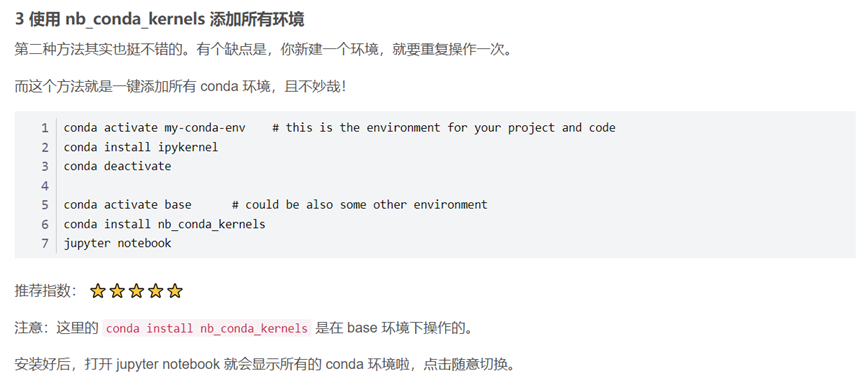

代码命令如下：

`conda activate my-conda-env \# this is the environment for your project and code`

**`conda install ipykernel \#每次创建虚拟环境，都要为虚拟环境添加ipykernel`**

`conda deactivate`

`conda activate base \# could be also some other environment`

**`conda install nb_conda_kernels \#在base环境下执行，conda也可用pip替换，3.9+`**

**`conda install nb_conda \#py3.9以下用这个`**

> ***注意：有可能一直卡在solving environment下，这里需要换源或者用pip，但pip和conda还是有区别的，比如conda list与pip list显示的结果不一样，conda下载的用conda，pip下载的用pip显示。***

**4. 删除jupyter添加的环境（不包含conda的虚拟环境）**

这里需要注意：

上面的第一个方法是在环境里装jupyter；

第二个方法是将指定的conda虚拟环境安装内核并配置给jupyter作为内核；

第三个是安装特殊的内核，会将conda的所有环境自动添加进jupyter中。

这里删除可以删除第二个方法添加的内核（第一个应该也可以，未尝试！）：

`查看安装了哪些虚拟环境kernel（在base或虚拟环境下运行都可以）：`

`jupyter kernelspec list`

`删除指定的kernel：`

`jupyter kernelspec uninstall myenv`

**补充命令：**

**\# 查看已有的虚拟环境，选择你要切换到的虚拟环境**

**conda info --envs**

**\# 或者**

**conda env list**

**\# 在命令行中切换到想要的虚拟环境，我这里切换到paddle**

**conda activate paddle**

**\# 在当前的paddle环境中安装好ipykernel**

**conda install ipykernel**

**\#切换回base**

**conda deactivate**

**conda activate base**

**特别注意：可能是版本问题，执行以上命令之后，jupyter从7.0+降级为了6.5**

## Jupyter更改工作目录和默认浏览器

**（一）默认目录修改**

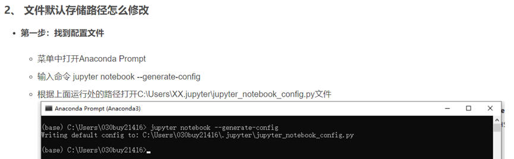

**代码如下：**

`jupyter notebook --generate-config`

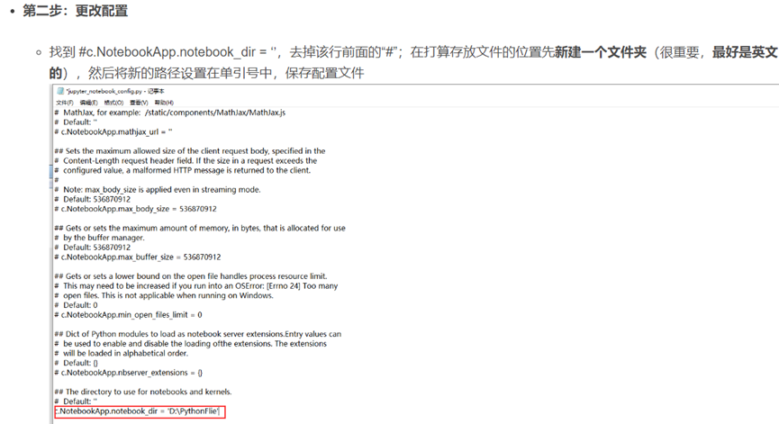

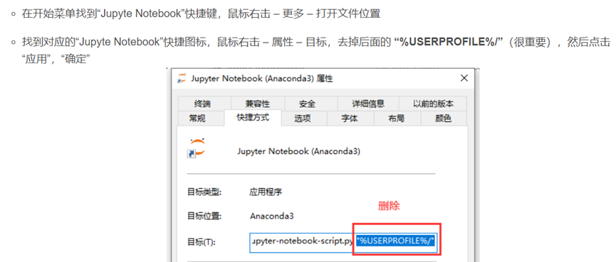

**（一）默认浏览器修改**

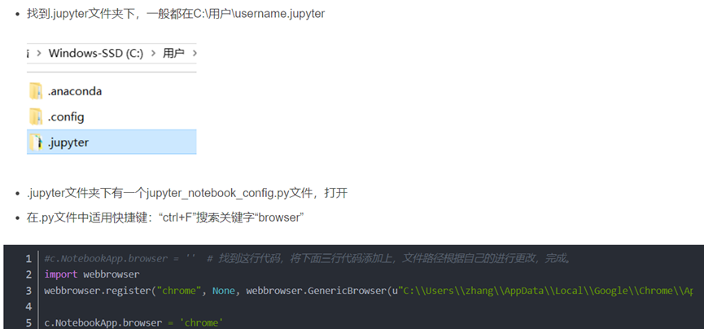

**代码如下：**

\#c.NotebookApp.browser = '' \# 找到这行代码，将下面三行代码添加上，文件路径根据自己的进行更改，完成。

import webbrowser

webbrowser.register("chrome",None,webbrowser.GenericBrowser(u"浏览器地址"))

c.NotebookApp.browser = 'chrome'

## Jupyter代码格式化

安装 nbextensions

1.安装：`pip install jupyter_contrib_nbextensions -i https://pypi.mirrors.ustc.edu.cn/simple`

2.激活：`jupyter contrib nbextension install --user`

安装 nbextensions_configurator

1.安装：`pip install jupyter_nbextensions_configurator`

2.激活：`jupyter nbextensions_configurator enable –user`

勾选Hinterland（代码提示/[自动补全](https://so.csdn.net/so/search?q=%E8%87%AA%E5%8A%A8%E8%A1%A5%E5%85%A8&spm=1001.2101.3001.7020)）和Autopep8（代码格式化）

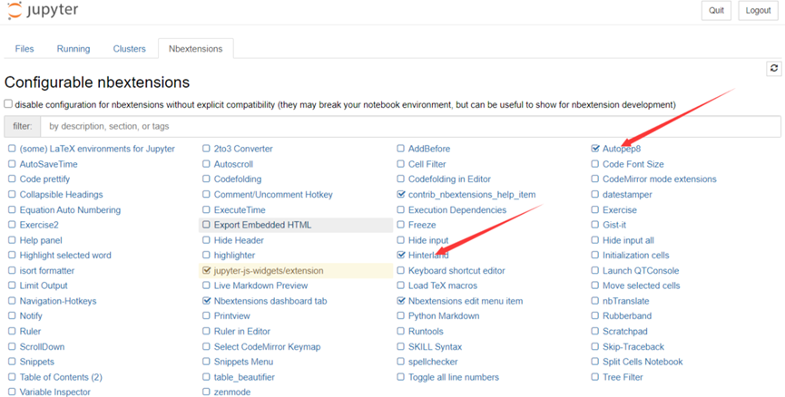

代码提示和自动补全已经设置完成，点击工具栏的小锤子就可以实现代码格式化了。

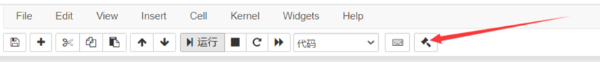

## Jupyter安装指定版本

1.查看版本：`jupyter notebook/lab –version`

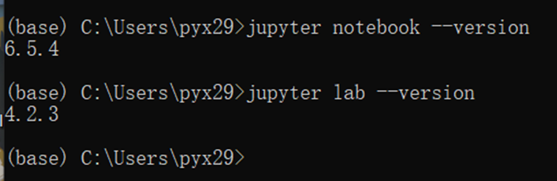

2．查看全部版本：`jupyter --version`

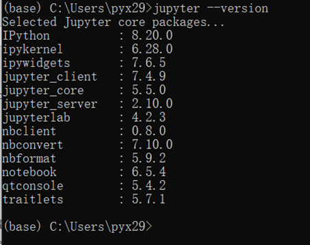

第一种采用 pip 方式进行安装，代码如下：

`pip/conda install jupyterlab/notebook==6.5.4  \#包名和上图所示相同而并非jupyter这个名字`

第 2 种采用 mamba（快速跨平台软件包管理器）方式进行安装，代码如下：

`mamba install -c conda-forge jupyterlab=3`

第 3 种采用 conda 方式进行安装，代码如下：

`conda install -c conda-forge jupyterlab=3`

另一种方法：`conda/pip install jupyter==version号`

# 问题四：Pytorch相关

## Pytorch安装方法

官网查看：<https://pytorch.org/get-started/previous-versions/>

安装版本GitHub：[pytorch/vision: Datasets, Transforms and Models specific to Computer Vision (github.com)](https://github.com/pytorch/vision#installation)

## Pytorch安装路径及验证安装是否成功

**路径检测：**

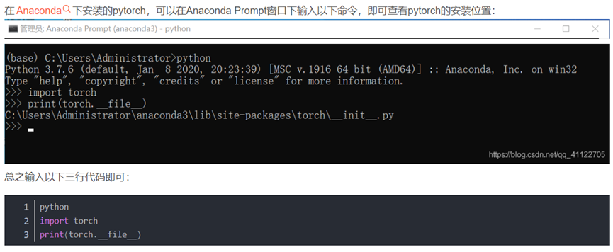

`import torch`

`print(torch.\_\_file\_\_)`

两行代码即可

**成功检测：**

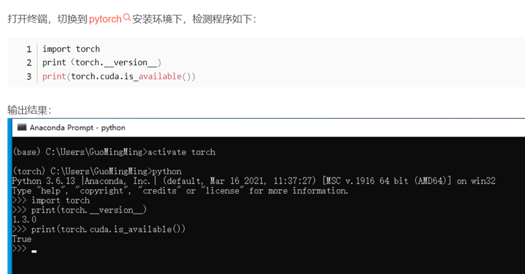

`import torch`

`print(torch.\_\_version\_\_) \#查看版本`

`print(torch.cuda.is_available()) \#查看是GPU/CPU（True-GPU）`

## Pytorch安装速度

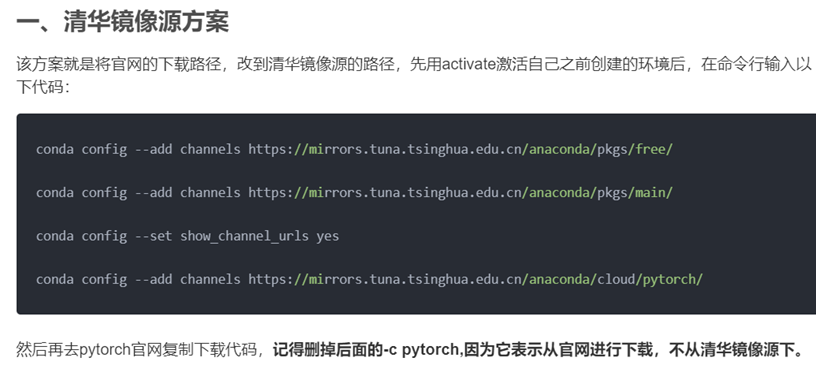

# 问题五：Anaconda环境的导入导出

## 导出当前环境

**conda env export -f d:\pybase.yml**

## 导入新的环境

**conda env creat -f d:pybase.yml**

**注意：路径要相同**

## 新环境命名问题

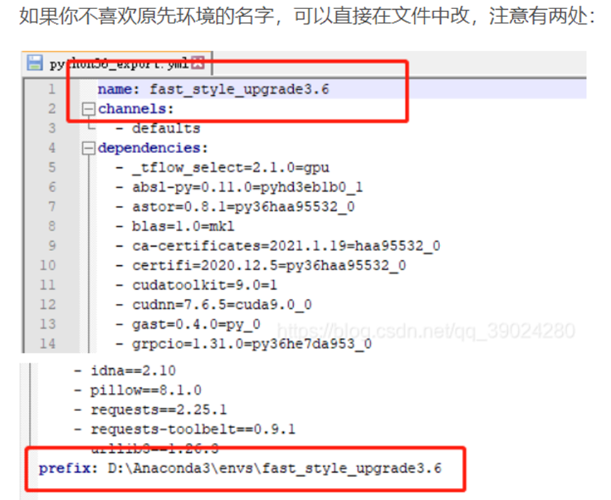

# 问题六：Anaconda导入本地py环境

## 先将原有的环境加入Anaconda

**conda create --prefix="D:\test_t" python=3.7.0 \#可指定py版本**

**注意：这会导致加入的环境没有名字，必须通过path来激活。如下图所示**

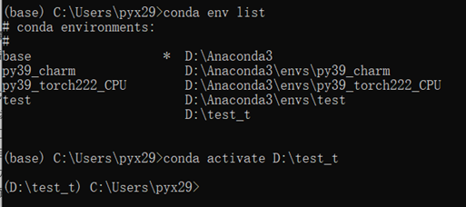

**之后通过克隆来实现本地环境的加入。如下代码：**

**conda create -n newName --clone D:\test_t**

**conda remove -p D:\test_t –all（-p可以改成-n，-p是通过路径删除-n是环境名删除）**

**上边这两步执行完毕后，本地环境就克隆完成了，会出现在你安装的Anaconda的根目录的envs文件夹下。下边的步骤为添加环境目录，意思就是可以不止Anconda/envs这一个路径。可以自定义。**

> **我们可以输入**`conda config --show envs_dirs`**来查看一下当前的环境目录。**
>
> 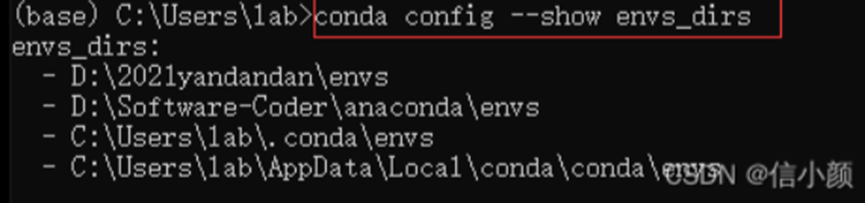
>
> **因此，使用**conda config --append envs_dirs 你的路径 **将我们的目录加进来(怎么删除？在.condarc文件下删除)**
>
> 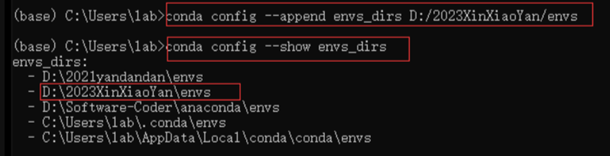
>
> 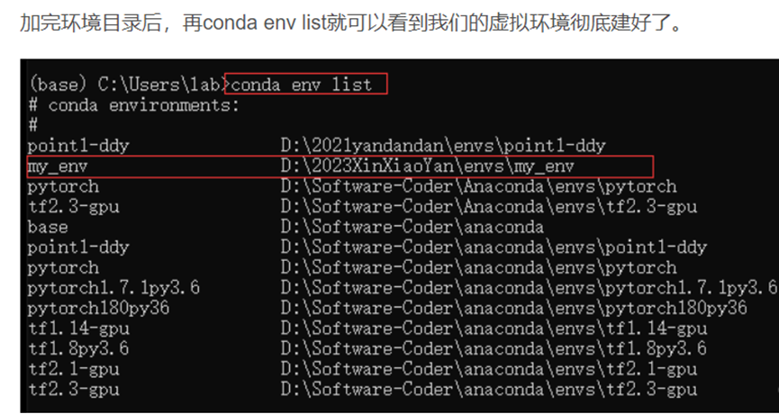
>

## 克隆/导出(导入)环境

**通过可视化软件克隆**

**conda create -n newName（新环境名） --clone oldName（旧环境名）**

**conda remove -n oldName（旧环境名） --all（该方法需要管理员权限）**

**终极方法（通过路径删除）**

**conda remove -p D:\test_t --all**

# 问题七：Jupyter Lab相关配置

## Jupyter Lab插件

> **[🤒 JupyterLab | 这几款插件推荐给天天使用JupyterLab的你！~-腾讯云开发者社区-腾讯云 (tencent.com)](https://cloud.tencent.com/developer/article/2224266)**

## Jupyter Lab代码提示

下载这个插件

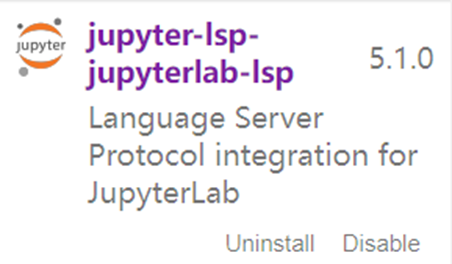

## Jupyter Lab代码格式化

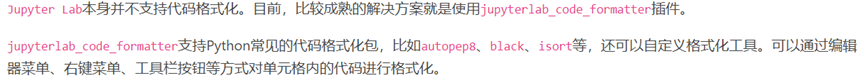

可以只下载各autopep8

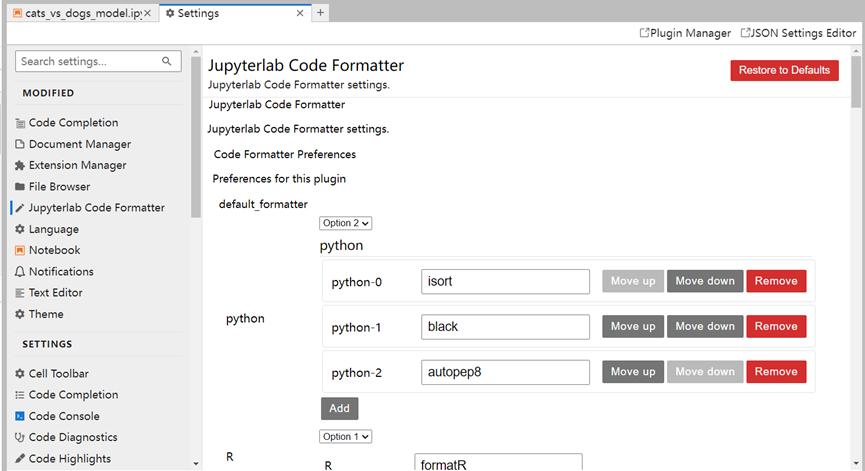

详情点击网址：[Jupyter Lab通过安装插件利用autopep8等实现快速格式化代码 - 代码天地 (codetd.com)](https://www.codetd.com/article/13421278#:~:text=Jupyter%20Lab%20%E6%9C%AC%E8%BA%AB%E5%B9%B6%E4%B8%8D%E6%94%AF%E6%8C%81%E4%BB%A3%E7%A0%81%E6%A0%BC%E5%BC%8F%E5%8C%96%E3%80%82%20%E7%9B%AE%E5%89%8D%EF%BC%8C%E6%AF%94%E8%BE%83%E6%88%90%E7%86%9F%E7%9A%84%E8%A7%A3%E5%86%B3%E6%96%B9%E6%A1%88%E5%B0%B1%E6%98%AF%E4%BD%BF%E7%94%A8%20jupyterlab_code_formatter%20%E6%8F%92%E4%BB%B6%E3%80%82%20jupyterlab_code_formatter,%E6%94%AF%E6%8C%81Python%E5%B8%B8%E8%A7%81%E7%9A%84%E4%BB%A3%E7%A0%81%E6%A0%BC%E5%BC%8F%E5%8C%96%E5%8C%85%EF%BC%8C%E6%AF%94%E5%A6%82%20autopep8%20%E3%80%81%20black%20%E3%80%81%20isort%20%E7%AD%89%EF%BC%8C%E8%BF%98%E5%8F%AF%E4%BB%A5%E8%87%AA%E5%AE%9A%E4%B9%89%E6%A0%BC%E5%BC%8F%E5%8C%96%E5%B7%A5%E5%85%B7%E3%80%82%20%E5%8F%AF%E4%BB%A5%E9%80%9A%E8%BF%87%E7%BC%96%E8%BE%91%E5%99%A8%E8%8F%9C%E5%8D%95%E3%80%81%E5%8F%B3%E9%94%AE%E8%8F%9C%E5%8D%95%E3%80%81%E5%B7%A5%E5%85%B7%E6%A0%8F%E6%8C%89%E9%92%AE%E7%AD%89%E6%96%B9%E5%BC%8F%E5%AF%B9%E5%8D%95%E5%85%83%E6%A0%BC%E5%86%85%E7%9A%84%E4%BB%A3%E7%A0%81%E8%BF%9B%E8%A1%8C%E6%A0%BC%E5%BC%8F%E5%8C%96%E3%80%82)

