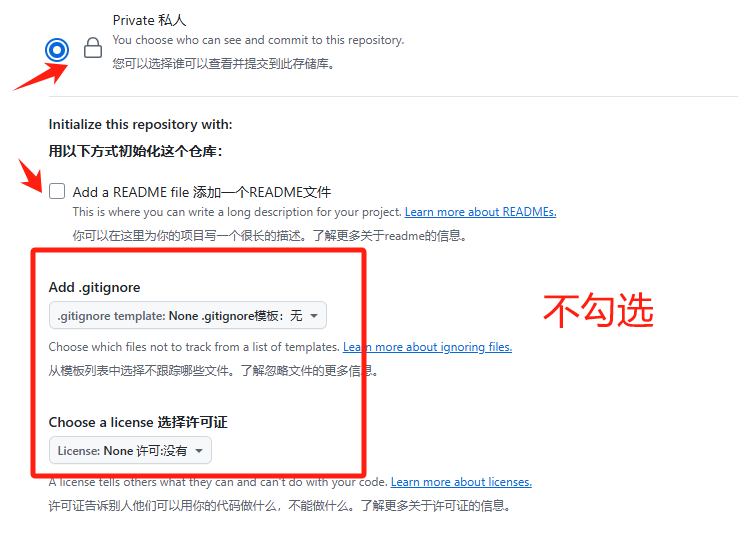
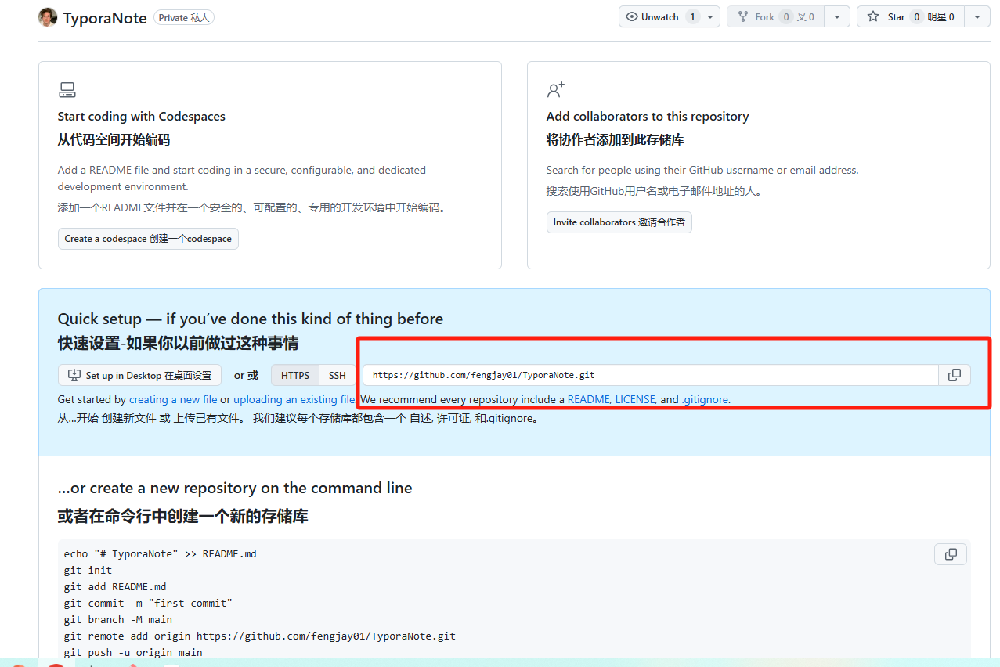
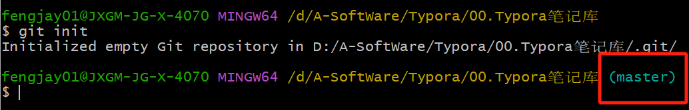
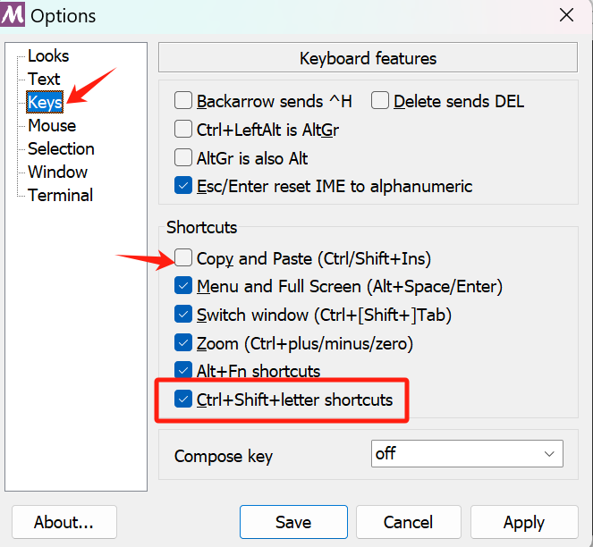

## 一、Git与Github

1.github创建项目，不要添加readme.md



2.复制地址



3.在想要上传的本地文件夹内，右键打开Git Bash，输入

```bash
git init
```



> 这个分支是master，github默认是main，第一次创建一般是master分支，可以改名字（仅限第一次）
>
> ```bash
> git branch -m main
> ```

3.添加要传的文件

```bash
#添加全部
git add .	

#添加单个文件
git add 文件名
# 示例：
git add main.py

#添加多个
git add 文件1 文件2 ...
# 示例：
git add main.py utils.py README.md

#添加整个目录
git add 路径/
# 示例：
git add src/
```

4.如果未提交过任何文件

```bash
#添加文件并提交一次
git add .
git commit -m "first commit"

#建立链接
git remote add origin https://github.com/fengjay01/TyporaNote.git

#推送文件
git push -u origin main
```

5.更新文件

```bash
#添加修改和新的文件并处理被删除的文件
git add . && git add -u

#会添加所有新文件，会更新所有修改文件，会记录所有被删除的文件
git add -A

#提交
git commit -m "first commit"


#如果仓库里有本地没有的文件，先合并再推送
git pull origin main --rebase
#推送
git push origin main
```

6.Github官方方法

```bash
# 一级标题是“Learm-stm32”
echo "# Learm-stm32" >> README.md
git init
git add README.md
git commit -m "first commit"
git branch -M main
git remote add origin https://github.com/fengjay01/Learm-stm32.git
git push -u origin main
```


## 二、Git Bash快捷键

- 更改复制粘贴快捷键（Ctrl+Shift+C/V）



## 二、Git 一些问题

### 1.代理超时

这样就可以清除 Git 的代理设置，让其直接连接网络进行操作

```
git config --global --unset http.proxy 
git config --global --unset https.proxy
```

### 2.Linux每次都要输入账户token