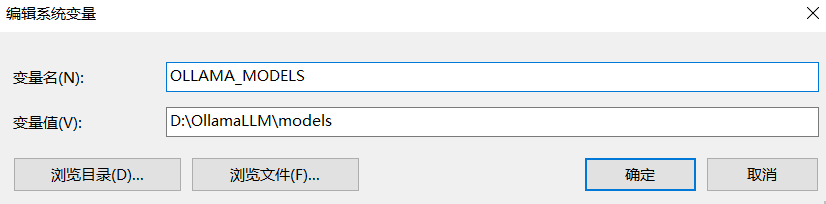
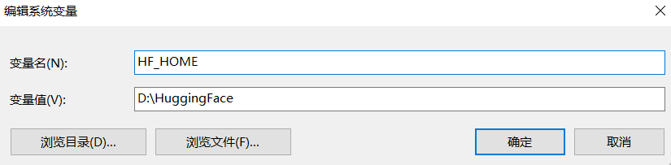
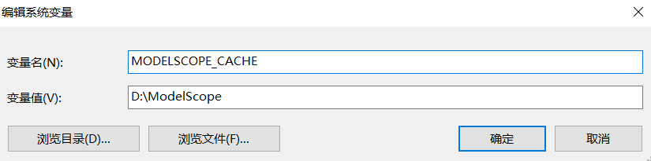
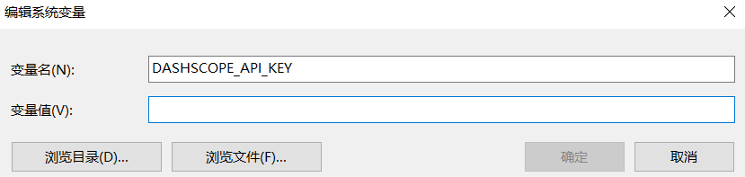
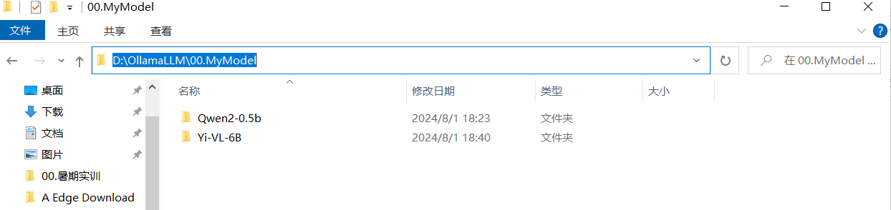
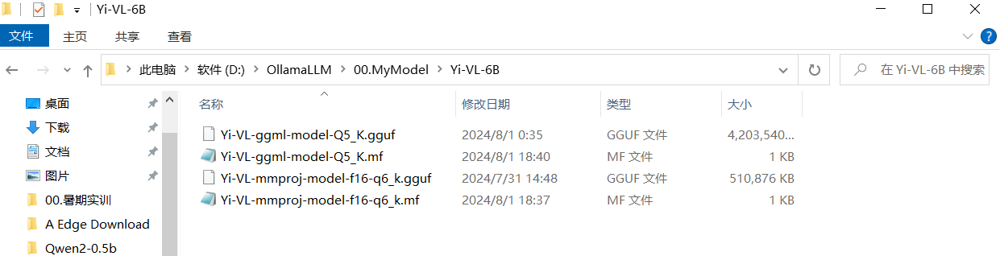
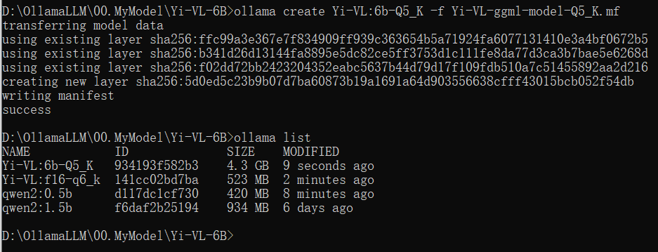
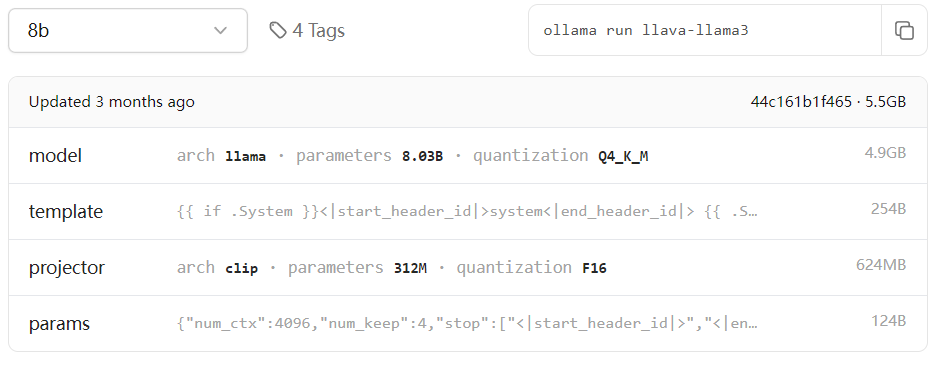

### 一、环境变量设置

#### 1、Ollama配置

- 安装位置：C:\Users\pyx29\AppData\Local\Programs\Ollama

- 默认位置：C:\Users\pyx29\.ollama
- 环境变量：OLLAMA_MODELS

 

#### 2、Huggingface配置

- 默认位置：C:\Users\username\.cache\huggingface
- 环境变量：HF_HOME

 

#### 3、ModelScope配置

- 默认位置：C:\Users\pyx29\.modelscope
- 环境变量：MODELSCOPE_CACHE


 

#### 4、Qwen API配置

**DASHSCOPE_API_KEY=“key”**

 


### 二、Ollama加载本地模型

#### 1、下载模型

Huggingface或者ModelScope

#### 2、准备Modelfile文件

##### （1）Modelfile参数说明

|         命令         |               描述               |
| :------------------: | :------------------------------: |
|    FROM (必需的)     |   引入使用的模型或者模型源文件   |
|   PARAMETER(参数)    |       设置大模型的运行参数       |
| TEMPLATE(提示词模板) | 用于大模型请求的prompt提示词模板 |
|        SYSTEM        |    设置的大模型默认的系统消息    |
|       ADAPTER        | 定义适用于模型的（Q）LoRA适配器  |
|       LICENSE        |           指定license.           |
|       MESSAGE        |           指定消息历史           |

##### （2）Modelfile样例文件

> FROM ./codeqwen-1_5-7b-chat-q8_0.gguf
>
> TEMPLATE """{{ if .System }}<|im_start|>system
> {{ .System }}<|im_end|>
> {{ end }}{{ if .Prompt }}<|im_start|>user
> {{ .Prompt }}<|im_end|>
> {{ end }}<|im_start|>assistant
> {{ .Response }}<|im_end|>
> """
> PARAMETER stop "<|im_start|>"
> PARAMETER stop "<|im_end|>"

#### 3、创建模型

##### （1）创建模型命令

**ollama create <your-model-name> -f <./Modelfile>**

文件名后缀不是重点。

##### （2）创建模型示例

创建存储大模型源文件和modelfile文件的目录



- **进入工作目录**，执行创建命令：**ollama create Yi-VL:6b-Q5_K -f Yi-VL-ggml-model-Q5_K.mf**
- 查看创建结果：**ollama list**





#### 4、多模态LLM

##### （1）导入步骤

 **！！！重点：**

- **ollama导入模型时，若为单纯的语言模型而非多模态模型，一个GGUF格式的文件即可**
- **但是，如果是多模态模型，一般除了量化后的模型，比如Q4_K.gguf，还需要一个f16的gguf文件，这个东西叫做“==视觉适配器==”**
- **f16的gguf文件相对较小600MB左右，一般模型文件名带有“==mmproj==”**
- **在ollama导入时需要将两个gguf合并成一个，代码如下：==copy /b name1.gguf + name2.gguf NewNameModel.gguf==**

```
copy /b qwen1_5-72b-chat-q4_k_m.gguf.a + qwen1_5-72b-chat-q4_k_m.gguf.b qwen1_5-72b-chat-q4_k_m.gguf
```

- **上述代码可以看出，有些模型并非一个完整的GGUF即使他本身是语言模型而非多模态模型**

##### （2）与语言模型的差异

总结，发现此情况是因为手动导入多模态模型时无法对图片进行操作识别，但是从ollama终端pull出来的同一个模型却可以，后来对比ollama官网提供的llava模型下载时都下载了什么内容，发现了差异，如下图示：



和自己导入的gguf相比多了一部分内容：

- **template**：就是编写Modelfile时写的**TEMPLATE""" <内容> """**，内容如下：

```
{{ if .System }}<|start_header_id|>system<|end_header_id|>

{{ .System }}<|eot_id|>{{ end }}{{ if .Prompt }}<|start_header_id|>user<|end_header_id|>

{{ .Prompt }}<|eot_id|>{{ end }}<|start_header_id|>assistant<|end_header_id|>

{{ .Response }}<|eot_id|>
```

- **params：**编写Modelfile时最后的**PARAMETER stop**

```
PARAMETER stop "<|im_start|>"
PARAMETER stop "<|im_end|>"
```

- ==**projector：**==这个就是多出来的f16.gguf的文件，如上图大约600MB（每个模型大小不一）

> 猜测：若将这个f16.gguf补上是不是就行了呢？（怎么补呢？）

完整的Modelfile文件内容如下：（该例子是Qwen模型的Modelfile文件）

```
FROM ./qwen2:0.5b.gguf

TEMPLATE """{{ if .System }}<|im_start|>system
{{ .System }}<|im_end|>
{{ end }}{{ if .Prompt }}<|im_start|>user
{{ .Prompt }}<|im_end|>
{{ end }}<|im_start|>assistant
{{ .Response }}<|im_end|>
"""
PARAMETER stop "<|im_start|>"
PARAMETER stop "<|im_end|>"
```

**注意：如果TEMPLATE和PARAMETER stop不知道不要写，只写FROM就行（可能会胡言乱语）（该部分还需深入原理）**

经验证上述猜想是完全正确的，受到启发的博客如下：

- **1、发现“适配器”，引起合并思想**：[如何让LM Studio支持本地(locally)的视觉大模型(Vision Model) | 草凡博客 (caovan.com)](https://caovan.com/ruheranglm-studiozhichibendelocallydeshijuedamoxingvision-model/.html)
- **2、确有合并的代码**：[大模型笔记之-ollama自定义模型 | Modelfile编写，推送至ollama Models_ollama modelfile-CSDN博客](https://blog.csdn.net/weixin_42232045/article/details/138905092?spm=1001.2014.3001.5506)


### 三、WANDB.AI平台

在kaggle训练lamma3模型时要填写APIKEY

- 官网：[Weights & Biases (wandb.ai)](https://wandb.ai)
- Key：[Weights & Biases (wandb.ai)](https://wandb.ai/authorize)即在原网址后加/auhorize

如果注册过账号且开通过项目，点击上述Key可查看api-key，首次使用会先创建项目，创建项目的时候会出现api-key
