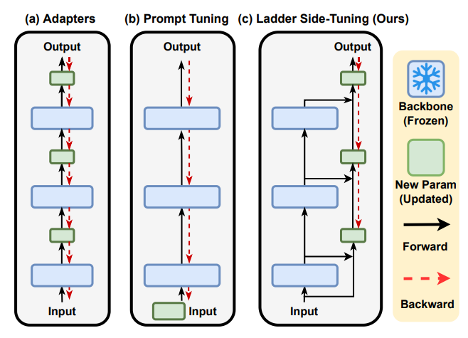
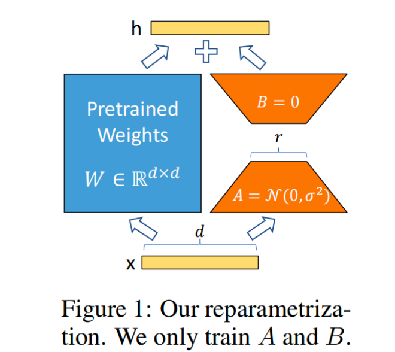
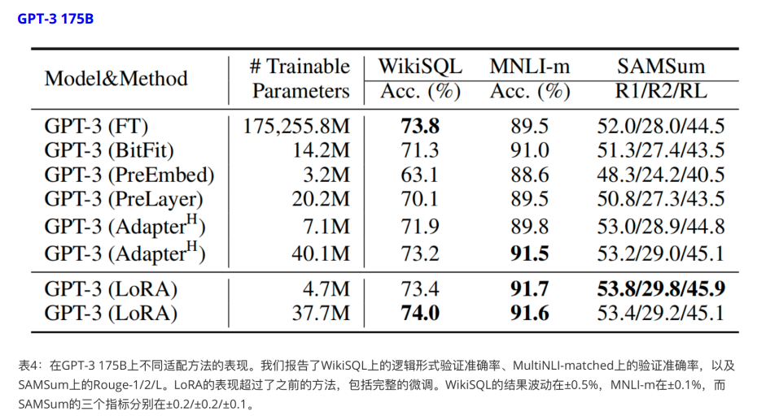

# 一、Adapter Tuning

# 二、Prompt Tuning

## 2.1、Prefix-Tuning

## 2.2、P-Tuning

> 思考&盲点：
>
> - embedding 是什么？何用？干嘛的？
> - 

## 2.3、Parameter-Efficient Prompt Tuning(PEFT)

## 2.4、P-Tuning v2

# 三、LoRA Tuning

## 3.1、问题背景 

**问题-1：**⼤模型通常包含数亿甚⾄数百亿个参数，对其进⾏微调需要⼤量的计算资源和存储空间。

**问题-2：**在微调过程中，直接修改预训练模型的所有参数可能会破坏模型的原始性能。

**问题-3：**存储和部署微调后的⼤模型需要⼤量存储空间，尤其是当需要在多个应⽤场景中部署不同微调版本时。

**问题-4：**许多微调⽅法会增加推理阶段的计算延迟，影响模型的实时性应⽤。

### 3.1.1、P-T/A-T/LST

> 思考：Adapter方法和P-Tuning方法**在训练微调时到底高效在哪？**

在对模型训练时，姑且可以笼统的分为两步：反向传播和梯度下降，以Pytorch为例具体就是

```
loss.backward()  #反向传播
optimizer.step()  #梯度下降
```

- `backward()`会根据模型的前向推理计算图来反向的对各个layer中的weight求的[偏导](https://zhida.zhihu.com/search?q=偏导&zhida_source=entity&is_preview=1)∂𝐿∂𝑤 用于之后的梯度下降，对各个layer中的input求偏导 ∂𝐿∂𝑥 用于向前层传递梯度，[链式求导](https://zhida.zhihu.com/search?q=链式求导&zhida_source=entity&is_preview=1)。

- `step()`则会根据所选用的优化器，对需要训练的参数执行相应的梯度下降策略，姑且可以将此过程简单描述成 如下公式 , 其中 𝜂 为学习率
  $$
  W{'}=W−𝜂\frac{∂𝐿}{∂𝑤}
  $$

**LST（Ladder Side-Tuning）**是一种高效的迁移学习方法，它旨在解决在微调大型预训练模型时内存需求大的问题。

**这种方法通过构建一个侧边网络，也就是固定原模型中的参数，将原模型各层输出与新建的旁路分支结合得到输出。从而避免了在整个大型模型上进行反向传播，显著降低了训练时的内存需求。**

LST的核心思想是利用“梯子”结构从主干网络中获取中间激活，并作为输入来构建侧网络。这种方法不仅减少了训练过程中的内存消耗，而且由于侧网络的规模较小，还可以提升训练效率。LST不向主干网络内部插入额外参数，而是采用分离的侧网络进行训练，这样可以在保持模型性能的同时，降低内存占用。



从图中不难发现，三种微调方法：

- 对于Adapter来说虽然只训练新插入的少部分参数，但是整个梯度回传的过程不能省略，换句话说，与微调整个模型相比：
  - 1）对于**反向传播**过程而言，各层对$weight$的梯度 $\frac{∂𝐿}{∂𝑤}$ 不用算了，但是对于$input$的梯度 $∂𝐿/∂𝑥$ 得算(要向前层传递); 
  - 2）对于**梯度下降**过程而言，只需要下降少部分新插入的层的$weight$，原模型的$weight$都不动;
- 对于P-Tuning虽然只需要训练$Embedding$层，但是$Embedding$层是输入层，所以与微调整个模型相比：
  - 1）对于反向传播过程而言，各层对$weight$的梯度 $∂𝐿/∂𝑤$ 不用算了，但是对于$input$的梯度 $∂𝐿/∂𝑥$ 得算(要向前层传递);
  -  2）对于梯度下降过程而言，只需要下降$Embedding$层参数，原模型的$weight$都不动

所以,再来回答本小节开始的问题：高效微调的高效 ，在于减少了所需**梯度下降过程**的**权重量和计算量**，对于**反向传播**的过程，**不需要保存对原始weight的梯度也就节省了显存**，但是**反向传播的复杂度并没有降低。**

- 而对于**LST便是一种反向传播过程和梯度下降过程都高效的微调方法**，如上图而言，不难发现，LST的反向传播和梯度下降过程都与原始模型无关，相当于**我重新定义了一个小的模型结构，通过获取原模型的输出作为输入来协助微调最终的结果**

LST在多个基准任务上表现出色，能够在较小的训练参数和训练成本的情况下，达到与全量参数微调相似的效果。这使得LST特别适用于资源有限的环境或需要在大规模模型上进行微调的场景。

LST的实现通常涉及以下几个步骤：

1. 从预训练的大型模型中提取中间层的输出作为特征。
2. 构建一个小型的侧网络，这个网络可以是MLP（多层感知机）或其他类型的神经网络结构。
3. 将提取的特征输入到侧网络中，并在侧网络上进行训练，而不需要在大型模型上进行反向传播。
4. 通过这种方式，侧网络可以学习到如何将预训练模型的知识迁移到新的任务上。

LST的提出，为在有限资源下有效利用大型预训练模型提供了一种新的解决方案。通过减少内存占用和提升训练效率，LST使得在实际应用中部署大型模型变得更加可行。

## 3.2、解决措施

**LoRA（Low-Rank Adaptation)** 通过引⼊**低秩矩阵**分解，在减少计算资源和存储需求的同时，保持了预训练模型的初始性能，稳定了微调过程，并**降低了存储和部署成本**。它特别适⽤于⼤规模模型的微调，在资源有限的环境中具有显著的优势。



> 思考:
>
> - 低秩分解,分解的矩阵W0是如何分解的?分解标准和分解步骤是什么?(用的SVD奇异值分解)
> - SVD奇异值分解又是什么?
> - 为什么低秩分解可以降低运算?
> - 低秩,这个秩得多低?有没有限制?秩的大小对模型的影响?
> - W0分解为AB低秩矩阵后,A,B如何初始化?(A高斯随机,满足正态,即值0-1;B初始化为0[为何B初始化为0?])
> - 为什么LoRA不会影响推理速度而P-Tuning和Adapter-Tuning则会影响模型推理速度？（从结构出发）

## 3.3、LoRA优势

- **存储与计算效率：**通过低秩适应（LoRA），可以显著减少所需存储的参数数量，并减少计算需求。
- **适应性与灵活性：**LoRA⽅法允许模型通过只替换少量特定的矩阵A和B来快速适应新任务，显著提⾼任务切换的 效率。
- **训练与部署效率：**LoRA的简单线性设计允许在不引⼊推理延迟的情况下，与冻结的权重结合使⽤，从⽽提⾼部署 时的操作效率。
- **不影响推理速度:**在⽣产中部署时,可以显式计算并存储$W_{\mathrm{finetuned}}=W_{\mathrm{pretrained}}+\Delta W$ ，并像往常⼀样执⾏推理。这保证了与细调的模型相⽐，不会引⼊任何额外的延迟.



灾难性遗忘：不用理睬、通用数据和垂直数据的比例（如何解决）
