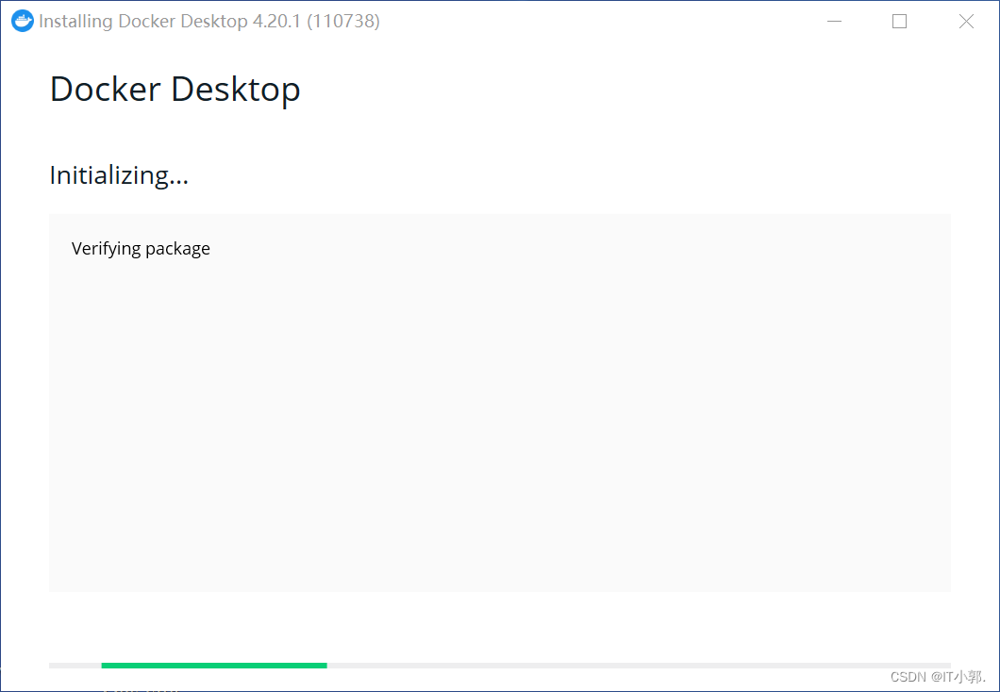
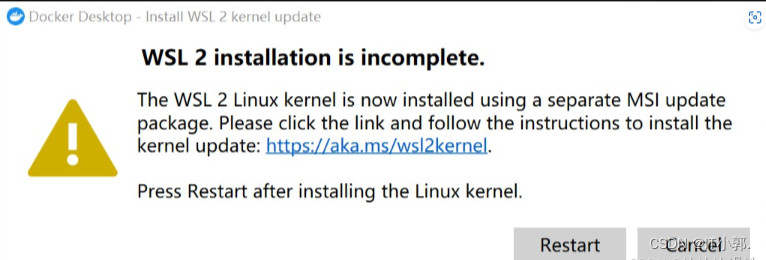
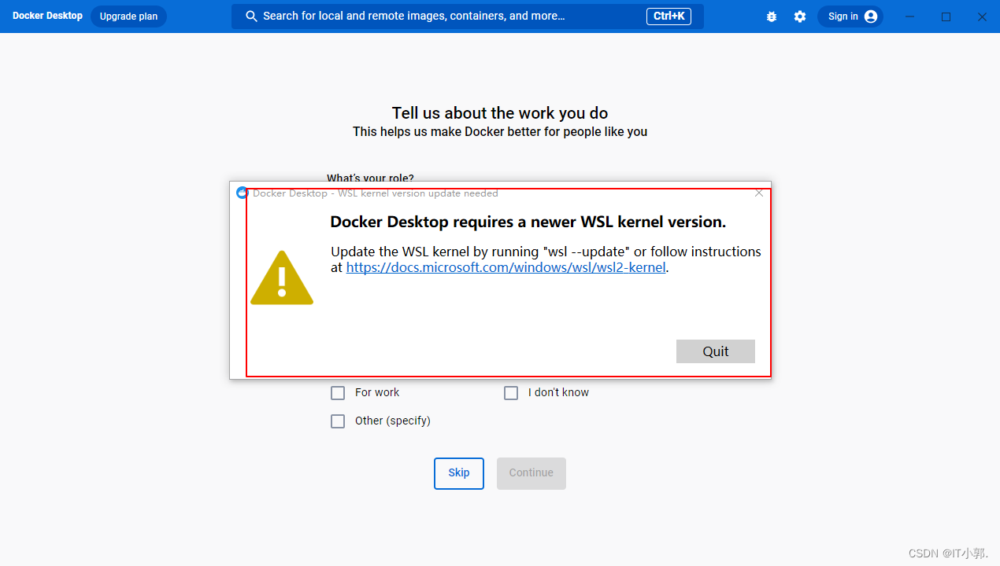
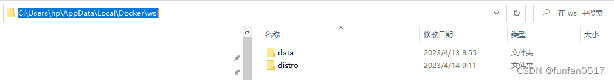
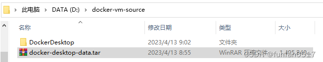
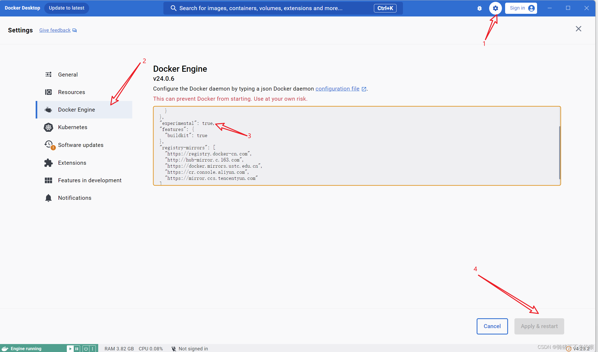

### 一、前言

> 作为开发人员，在日常开发中，我们需要在本地去启动一些服务，如：redis、MySQL等，就需要去下载这些在本地去启动，操作较为繁琐。此时，我们可以使用Docker Desktop，来搭建我们需要的服务，直接在容器中去启动即可。

### 二、下载 Docker Desktop

docker官网：https://www.docker.com/


### 三、安装 Docker Desktop

#### **1、下载并安装**

我在windows上下载的是 Docker Desktop,下载地址，点进去根据自己的需要去下载，我是下载的Windows版本的。把下载下来的.exe文件双击打开，如下图所示，直接点击OK即可。

- 安装位置：C:\Program Files\Docker\Docker




#### **2、配置 Docker Desktop 环境**

因为docker desktop 是可以部署在windows 上来运行docker的应用服务的，其基于windows 的 Hyper-V
服务和WSL2内核的Windows上创建一个子系统（linux）,从而实现其在windows上运行docker。所以电脑上需要开启Hyper-V
服务，和安装WSL2。

开启Hyper-V 服务：控制面板—程序—程序和功能—启动或关闭Windows功能 中 勾选【Hyper-V】和【容器】选项。


配置完毕后，重启电脑

#### **3、安装 wsl2**

我们可以从微软官网下载最新版本的wsl2，然后正常打开。

下面这个链接，访问下载，安装更新：
https://wslstorestorage.blob.core.windows.net/wslblob/wsl_update_x64.msi

下载完成后直接双击安装即可


#### **4、打开 Docker Desktop 的问题**

##### **问题一：wsl 2 installation**

打开 docker desktop, 如果出现报错如下，报错意思是：是因为我们还需要进行wsl的下载和配置




这里我们用两步来解决这个问题：

**1、我们先去系统里查看一下有没有启用Windows的Linux子系统，步骤如下：**
控制面板->程序->程序和功能


如果没有的话，我们勾选上，重新启动电脑，打开Docker Desktop 。

**2、如果还是没有解决的话。原因就剩一个了就是：**
我们使用的wsl2版本很旧，因此需要手动更新。我们可以根据提示从微软官网下载最新版本的wsl2，然后正常打开。

下面这个链接，访问下载，安装更新：
https://wslstorestorage.blob.core.windows.net/wslblob/wsl_update_x64.msi

下载完成后直接双击安装即可


重新启动，运行，发现问题已经解决。

##### **问题二：wsl kernel 版本低**

- 如果已经按照过wsl ， 打开 docker desktop, 如果出现报错如下，报错意思是：**wsl kernel** 版本低，需要进行更新。

解决方法：以管理员的身份打开控制台（cmd）,并执行命令 **wsl --update** 进行更新.

> **注意：[wsl](https://so.csdn.net/so/search?q=wsl&spm=1001.2101.3001.7020) --update 进度一直为0 可能是因为默认的wsl --update 是从微软商店下载的，微软应用商店就经常出现网络的问题。在wsl --update 后面加上 --web-download 就可以从github上进行下载** 




如上图中提示，wsl 更新成功后，需要对wsl重启后才会更新生效。可以执行 **wsl --shutdown** 进行关闭wsl （我执行命令后又重启了一下电脑。）

重启后，再次打开 docker desktop即可。

#### 5、镜像配置


运行成功后配置需要的加速源，加快下载的速度。注意在原配置后加一个逗号：（镜像很多，可去搜索）

`"registry-mirrors": [`
    `"https://hub-mirror.c.163.com",`
    `"https://mirror.baidubce.com"`
`]`

在命令行中输入`docker info`命令，可以在末尾看到配置后的结果：

 

**参考博客：**

[二、Docker安装及使用教程（Windows版）_docker for windows-CSDN博客](https://blog.csdn.net/weixin_44330367/article/details/130146965?spm=1001.2014.3001.5506)

[Docker Desktop 安装使用教程-CSDN博客](https://blog.csdn.net/GoodburghCottage/article/details/131413312?spm=1001.2014.3001.5506)

### 四、路径迁移配置

#### 方法一：Docker桌面应用中直接设置

> 注意：该方法适用于刚安装Docker，这样可避免本来有的镜像在迁移过程中出现未知bug。
>
> 原本的目录位置：C:\Users\pyx29\AppData\Local\Docker\wsl
>
> 我自己更改的位置：D:\DockerDesktop\DockerDesktopWSL
>
> DockerDesktopWSL这个是他自己自动生成的，我原本只设置了D:\DockerDesktop这个。


#### 方法二：Docker命令行设置

**本部分未做测试，从配置后的最终结果可以看出和方法一结果一致，但方法一较适合刚开始安装时使用。**

docker默认安装路径一般在C:\Program Files\Docker


WSL发行版默认安装路径在%LOCALAPPDATA%/Docker/wsl目录



docker的运行数据、镜像文件都存在%LOCALAPPDATA%/Docker/wsl/data/ext4.vhdx中，后续安装docker镜像和容器会让C盘空间紧张。
可以通过以下步骤来迁移镜像的路径：
1.关闭Docker Desktop
2.在命令行输入关闭wsl的命令：wsl --shutdown
3.将docker-desktop-data导出到你想放置的位置（后缀名设为.tar）

> `wsl --export docker-desktop-data PATH\FILE.tar`
> `// PATH为导出地址，例如：D:\docker-vm-source`
> `// FILE为导出后的文件名称，例如：docker-desktop-data`
> `// 完整命令：wsl --export docker-desktop-data D:\docker-vm-source\docker-desktop-data.tar`
> 

4.在命令行输入注销原docker-desktop-data的命令：`wsl --unregister docker-desktop-data`
5.重新导入docker-desktop-data

> `wsl --import docker-desktop-data org_folder src_file --version 2`
> `// org_floder：想存放镜像和容器的目录`
> `// src_file：步骤3中导出的文件名`
> `// 完整命令：wsl --import docker-desktop-data D:\docker-vm-source\DockerDesktop D:\docker-vm-source\docker-desktop-data.tar --version 2`
>
>  

迁移完成后重启docker即可。

> 详细内容请看以下相关博客：
>
> [Docker Desktop修改默认存储路径_docker下的ext4.vhdx-CSDN博客](https://blog.csdn.net/izhke/article/details/133223089?spm=1001.2014.3001.5506)
>
> [二、Docker安装及使用教程（Windows版）_docker for windows-CSDN博客](https://blog.csdn.net/weixin_44330367/article/details/130146965?spm=1001.2014.3001.5506)

### 五、容器自启动问题

> 1. 打开 Docker Desktop 应用。
> 2. 点击右上角的设置（Settings）按钮，或者使用快捷键 `Cmd + ,`（在 macOS 上）或 `Ctrl + ,`（在 Windows 上）打开设置。
> 3. 在设置菜单中选择 "Docker Engine"。
> 4. 在 "Daemon" 选项卡中找到 "experimental" 选项，并确保它被设置为 `true`。这样就可以启用实验性功能，包括控制容器自启动的选项。
> 5. 保存更改并重启 Docker Desktop 以使设置生效。
>



接下来，对于已经创建的容器，你可以通过以下命令来禁用其自启动特性：

```
docker update --restart=no <容器名或ID>
```

请将 <容器名或ID> 替换为你想要禁用自启动的容器的名称或 ID。

对于尚未创建的容器，你可以在启动容器时使用 `--restart=no` 选项来确保它不会在 Docker 启动时自动启动：

```
docker run --restart=no -d <镜像名> <其他选项>
```


请将 <镜像名> 替换为你想要运行的 Docker 镜像的名称，并添加任何其他必要的选项。

 

### 六、配置WSL2最大内存占用大小

在**C:/Users/UserName/.wslconfig**创建一个文件，配置如下所示。

> processors设置WSL2使用的CPU内核数量
> memory设置WSL2的内存大小
> swap设置WSL2的虚拟内存大小，即如果memory用完了，则使用swap。swap的速度取决于你磁盘速度，如果你的事SSD固态硬盘，则速度会比机械硬盘的速度快。

**[wsl2]**
**processors=4**
**memory=2GB**
**swap=1GB**

 

不知道processors设置多少的，直接看任务管理器的CPU内核数
memory根据自己电脑的承受能力设置，内存大的可以设置大点。如：8G设置2G，16G设置3G，32G设置4G。


**重启电脑使WSL2配置生效**


### 七、Docker上部署LobeChat

1、登录账号后点击顶端的serach搜索镜像下载，也可用命令行下载。


2、打开 Terminal 终端执行如下Docker命令，仅限使用本地Ollama；

```
docker run -d -p 3210:3210 --name lobe-chat lobehub/lobe-chat
```

3、关于docker部署lobechat官方文档有更加详细的参数设置，类似初始化；

本地部署时使用上述代码即可，即设定端口，名字即可，至于那些API以及和ollama关联可以在lobechat的web页面设置。

**！！！注意：一个镜像可以打开多个容器，只需要设置不同的参数就行。**


### 八、Docker上部署OpenWeb-ui