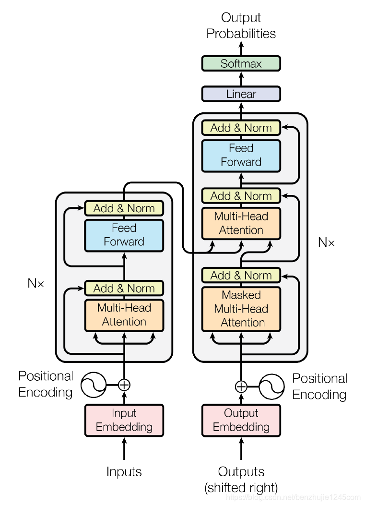

2017 年，Google 在论文 Attention is All you need 中提出了 Transformer 模型，其使用 Self-Attention 结构取代了在 NLP 任务中常用的 RNN 网络结构。相比 RNN 网络结构，其最大的优点是可以并行计算。Transformer 的整体模型架构如图 1.1 所示：

图 1.1 Transformer 模型架构

#### 1.1 Transformer 概览 

首先，让我们先将 Transformer 模型视为一个黑盒，如图 1.2 所示。在机器翻译任务中，将一种语言的一个句子作为输入，然后将其翻译成另一种语言的一个句子作为 输出。
