# 深度学习

## 要求

- 需要一定的数学基础，高数、线性代数、概率论
- 需要掌握机器学习基础，分类、回归等算法
- 需要会使用相关工具，Scikit-learn、Numpy、TensorFlow

## 目标

- 算法
  - 掌握神经网络的数学原理
  - 使用工具动手实现神经网络结构
- 应用
  - 使用TensorFlow编写神经网络案例

## 课程安排


## 环境要求

```
tensorflow==1.8.0
h5py==2.8.0
numpy==1.14.2
scikit-learn==0.18.1
matplotlib==2.2.2
```


# 第一章 深度学习与神经网络

```
知道深度学习与机器学习的区别
了解神经网络的结构组成
知道深度学习效果特点
知道逻辑回归的算法计算输出、损失函数
知道导数的计算图
知道逻辑回归的梯度下降算法
知道多样本的向量计算
应用完成向量化运算
应用完成一个单神经元神经网络的结构
知道浅层神经网络的前向计算过程
知道选择激活函数的原因
说明浅层网络的反向传播推导过程
应用完成一个浅层神经网络结构进行分类
了解深层网络的前向传播与反向传播的过程
```


# 1.1 深度学习介绍

## 学习目标

- 目标
  - 知道深度学习与机器学习的区别
  - 了解神经网络的结构组成
  - 知道深度学习效果特点
- 应用
  - 无

### 1.1.1 区别

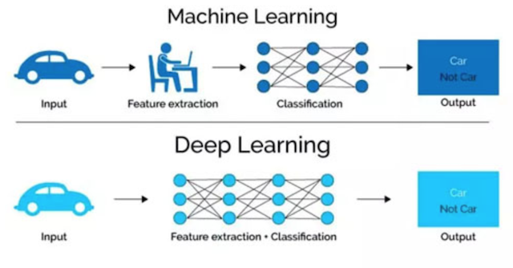

#### 1.1.1.1 特征提取方面

- 机器学习的**特征工程步骤是要靠手动完成的，而且需要大量领域专业知识**
- 深度学习**通常由多个层组成，它们通常将更简单的模型组合在一起，通过将数据从一层传递到另一层来构建更复杂的模型。通过大量数据的训练自动得到模型，不需要人工设计特征提取环节**。

> 深度学习算法试图从数据中学习高级功能，这是深度学习的一个非常独特的部分。因此，减少了为每个问题开发新特征提取器的任务。**适合用在难提取特征的图像、语音、自然语言领域**

### 1.1.2 深度学习应用场景

- 图像识别
  - 物体识别
  - 场景识别
  - 车型识别
  - 人脸检测跟踪
  - 人脸关键点定位
  - 人脸身份认证
- 自然语言处理技术
  - 机器翻译
  - 文本识别
  - 聊天对话
- 语音技术
  - 语音识别

### 1.1.3 深度学习代表算法-神经网络

#### 1.1.3.1 神经网络

**人工神经网络（ Artificial Neural Network， 简写为ANN）也简称为神经网络（NN）**。是一种模仿生物神经网络（动物的中枢神经系统，特别是大脑）结构和功能的 **计算模型**。经典的神经网络结构包含三个层次的神经网络。**分别输入层，输出层以及隐藏层。**

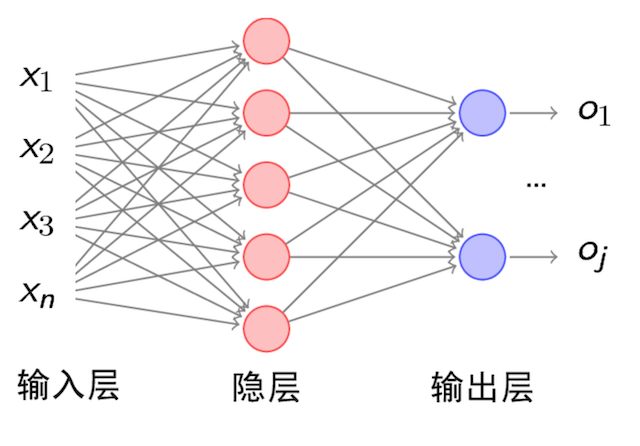

**其中每层的圆圈代表一个神经元，隐藏层和输出层的神经元有输入的数据计算后输出，输入层的神经元只是输入。**

- 神经网络的特点
  - 每个连接都有个权值，同一层神经元之间没有连接
  - 神经元当中会含有**激活函数**
  - 最后的输出结果对应的层也称之为**全连接层**

> 神经网络是深度学习的重要算法，用途在图像（如图像的分类、检测）和自然语言处理（如文本分类、聊天等）

那么为什么设计这样的结构呢？首先从一个最基础的结构说起，神经元。以前也称之为感知机。神经元就是要模拟人的神经元结构。

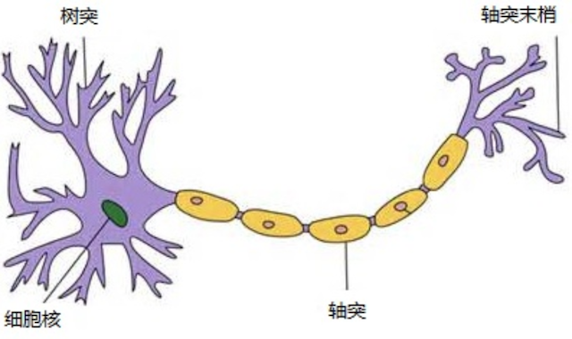

> 一个神经元通常具有多个**树突**，主要用来接受传入信息；而**轴突**只有一条，轴突尾端有许多轴突末梢可以给其他多个神经元传递信息。轴突末梢跟其他神经元的树突产生连接，从而传递信号。这个连接的位置在生物学上叫做“**突触**”。

#### 1.1.3.2 神经网络理解案例

我们以票房预测的例子说明

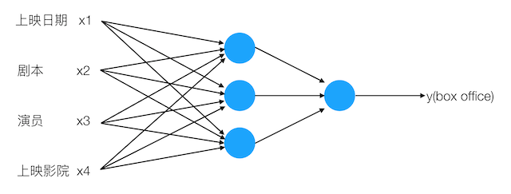

输入影响票房的N个因素，这里举例四个因素，结果输出一个Y预测票房结果

### 1.1.4 为什么深度学习现在效果非常好

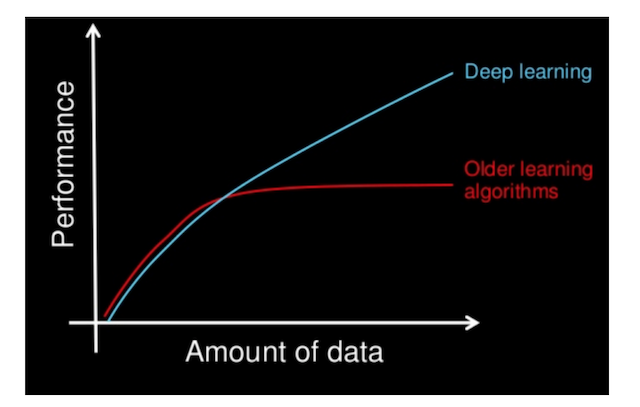

过去十多年，得益于数字社会的发展，积累了大量的数据。以前的一些算法到达了瓶颈期，它们无法适用于大量的数据。"大规模"一直推动深度学习的发展进步。不仅仅是数据量的大，算法模型规模越来越大等。

- 数据
- 计算
  - 训练网络需要GPU、TPU
- 算法
  - 一些创新，如ReLU激活函数


# 1.2 神经网络基础

## 学习目标

- 目标
  - 知道逻辑回归的算法计算输出、损失函数
  - 知道导数的计算图
  - 知道逻辑回归的梯度下降算法
  - 知道多样本的向量计算
- 应用
  - 应用完成向量化运算
  - 应用完成一个单神经元神经网络的结构

### 1.2.1 Logistic回归

#### 1.2.1.1 Logistic回归

逻辑回归是一个主要用于二分分类类的算法。那么逻辑回归是给定一个$x$, 输出一个该样本属于1对应类别的预测概率$\hat{y}=P(y=1|x)$

Logistic 回归中使用的参数如下**：$y$是目标值，$\hat{y}$是预测值，二者范围均属于0，1表示概率。**

- **输入的特征向量**：$x\in R^nx$，$x$是一个 n维的特征数量，用于训练的标签：$y\in 0,1$
- **参数**：权重：$w\in R^nx$, 偏置：$b\in R$
- 输出预测结果：$\hat{y} = \sigma(w^Tx+b)=\sigma(w_1x_1+w_2x_2+...+b)=\sigma(\theta^Tx)$

  - Sigmoid 函数： $ s = \sigma(w^Tx+b) = \sigma(z) = \frac{1}{1+e^{-z}}$
  - 如果z的结果非常大，那么S的结果接近于1
  - 如果z的结果较小或者是非常大的负数，那么S的结果接近于0

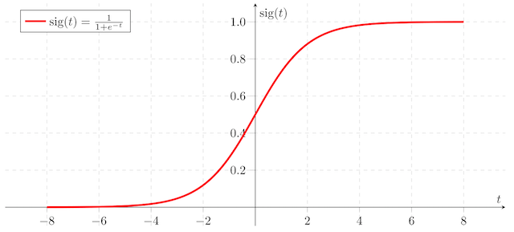

$e^{-z}$的函数如下

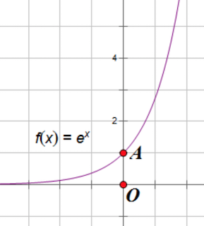

例如：

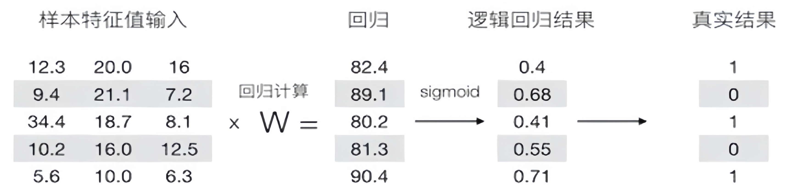

#### 1.2.1.2 逻辑回归损失函数

**损失函数（loss function）**用于衡量**预测结果与真实值之间的误差**。最简单的损失函数定义方式为平方差损失：

$L(\hat{y}, y)=\frac{1}{2}(\hat{y}-y)^{2}$，逻辑回归不用他，平方差损失函数有多个局部最小点，这一特性使得在优化的过程中很难找到损失最小的值.

逻辑回归一般使用$L(\hat{y}, y)=-(y \log \hat{y})-(1-y) \log (1-\hat{y})$

该式子的理解：

- 如果y=1,损失为$-\log\hat{y}$，那么要想损失越小，$\hat{y}$的值必须越大，即越趋近于或者等于1
- 如果y=0,损失为$\log(1-\hat{y})$),那么要想损失越小，那么$\hat{y}$的值越小，即趋近于或者等于0

损失函数是在单个训练样本中定义的，它衡量了在**单个**训练样本上的表现。**代价函数（cost function）**衡量的是在**全体**训练样本上的表现，即衡量参数 w 和 b 的效果，所有训练样本的损失平均值

$J(w,b)=\frac1m\sum_{i=1}^mL(\hat{y}^{(i)},y^{(i)})$

### 1.2.2 梯度下降算法

目的：找到损失函数的最小值

方法：梯度下降

函数的**梯度（gradient）**指出了函数的最陡增长方向。**梯度的方向走，函数增长得就越快。那么按梯度的负方向走，函数值自然就降低得最快了**。模型的训练目标即是寻找合适的 w 与 b 以最小化代价函数值。假设 **w 与 b 都是一维实数**，那么可以得到如下的 J 关于 w 与 b 的图：


可以看到，成本函数 J 是一个**凸函数**，**与非凸函数的区别在于其不含有多个局部最低。**

参数w和b的更新公式为：

$\large w:=w-\alpha\frac{dJ(w,b)}{dw}, b:=b-\alpha\frac{dJ(w,b)}{db}$

> 注：其中 α 表示学习速率，即每次更新的 w 的步伐长度，可以理解为走一大步还是一小步。当 w 大于最优解 w′ 时，导数大于 0，那么 w 就会向更小的方向更新。反之当 w 小于最优解 w′ 时，导数小于 0，那么 w 就会向更大的方向更新。迭代直到收敛。

通过平面来理解梯度下降过程：

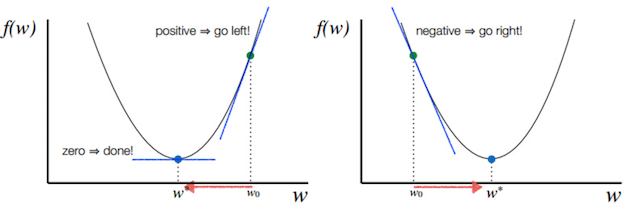

### 1.2.3 导数

理解梯度下降的过程之后，我们通过例子来说明梯度下降在计算导数意义或者说这个导数的意义。

#### 1.2.3.1 导数

导数也可以理解成某一点处的斜率。斜率这个词更直观一些。

- 各点处的导数值一样

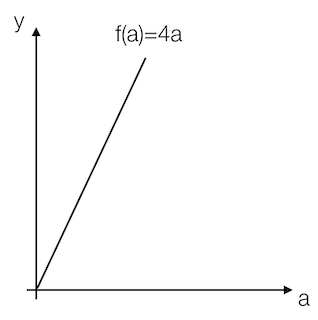

我们看到这里有一条直线，这条直线的斜率为4。我们来计算一个例子

例：取一点为a=2,那么y的值为8，我们稍微增加a的值为a=2.001,那么y的值为8.004，也就是当a增加了0.001，随后y增加了0.004，即4倍

那么我们的这个斜率可以理解为当一个点偏移一个不可估量的小的值，所增加的为4倍。

可以记作$\large \frac{f(a)}{da}$或者$\large \frac d{da}f(a)$。

- 各点的导数值不全一致

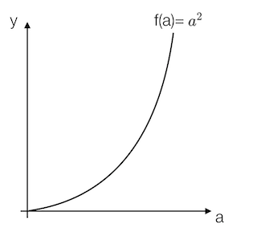

例：取一点为a=2,那么y的值为4，我们稍微增加a的值为a=2.001,那么y的值约等于4.004（4.004001），也就是当a增加了0.001，随后y增加了4倍

取一点为a=5,那么y的值为25，我们稍微增加a的值为a=5.001,那么y的值约等于25.01（25.010001），也就是当a增加了0.001，随后y增加了10倍

可以得出该函数的导数2为2a。

- 更多函数的导数结果

|                         函数                          |             导数             |
| :---------------------------------------------------: | :--------------------------: |
|                      $f(a)=a^2$                       |             $2a$             |
|                      $f(a)=a^3$                       |            $3a^2$            |
|                     $f(a)=ln(a)$                      |      $\large \frac1{a}$      |
|                      $f(a)=e^a$                       |            $e^a$             |
|         $$\sigma(z)=\Large \frac1{1+e^{-z}}$$         |  $$\sigma(z)(1-\sigma(z))$$  |
| $$g(z)=tanh(z)=\Large \frac{e^z-e^{-z}}{e^z+e^{-z}}$$ | $$1-(tanh(z))^2=1-(g(z))^2$$ |

#### 1.2.3.2 导数计算图

那么接下来我们来看看含有多个变量的到导数流程图，假设𝐽(𝑎,𝑏,𝑐)=3(𝑎+𝑏𝑐)*J*(*a*,*b*,*c*)=3(*a*+*b**c*)

我们以下面的流程图代替

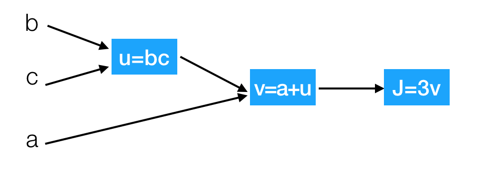

这样就相当于从左到右计算出结果，然后从后往前计算出导数

- 导数计算

问题：那么现在我们要计算J相对于三个变量a,b,c的导数？

假设b=4,c=2,a=7,u=8,v=15,j=45

- $\large\frac{dJ}{dv}=3$

增加v从15到15.001，那么$J\approx45.003$

- $\large\frac{dJ}{da}=3$

增加a从7到7.001,那么$v\approx15.001$，$J\approx45.003$

这里也涉及到链式法则

#### 1.2.3.3 链式法则

- $\large\frac{dJ}{da}=\frac{dJ}{dv}\frac{dv}{da}=3*1=3$

J相对于a增加的量可以理解为J相对于v*v相对于a增加的

接下来计算

- $\large\frac{dJ}{db}=6=\frac{dJ}{du}\frac{du}{db}=3*2\ ,\frac{dJ}{dc}=9=\frac{dJ}{du}\frac{du}{dc}=3*3$

#### 1.2.3.4 逻辑回归的梯度下降

逻辑回归的梯度下降过程计算图，首先从前往后的计算图得出如下

- $z=w^Tx+b$
- $\hat{y}=a=\sigma(z)$
- $J(a,y)=-(y\log a)-(1-y)\log(1-a)$

那么计算图从前向过程为,假设样本有两个特征

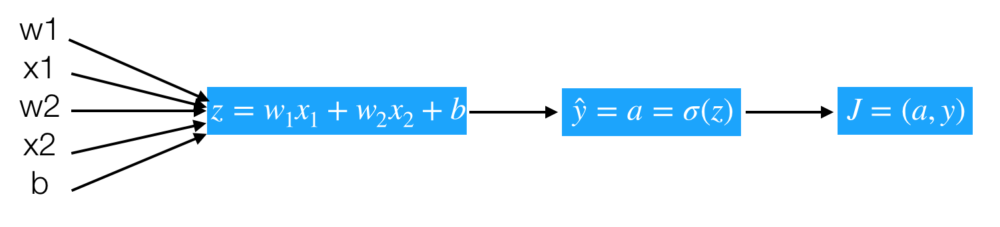

问题：计算出$J$关于$z$的导数

- $\large dz=\frac{dJ}{da}\frac{da}{dz}=a-y$
  - $\large\frac{dJ}{da}=-\frac{y}{a}+\frac{1-y}{1-a}$
  - $\large\frac{da}{dz}=a(1-a)$

所以我们这样可以求出总损失相对于$w_1,w_2,b$参数的某一点导数，从而可以更新参数

- $$ \large\frac{dJ}{dw1}=\frac{dJ}{dz}\frac{dz}{dw1}=dz*x1 $$
- $$\large\frac{dJ}{dw2}=\frac{dJ}{dz}\frac{dz}{dw1}=dz*x2 $$
- $$ \large\frac{dJ}{db}=dz $$

相信上面的导数计算应该都能理解了，所以当我们**计算损失函数的某个点相对于𝑤1,𝑤2,𝑏\*w\*1,\*w\*2,\*b\*的导数之后，就可以更新这次优化后的结果。**

$\begin{aligned}
&w_{1}:=w_{1}-\alpha\frac{dJ(w_{1},b)}{dw_{1}} \\
&w_{2}:=w_{2}-\alpha\frac{dJ(w_{2},b)}{dw2} \\
&b:=b-\alpha\frac{dJ(w,b)}{db}
\end{aligned}$

### 1.2.4 向量化编程

**每更新一次梯度时候，在训练期间我们会拥有m个样本，那么每个样本都可以通过梯度下降计算来计算每个样本的参数的梯度。最终，我们要对所有样本的参数梯度进行统一整理，即求和在求平均值，比如m各样本，$w_{ij}$表示第i个样本的第j个权重，$b_{ij}$同理，我们要将$w_{11}+w_{21}+...+w_{m1},w_{12}+w_{22}+...,w_{m2},...,w_{1n}+...w_{mn}$,求和在求平均值，$b_{ij}$同理。**


$J(w,b)=\frac1m\sum_{i=1}^mL(a^{(i)},y^{(i)})$

计算参数的梯度为：$d(w_1)^i,d(w_2)^i,d(b)^i$,这样，我们想要得到最终的𝑑𝑤1,𝑑𝑤2,𝑑𝑏，如何去设计一个算法计算？伪代码实现：

> 初始化，假设
>
> $\large\begin{aligned}
>&J=0,dw_1=0,dw_2=0,db=0 \\
> &for\ i\ in\ m: \\
>&z^i=w^Tx^i+b \\
>  &a^i=\sigma(z^i) \\
>&J+=-[y^ilog(a^i)+(1-y^i)log(1-a^i)]
>  \end{aligned}$
>
>  每个梯度计算结果相加
>
>  $\large\begin{aligned}&dz^i=a^i-y^i \\
>&dw_1+=x_1^idz^i \\
>  &dw_2+=x_2^idz^i \\
>&db+=dz^i
>  \end{aligned}$
>
>  最后求出平均梯度
>
>  $\large\begin{aligned}&J/=m\\&dw_1/=m\\&dw_2/=m\\&db/=m\end{aligned}$

#### 1.2.4.1 向量化优势

**什么是向量化**

由于在进行计算的时候，最好不要使用for循环去进行计算，因为有Numpy可以进行更加快速的向量化计算。

在公式$$ z=w^{T}x+b $$中w,x都可能是多个值，也就是$$ \bar{w}=\left(\begin{array}{c}w_1\\ \vdots\\ w_{n}\end{array}\right),\bar{x}=\left(\begin{array}{c}x_1\\ \vdots\\ x_{n}\end{array}\right) $$

```python
import numpy as np
import time
a = np.random.rand(100000)
b = np.random.rand(100000)
```

- 第一种方法

```python
# 第一种for 循环
c = 0
start = time.time()
for i in range(100000):
    c += a[i]*b[i]
end = time.time()

print("计算所用时间%s " % str(1000*(end-start)) + "ms")
```

- 第二种向量化方式使用np.dot

```python
# 向量化运算
start = time.time()
c = np.dot(a, b)
end = time.time()
print("计算所用时间%s " % str(1000*(end-start)) + "ms")
```

Numpy能够充分的利用并行化，Numpy当中提供了很多函数使用

|        函数         |       作用       |
| :-----------------: | :--------------: |
| np.ones or np.zeros | 全为1或者0的矩阵 |
|       np.exp        |     指数计算     |
|       np.log        |     对数计算     |
|       np.abs        |    绝对值计算    |

**所以上述的m个样本的梯度更新过程，就是去除掉for循环。原本这样的计算**

#### 1.2.4.2 向量化实现伪代码

- 思路

| $$ z^1=w^{T}x^1+b $$  | $$ z^2=w^{T}x^2+b $$  | $$ z^3=w^{T}x^3+b $$  |
| :-------------------: | :-------------------: | :-------------------: |
| $$ a^1=\sigma(z^1) $$ | $$ a^2=\sigma(z^2) $$ | $$ a^3=\sigma(z^3) $$ |

可以变成这样的计算

$\left.\bar{w}=\left(\begin{array}{c}w_1\\\vdots\\w_n\end{array}\right.\right),\quad\bar{x}=\left(\begin{array}{ccccc}\vdots&\vdots&\vdots&\vdots&\vdots\\x^1&x^2&x^3&\vdots&x^m\\\vdots&\vdots&\vdots&\vdots&\vdots\end{array}\right)$

注：w的形状为(n,1), x的形状为(n, m)，其中n为特征数量，m为样本数量

我们可以让$Z=W^TX+b=\left(z_1,z_2,z_3\cdots z_m\right)+b=np.dot(W^T,X)+b$，得出的结果为(1, m)大小的矩阵 注：大写的𝑊,𝑋*W*,*X*为多个样本表示

- 实现多个样本向量化计算的伪代码

> 初始化，假设n个特征,m个样本
>
> $ \large\begin{aligned}&J=0,\\&W=np.zeros([n,1]),\\&b=0\\&Z=np.dot(W^{T},X)+bA=\sigma(Z)\end{aligned}$
>
> 每个样本梯度计算过程为：
>
> $\large\begin{aligned}&dZ=A-Y\\&dW=\frac{1}{m}XdZ^{T}\\&db=\frac{1}{m}np.sum(dZ)\end{aligned}$
>
> 更新
>
> $$ \large\begin{aligned}&w:=w-\alpha dw\\&b:=b-\alpha db\end{aligned} $$

这相当于一次使用了M个样本的所有特征值与目标值，那我们知道如果想多次迭代，使得这M个样本重复若干次计算

### 1.2.5 正向传播与反向传播 

前面我们所做的整个过程分为两个部分，一个是从前往后的计算出梯度与损失，另外一部分是从后往前计算参数的更新梯度值。所以在神经网络当中会经常出现两个概念，正向传播与反向传播。


# 1.3 浅层神经网络

## 学习目标

- 目标
  - 知道浅层神经网络的前向计算过程
  - 知道选择激活函数的原因
  - 说明浅层网络的反向传播推导过程
- 应用
  - 应用完成一个浅层神经网络结构进行分类

### 1.3.1 浅层神经网络表示

之前已经说过神经网络的结构了，在这不重复叙述。假设我们有如下结构的网络

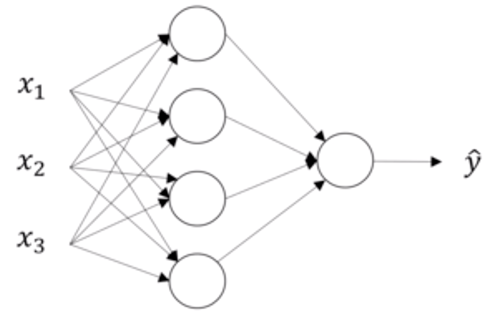

对于这个网络我们建立一个简单的图示？我们对第一个隐藏层记为[1]，输出层为[2]。如下图

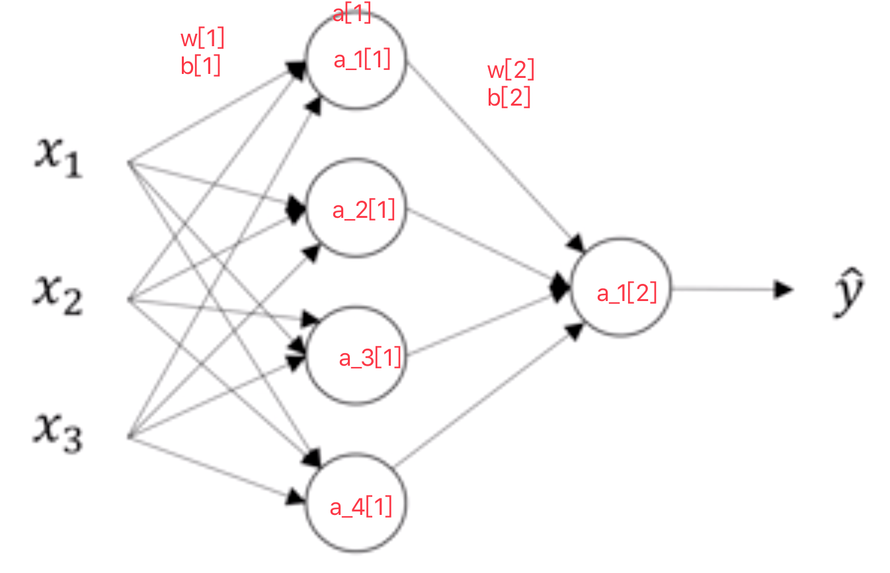

计算图如下

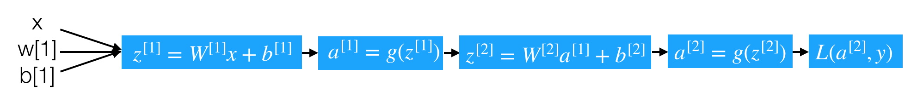

- 每个神经元的计算分解步骤如下

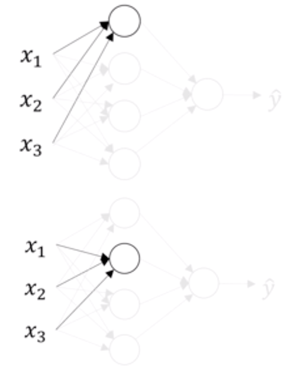

- 第一层中的第一个神经元

$$ z_1^{\begin{bmatrix}1\end{bmatrix}}=(W_1^{\begin{bmatrix}1\end{bmatrix}})^{T}x+b_1^{\begin{bmatrix}1\end{bmatrix}}$$

$a_1^{[1]}=\sigma(z_1^{\begin{bmatrix}1\end{bmatrix}}) $

- 第一层中的第二个神经元

$$ z_2^{\begin{bmatrix}1\end{bmatrix}}=(W_2^{\begin{bmatrix}1\end{bmatrix}})^{T}x+b_2^{\begin{bmatrix}1\end{bmatrix}} $$

$$ a_2^{[1]}=\sigma(z_2^{[1]}) $$

得出第一层的计算：

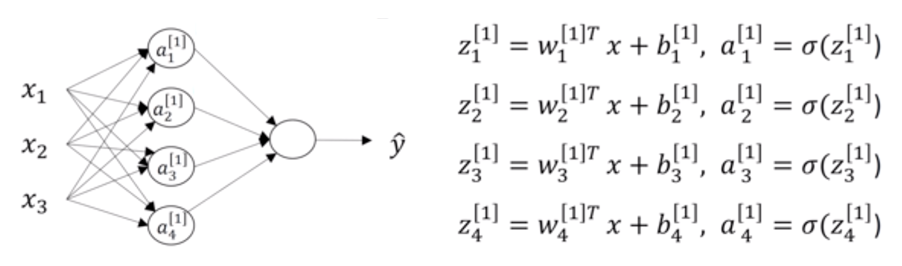

### 1.3.2 单个样本的向量化表示

那么现在把上面的第一层的计算过程过程用更简单的形式表现出来就是这样的计算

$\left(\begin{array}{ccc}\cdots&(W_1^{[1]})^T&\cdots\\\cdots&(W_2^{[1]})^T&\cdots\\\cdots&(W_3^{[1]})^T&\cdots\\\cdots&(W_4^{[1]})^T&\cdots\end{array}\right)*\left(\begin{array}{c}x_1\\x_2\\x_3\end{array}\right)+\left(\begin{array}{c}b_1^{[1]}\\b_2^{[1]}\\b_3^{[1]}\\b_4^{[1]}\end{array}\right)$

那么对于刚才我们所举的例子，将所有层通过向量把整个前向过程表示出来，并且确定每一个组成部分的形状

> 前向过程计算：
>
> $\begin{aligned}
> &z^{\begin{bmatrix}1\end{bmatrix}} =W^{\lfloor1\rfloor}x+b^{\lfloor1\rfloor}\text{ 形状:(4,1)}=(4,3)^\star(3,1)+(4,1)  \\
> &a^{\begin{bmatrix}1\end{bmatrix}} =\sigma(z^{\begin{bmatrix}1\end{bmatrix}})\text{ 形状: }(4,1)  \\
> &z^{\begin{bmatrix}2\end{bmatrix}} =W^{[2]}a^{[1]}+b^{[2]}\text{ 形状: }(1,1)=(1,4)^\star(4,1)+(1,1)  \\
> &a^{\begin{bmatrix}2\end{bmatrix}} =\sigma(z^{[2]})\text{ 形状:(1,1)} 
> \end{aligned}$

那么如果有多个样本，需要这样去做

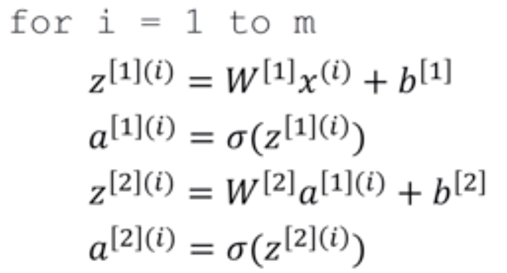

- 多个样本的向量化表示

假设一样含有M个样本，那么上述过程变成

> $\begin{aligned}
> &Z^{\begin{bmatrix}1\end{bmatrix}} =W^{\begin{bmatrix}1\end{bmatrix}}X+b^{\begin{bmatrix}1\end{bmatrix}}\text{ 形状:(4,m)}=(4,3)^\star(3,m)+(4,1)  \\
> &A^{\begin{bmatrix}1\end{bmatrix}} =\sigma(Z^{\begin{bmatrix}1\end{bmatrix}})\text{ 形状:(4,m)}  \\
> &Z^{\begin{bmatrix}2\end{bmatrix}} =W^{[2]}A^{[1]}+b^{[2]}\text{ 形状:(1,m)}=(1,4)^\star(4,m)+(1,1)  \\
> &A^{\begin{bmatrix}2\end{bmatrix}} =\sigma(Z^{\begin{bmatrix}2\end{bmatrix}})\text{ 形状:(1,m)} 
> \end{aligned}$

### 1.3.4 激活函数的选择

**涉及到网络的优化时候，会有不同的激活函数选择有一个问题是神经网络的隐藏层和输出单元用什么激活函数。之前我们都是选用 sigmoid 函数，但有时其他函数的效果会好得多，大多数通过实践得来，没有很好的解释性。**

可供选用的激活函数有：

- $tanh$ 函数（the hyperbolic tangent function，双曲正切函数）：

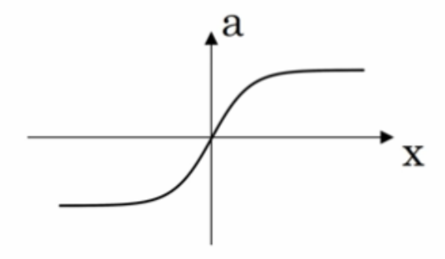

效果比 sigmoid 函数好,因为函数输出介于 -1 和 1 之间。

注 :tanh 函数存在和 sigmoid 函数一样的缺点：当 z 趋紧无穷大（或无穷小），导数的梯度（即函数的斜率）就趋紧于 0，这使得梯度算法的速度会减慢。

- ReLU 函数（the rectified linear unit，修正线性单元）

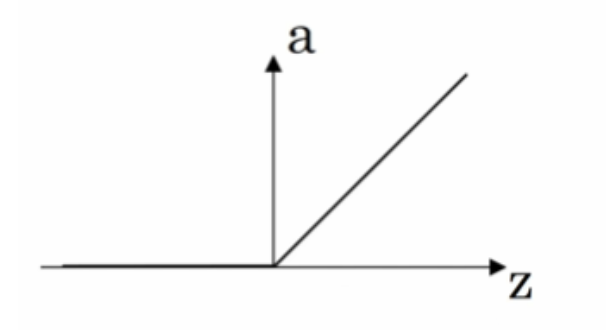

当 z > 0 时，梯度始终为 1，从而提高神经网络基于梯度算法的运算速度，收敛速度远大于 sigmoid 和 tanh。然而当 z < 0 时，梯度一直为 0，但是实际的运用中，该缺陷的影响不是很大。

- Leaky ReLU（带泄漏的 ReLU）：

  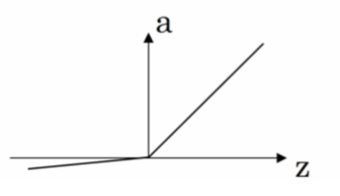

Leaky ReLU 保证在 z < 0 的时候，梯度仍然不为 0。理论上来说，Leaky ReLU 有 ReLU 的所有优点，但在实际操作中没有证明总是好于 ReLU，因此不常用。

#### 1.3.4.1 为什么需要非线性的激活函数

使用线性激活函数和不使用激活函数、直接使用 Logistic 回归没有区别，那么无论神经网络有多少层，输出都是输入的线性组合，与**没有隐藏层**效果相当，就成了最原始的感知器了。

> a^{[1]} = z^{[1]} = W^{[1]}x+b^{[1]}*a*[1]=*z*[1]=*W*[1]*x*+*b*[1]
>
> {a}^{[2]}=z^{[2]} = W^{[2]}a^{[1]}+b^{[2]}*a*[2]=*z*[2]=*W*[2]*a*[1]+*b*[2]
>
> 那么这样的话相当于
>
> {a}^{[2]}=z^{[2]} = W^{[2]}(W^{[1]}x+b^{[1]})+b^{[2]}=(W^{[2]}W^{[1]})x+(W^{[2]}b^{[1]}+b^{[2]})=wx+b*a*[2]=*z*[2]=*W*[2](*W*[1]*x*+*b*[1])+*b*[2]=(*W*[2]*W*[1])*x*+(*W*[2]*b*[1]+*b*[2])=*w**x*+*b*

### 1.3.5 修改激活函数的前向传播和反向传播

将上述网络的隐层激活函数修改为tanh，最后一层同样还是二分类，所以激活函数选择依然是sigmoid函数

- 前向传播

> Z^{[1]} = W^{[1]}X+b^{[1]}*Z*[1]=*W*[1]*X*+*b*[1]
>
> {A}^{[1]}=tanh(Z^{[1]})*A*[1]=*t**a**n**h*(*Z*[1])
>
> Z^{[2]} = W^{[2]}A^{[1]}+b^{[2]}*Z*[2]=*W*[2]*A*[1]+*b*[2]
>
> A^{[2]}=\sigma(Z^{[2]})*A*[2]=*σ*(*Z*[2])

- 反向梯度下降

那么通过这个计算图来理解这个过程，单个样本的导数推导过程：


由于网络已经存在两层，所以我们需要从后往前得到导数结果,并且多个样本的情况下改写成

> 最后一个输出层的参数的导数：
>
> dZ^{[2]} = A^{[2]} - Y*d**Z*[2]=*A*[2]−*Y*
>
> dW^{[2]}=\frac{1}{m}dZ^{[2]}{A^{[1]}}^{T}*d**W*[2]=*m*1*d**Z*[2]*A*[1]*T*
>
> db^{[2]}=\frac{1}{m}np.sum(dZ^{[2]}, axis=1)*d**b*[2]=*m*1*n**p*.*s**u**m*(*d**Z*[2],*a**x**i**s*=1)
>
> 隐藏层的导数计算：
>
> dZ^{[1]} = {W^{[2]}}^{T}dZ^{[2]}*{(1-g(Z^{[1]})}^{2}={W^{[2]}}^{T}dZ^{[2]}*{(1-A^{[1]})}^{2}*d**Z*[1]=*W*[2]*T**d**Z*[2]∗(1−*g*(*Z*[1])2=*W*[2]*T**d**Z*[2]∗(1−*A*[1])2
>
> dW^{[1]}=\frac{1}{m}dZ^{[1]}X^{T}*d**W*[1]=*m*1*d**Z*[1]*X**T*
>
> db^{[1]} = \frac{1}{m}np.sum(dZ^{[1]}, axis=1)*d**b*[1]=*m*1*n**p*.*s**u**m*(*d**Z*[1],*a**x**i**s*=1)


# 1.4 深层神经网络

## 学习目标

- 目标
  - 了解深层网络的前向传播与反向传播的过程
- 应用
  - 无

#### 为什么使用深层网络

对于人脸识别等应用，神经网络的第一层从原始图片中提取人脸的轮廓和边缘，每个神经元学习到不同边缘的信息；网络的第二层将第一层学得的边缘信息组合起来，形成人脸的一些局部的特征，例如眼睛、嘴巴等；后面的几层逐步将上一层的特征组合起来，形成人脸的模样。随着神经网络层数的增加，特征也从原来的边缘逐步扩展为人脸的整体，由整体到局部，由简单到复杂。层数越多，那么模型学习的效果也就越精确。

通过例子可以看到，随着神经网络的深度加深，模型能学习到更加复杂的问题，功能也更加强大。

### 1.4.1 深层神经网络表示

#### 1.4.1.1 什么是深层网络？

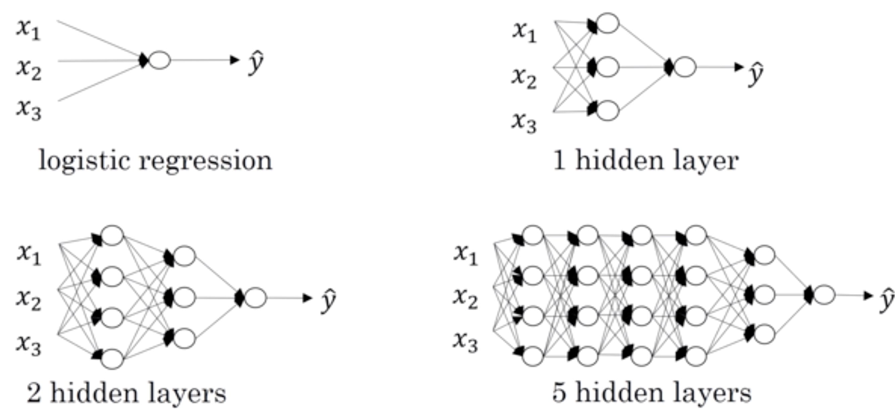

使用浅层网络的时候很多分类等问题得不到很好的解决，所以需要深层的网络。

### 1.4.2 四层网络的前向传播与反向传播

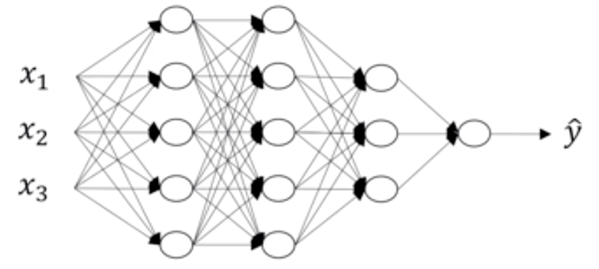

在这里首先对每层的符号进行一个确定，我们设置L为第几层，n为每一层的个数，L=[L1,L2,L3,L4],n=[5,5,3,1]

#### 1.4.2.1 前向传播

首先还是以单个样本来进行表示,每层经过线性计算和激活函数两步计算

> z^{[1]} = W^{[1]}x+b^{[1]}, a^{[1]}=g^{[1]}(z^{[1]})*z*[1]=*W*[1]*x*+*b*[1],*a*[1]=*g*[1](*z*[1]), 输入x*x*, 输出a^{[1]}*a*[1]
>
> z^{[2]} = W^{[2]}a^{[1]}+b^{[2]}, a^{[2]}=g^{[2]}(z^{[2]})*z*[2]=*W*[2]*a*[1]+*b*[2],*a*[2]=*g*[2](*z*[2]),输入a^{[1]}*a*[1], 输出a^{[2]}*a*[2]
>
> z^{[3]} = W^{[3]}a^{[2]}+b^{[3]},a^{[3]}=g^{[3]}(z^{[3]})*z*[3]=*W*[3]*a*[2]+*b*[3],*a*[3]=*g*[3](*z*[3]), 输入a^{[2]}*a*[2], 输出a^{[3]}*a*[3]
>
> z^{[4]} = W^{[4]}a^{[3]}+b^{[4]},a^{[4]}=\sigma(z^{[4]})*z*[4]=*W*[4]*a*[3]+*b*[4],*a*[4]=*σ*(*z*[4]), 输入a^{[3]}*a*[3], 输出a^{[4]}*a*[4]

我们将上式简单的用通用公式表达出来，x = a^{[0]}*x*=*a*[0]

> z^{[L]} = W^{[L]}a^{[L-1]}+b^{[L]}, a^{[L]}=g^{[L]}(z^{[L]})*z*[*L*]=*W*[*L*]*a*[*L*−1]+*b*[*L*],*a*[*L*]=*g*[*L*](*z*[*L*]), 输入a^{[L-1]}*a*[*L*−1], 输出a^{[L]}*a*[*L*]

- m个样本的向量表示

> Z^{[L]} = W^{[L]}A^{[L-1]}+b^{[L]}*Z*[*L*]=*W*[*L*]*A*[*L*−1]+*b*[*L*]
>
> A^{[L]}=g^{[L]}(Z^{[L]})*A*[*L*]=*g*[*L*](*Z*[*L*])
>
> 输入a^{[L-1]}*a*[*L*−1], 输出a^{[L]}*a*[*L*]

#### 1.4.2.2 反向传播

因为涉及到的层数较多，所以我们通过一个图来表示反向的过程

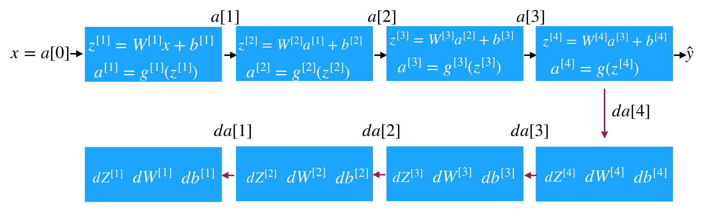

- 反向传播的结果（理解）

单个样本的反向传播：

> dZ^{[l]}=\frac{dJ}{da^{[l]}}\frac{da^{[l]}}{dZ^{[l]}}=da^{[l]}*g^{[l]}{'}(Z^{[l]})*d**Z*[*l*]=*d**a*[*l*]*d**J**d**Z*[*l*]*d**a*[*l*]=*d**a*[*l*]∗*g*[*l*]′(*Z*[*l*])
>
> dW^{[l]}=\frac{dJ}{dZ^{[l]}}\frac{dZ^{[l]}}{dW^{[l]}}=dZ^{[l]}\cdot a^{[l-1]}*d**W*[*l*]=*d**Z*[*l*]*d**J**d**W*[*l*]*d**Z*[*l*]=*d**Z*[*l*]⋅*a*[*l*−1]
>
> db^{[l]}=\frac{dJ}{dZ^{[l]}}\frac{dZ^{[l]}}{db^{[l]}}=dZ^{[l]}*d**b*[*l*]=*d**Z*[*l*]*d**J**d**b*[*l*]*d**Z*[*l*]=*d**Z*[*l*]
>
> da^{[l-1]}=W^{[l]T}\cdot dZ^{[l]}*d**a*[*l*−1]=*W*[*l*]*T*⋅*d**Z*[*l*]

多个样本的反向传播

> dZ^{[l]}=dA^{[l]}*g^{[l]}{'}(Z^{[l]})*d**Z*[*l*]=*d**A*[*l*]∗*g*[*l*]′(*Z*[*l*])
>
> dW^{[l]}=\frac{1}{m}dZ^{[l]}\cdot {A^{[l-1]}}^{T}*d**W*[*l*]=*m*1*d**Z*[*l*]⋅*A*[*l*−1]*T*
>
> db^{[l]}=\frac{1}{m}np.sum(dZ^{[l]},axis=1)*d**b*[*l*]=*m*1*n**p*.*s**u**m*(*d**Z*[*l*],*a**x**i**s*=1)
>
> dA^{[l]}=W^{[l+1]T}\cdot dZ^{[l+1]}*d**A*[*l*]=*W*[*l*+1]*T*⋅*d**Z*[*l*+1]

### 1.4.3 参数与超参数

#### 1.4.3.1 参数

**参数**即是我们在过程中想要模型学习到的信息（**模型自己能计算出来的**），例如 W[l]W[l]，b[l]b[l]。而**超参数（hyper parameters）**即为控制参数的输出值的一些网络信息（**需要人经验判断**）。超参数的改变会导致最终得到的参数 W[l]，b[l] 的改变。

#### 1.4.3.2 超参数

典型的超参数有：

- 学习速率：α
- 迭代次数：N
- 隐藏层的层数：L
- 每一层的神经元个数：n[1]，n[2]，...
- 激活函数 g(z) 的选择

当开发新应用时，预先很难准确知道超参数的最优值应该是什么。因此，通常需要尝试很多不同的值。应用深度学习领域是一个很大程度基于经验的过程。

#### 1.4.3.3 参数初始化

- 为什么要随机初始化权重

**如果在初始时将两个隐藏神经元的参数设置为相同的大小，那么两个隐藏神经元对输出单元的影响也是相同的，通过反向梯度下降去进行计算的时候，会得到同样的梯度大小，所以在经过多次迭代后，两个隐藏层单位仍然是对称的。无论设置多少个隐藏单元，其最终的影响都是相同的，那么多个隐藏神经元就没有了意义。**

在初始化的时候，W 参数要进行随机初始化，不可以设置为 0。b 因为不存在上述问题，可以设置为 0。

以 2 个输入，2 个隐藏神经元为例：

```py
W = np.random.rand(2,2)* 0.01
b = np.zeros((2,1))
```

- 初始化权重的值选择

这里将 W 的值乘以 0.01（或者其他的常数值）的原因是为了使得权重 W 初始化为较小的值，**这是因为使用 sigmoid 函数或者 tanh 函数作为激活函数时，W 比较小，则 Z=WX+b 所得的值趋近于 0，梯度较大，能够提高算法的更新速度。而如果 W 设置的太大的话，得到的梯度较小，训练过程因此会变得很慢。**

ReLU 和 Leaky ReLU 作为激活函数时不存在这种问题，因为在大于 0 的时候，梯度均为 1。


# 1.5 总结

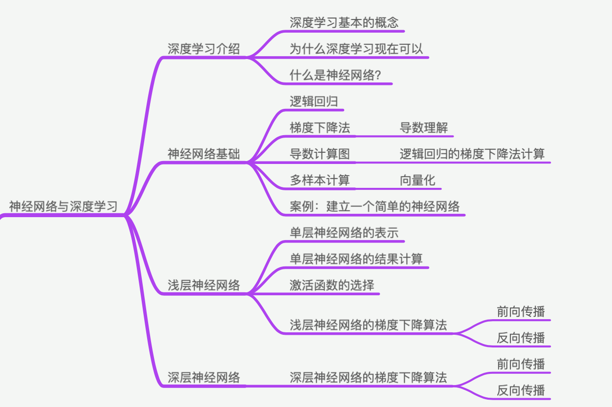
