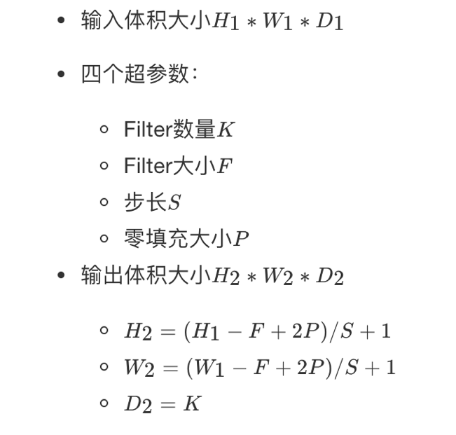

# 卷积神经网络

```
了解卷积神经网络的构成
记忆卷积的原理以及计算过程
了解池化的作用以及计算过程
知道LeNet-5网络结构
了解经典的分类网络结构
知道NIN中1x1卷积原理以及作用
知道Inception的作用
了解迁移学习以及技巧
应用卷积神经网络进行手势识别
```


# 3.1 图像数据与边缘检测

## 学习目标

- 目标
  - 了解卷积网络的历史
  - 了解边缘检测相关概念以及卷积运算过程
- 应用
  - 无

### 3.1.1 为什么需要卷积神经网络

在**计算机视觉**领域，通常要做的就是指用机器程序替代人眼对目标图像进行识别等。**那么神经网络也好还是卷积神经网络其实都是上个世纪就有的算法，只是近些年来电脑的计算能力已非当年的那种计算水平，同时现在的训练数据很多**，于是神经网络的相关算法又重新流行起来，因此卷积神经网络也一样流行。

- 1974年，Paul Werbos提出了误差反向传导来训练人工神经网络，使得训练多层神经网络成为可能。
- **1979年，Kunihiko Fukushima（福岛邦彦），提出了Neocognitron， 卷积、池化的概念基本形成。**
- **1986年，Geoffrey Hinton与人合著了一篇论文：Learning representations by back-propagation errors。**
- 1989年，Yann LeCun提出了一种用反向传导进行更新的卷积神经网络，称为LeNet。
- 1998年，Yann LeCun改进了原来的卷积网络，LeNet-5。

#### 3.1.1.2 图像特征数量对神经网络效果压力

假设下图是一图片大小为28 * 28 的黑白图片时候，每一个像素点只有一个值（单通道）。那么总的数值个数为 784个特征。


那现在这张图片是彩色的，那么彩色图片由RGB三通道组成，也就意味着总的数值有28 *28* 3 = 2352个值。


从上面我们得到一张图片的输入是2352个特征值，即神经网路当中与若干个神经元连接，假设第一个隐层是10个神经元，那么也就是23520个权重参数。

**如果图片再大一些呢，假设图片为1000 \*1000\* 3，那么总共有3百万数值，同样接入10个神经元，那么就是3千万个权重参数。这样的参数大小，神经网络参数更新需要大量的计算不说，也很难达到更好的效果，大家就不倾向于使用多层神经网络了。**

所以就有了卷积神经网络的流行，那么卷积神经网络为什么大家会选择它。那么先来介绍感受野以及边缘检测的概念。

### 3.1.2 感受野

1962年Hubel和Wiesel通过对**猫视觉皮层细胞**的研究，提出了感受野(receptive field)的概念，Fukushima基于感受野概念提出的神经认知机(neocognitron)可以看作是卷积神经网络的第一个实现网络。

**单个感受器与许多感觉神经纤维相联系，感觉信息是通过许多感受神经纤维发放总和性的空间与时间类型不同的冲动，相当于经过编码来传递。**


### 3.1.3 边缘检测

**为了能够用更少的参数，检测出更多的信息，基于上面的感受野思想。**通常神经网络需要检测出物体最明显的垂直和水平边缘来区分物体。比如


看一个列子，一个 6×6的图像卷积与一个3×3的过滤器（Filter or kenel）进行**卷积运算（符号为 \*），\* 也可能是矩阵乘法所以通常特别指定是卷积的时候代表卷积意思。**

- 相当于将 Filter 放在Image 上，从左到右、从上到下地（默认一个像素）移动过整个Image，分别计算 ImageImage 被 Filter 盖住的部分与 Filter的逐元素乘积的和


在这个6×6 的图像中，左边一半像素的值全是 10，右边一半像素的值全是 0，中间是一条非常明显的垂直边缘。这个图像与过滤器卷积的结果中，中间两列的值都是 30，两边两列的值都是 0，即检测到了原 6×66×6 图像中的垂直边缘。

注：虽然看上去非常粗，是因为我们的图像太小，只有5个像素长、宽，所以最终得到结果看到的是两个像素位置，如果在一个500 x 500的图当中，就是一个竖直的边缘了。


随着深度学习的发展，我们需要检测更复杂的图像中的边缘，与其使用由人手工设计的过滤器，**还可以将过滤器中的数值作为参数，通过反向传播来学习得到**。算法可以根据实际数据来选择合适的检测目标，无论是检测水平边缘、垂直边缘还是其他角度的边缘，并习得图像的低层特征。


# 3.2 卷积神经网络(CNN)原理

## 学习目标

- 目标
  - 了解卷积神经网络的构成
  - 记忆卷积的原理以及计算过程
  - 了解池化的作用以及计算过程
- 应用
  - 无

### 3.2.1 卷积神经网络的组成

- 定义
  - 卷积神经网络由**一个或多个卷积层、池化层以及全连接层等组成**。与其他深度学习结构相比，卷积神经网络在图像等方面能够给出更好的结果。这一模型也可以使用**反向传播算法**进行训练。相比较其他浅层或深度神经网络，卷积神经网络需要考量的参数更少，使之成为一种颇具吸引力的深度学习结构。

我们来看一下卷积网络的整体结构什么样子。


其中包含了几个主要结构

- **卷积层（Convolutions）**
- **池化层（Subsampling）**
- **全连接层（Full connection）**
- 激活函数

### 3.2.2 卷积层

- 目的
  - 卷积运算的目的是提取输入的不同特征，某些卷积层可能只能提取一些低级的特征如边缘、线条和角等层级，更多层的网路能从低级特征中迭代提取更复杂的特征。
- 参数：
  - size:卷积核/过滤器大小，**选择有1 \*1， 3\* 3， 5 \* 5**
  - padding：**零填充，Valid 与Same**
  - stride:步长，**通常默认为1**
- 计算公式



#### 3.2.2.1 卷积运算过程

对于之前介绍的卷积运算过程，我们用一张动图来表示更好理解些。一下计算中，假设图片长宽相等，设为N

- 一个步长，3 X 3 卷积核运算

假设是一张5 X 5 的单通道图片，通过使用3 X 3 大小的卷积核运算得到一个 3 X 3大小的运算结果（图片像素数值仅供参考）


我们会发现进行卷积之后的图片变小了，假设N为图片大小，F为卷积核大小

相当于$N - F + 1 = 5 - 3 + 1 = 3$

如果我们换一个卷积核大小或者加入很多层卷积之后，图像可能最后就变成了1 X 1 大小，这不是我们希望看到的结果。并且对于原始图片当中的边缘像素来说，只计算了一遍，二对于中间的像素会有很多次过滤器与之计算，这样导致对边缘信息的丢失。

- 缺点
  - 图像变小
  - 边缘信息丢失

### 3.2.3 padding-零填充

零填充：在图片像素的最外层加上若干层0值，若一层，记做p =1。

- 为什么增加的是0？

因为0在权重乘积和运算中对最终结果不造成影响，也就避免了图片增加了额外的干扰信息。


这张图中，还是移动一个像素，并且外面增加了一层0。那么最终计算结果我们可以这样用公式来计算：

$5 + 2 * p - 3 + 1 = 5+2*1−3+1=5$

P为1，那么最终特征结果为5。实际上我们可以填充更多的像素，假设为2层，则

$5 + 2 * 2 - 3 + 1 = 5+2∗2−3+1=7$，这样得到的观察特征大小比之前图片大小还大。所以我们对于零填充会有一些选择，该填充多少？

#### 3.2.3.1 Valid and Same卷积

有两种两种形式，所以为了避免上述情况，大家选择都是Same这种填充卷积计算方式

- Valid :不填充，也就是最终大小为
  - $(N - F + 1)$ 
- Same：输出大小与原图大小一致，那么
  - $(N + 2P - F + 1)=N$

那也就意味着，之前大小与之后的大小一样，得出下面的等式

$(N + 2P - F + 1) = N$

$P = \large\frac{F -1}{2}$

所以当知道了卷积核的大小之后，就可以得出要填充多少层像素。

#### 3.2.3.2 奇数维度的过滤器

通过上面的式子，如果F不是奇数而是偶数个，那么最终计算结果不是一个整数，造成0.5,1.5.....这种非整数的情况，这样填充不均匀，所以也就是为什么卷积核默认都去使用奇数维度大小

- $1*1,3*3,5*5$

- 另一个解释角度
  - 奇数维度的过滤器有中心，便于指出过滤器的位置

当然这个都是一些假设的原因，最终原因还是在F对于计算结果的影响。所以通常选择奇数维度的过滤器，是大家约定成俗的结果，可能也是基于大量实验奇数能得出更好的结果。

### 3.2.4 stride-步长

以上例子中我们看到的都是每次移动一个像素步长的结果，如果将这个步长修改为2,3，那结果如何？


这样如果以原来的计算公式，那么结果

N + 2P - F + 1 = 6 + 0 -3 +1 = 4

但是移动2步才得出一个结果，所以公式变为 

$\large\frac{N + 2P - F}{2} $$+ 1 = 1.5 + 1 = 2.5$，如果相除不是整数的时候，向下取整，为2。这里并没有加上零填充。

所以最终的公式就为：

对于输入图片大小为N，过滤器大小为F，步长为S，零填充为P

$（N + 2P - F）/S + 1$

### 3.2.5 多通道卷积

当输入有多个通道（channel）时(例如图片可以有 RGB 三个通道)，卷积核需要拥有相同的channel数,每个卷积核 channel 与输入层的对应 channel 进行卷积，将每个 channel 的卷积结果按位相加得到最终的 Feature Map。


#### 3.2.5.1 多卷积核

当有多个卷积核时，可以学习到多种不同的特征，对应产生包含多个 channel 的 Feature Map, 例如上图有两个 filter，所以 output 有两个 channel。**这里的多少个卷积核也可理解为多少个神经元。**


相当于我们把多个功能的卷积核的计算结果放在一起，比如水平边缘检测和垂直边缘检测器。

### 3.2.6 卷积总结

我们来通过一个例子看一下结算结果，以及参数的计算

- 假设我们有10 个Filter，每个Filter尺寸为3 X 3 X 3（计算RGB图片），并且只有一层卷积，那么参数有多少？

计算：每个Filter参数个数为：3 * 3 * 3 w + 1 bias = 28个权重参数，总共28 * 10 = 280个参数，即使图片任意大小，我们这层的参数也就这么多。

- 假设一张200 * 200 * 3的图片，进行刚才的FIlter,步长为1，最终为了保证最后输出的大小为200 * 200，需要设置多大的零填充

  - $\Large(\frac{N + 2P - F}{s} + 1) $$= N$                $(1)$


  - $\large P= $$\Large\frac{(N -1) * s + F - N}{2} = \frac{199 + 3 - 200}{2} = 1$              $(2)$
  - 两式联立可计算。

> 注意：（1）、（2）两式仅为当输入为方阵（NxN）时可用，下面给出同用计算
>
> - 输入尺寸为$W*H$即宽为W，长为H
> - $\Large(\frac{W + 2P - F}{s} + 1) $$= W$ 
> - $\Large(\frac{H + 2P - F}{s} + 1) $$= H$ 

#### 3.2.6.1 设计单个卷积Filter的计算公式

假设神经网络某层l*l*的输入：

- inputs:$\Large n_h^{[l-1]},n_w^{[l-1]},n_c^{[l-1]}$
- 卷积层参数设置：
  - $f^{[l]}$:filter的大小
  - $p^{[l]}$:padding的大小
  - $s^{[l]}$:stride大小
  - $n_{c}^{[l]}$:filter的总数量
- outputs：$n_h^{[l]},n_w^{[l]},n_c^{[l]}$

所以通用的表示每一层：

- 每个Filter：$f^{[l]} * f^{[l]} * n_{c}^{[l -1]}$
- 权重Weights：$f^{[l]} * f^{[l]} * n_{c}^{[l -1]} * n_{c}^{[l]}$
- **应用激活函数Activations**：$a^{[l]} = n_{h}^{[l]},n_{w}^{[l]},n_{c}^{[l]}$
- 偏差bias：$1 * 1 * 1 * n_{c}^{[l]}$，通常会用4维度来表示

之前的式子我们就可以简化成,假设多个样本编程向量的形式

$Z^{[l]} = W^{[l]} * X^{[l-1]} + b^{[l]}$

$A^{[l]} = g(Z^{[l]})$

### 3.2.7 池化层(Pooling)

池化层主要对卷积层学习到的特征图进行亚采样（subsampling）处理，主要由两种

- **最大池化：Max Pooling,取窗口内的最大值作为输出**
- 平均池化：Avg Pooling,取窗口内的所有值的均值作为输出

池化后的尺寸计算：

-  $W=(W-F)/S+1$
- $H=(H-F)/S+1$

> 一般情况下池化时，池化核大小与步长相同，即F=S，所以上式亦可为：
>
> $W=W/F$
>
> $H=H/F$

意义在于：

- 降低了后续网络层的输入维度，缩减模型大小，提高计算速度
- 提高了Feature Map 的鲁棒性，防止过拟合


对于一个输入的图片，我们使用一个区域大小为2 *2，步长为2的参数进行求最大值操作。同样池化也有一组参数，f, s\*f*,\*s*，得到2* 2的大小。当然如果我们调整这个超参数，比如说3 * 3，那么结果就不一样了，通常选择默认都是f = 2 * 2, s = 2*f*=2∗2,*s*=2

池化超参数特点：不需要进行学习，不像卷积通过梯度下降进行更新。

如果是平均池化则：


#### 3.2.7.1 池化层的反向传播

贴个博客：[深度学习（四）：卷积神经网络(CNN)模型结构，前向传播算法和反向传播算法介绍。_前向传播,注意卷积函数的使用方法!-CSDN博客](https://blog.csdn.net/anshuai_aw1/article/details/84747934?utm_medium=distribute.pc_relevant.none-task-blog-2~default~baidujs_baidulandingword~default-0-84747934-blog-105510004.235^v43^pc_blog_bottom_relevance_base2&spm=1001.2101.3001.4242.1&utm_relevant_index=3)

具体分为最大值 以及平均池化，具体的例子用ChatGpt举例（国内的不行，出错）

### 3.2.8 全连接层

卷积层+激活层+池化层可以看成是CNN的特征学习/特征提取层，而学习到的特征（Feature Map）最终应用于模型任务（分类、回归）：

- 先对所有 Feature Map 进行扁平化（flatten, 即 reshape 成 1 x N 向量）
- 再接一个或多个全连接层，进行模型学习


### 3.2.9 总结

- 掌握卷积神经网路的组成
- 掌握卷积的计算过程
  - 卷积过滤器个数
  - 卷积过滤器大小
  - 卷积过滤器步数
  - 卷积过滤器零填充
- 掌握池化的计算过程原理


# 3.3 经典分类网络结构

## 学习目标

- 目标
  - 知道LeNet-5网络结构
  - 了解经典的分类网络结构
  - 知道一些常见的卷机网络结构的优化
    - 知道NIN中1x1卷积原理以及作用
    - 知道Inception的作用
  - 了解卷积神经网络学习过程内容
- 应用
  - 无

下面我们主要以一些常见的网络结构去解析，并介绍大部分的网络的特点。这里看一下卷积的发展历史图。


### 3.3.1 LeNet-5网络

首先我们从一个稍微早一些的卷积网络结构LeNet-5（这里稍微改了下名字）,开始的目的是用来识别数字的。从前往后介绍完整的结构组成，并计算相关输入和输出。

#### 3.3.1.1 网络结构


- 激活层默认不画网络图当中，这个网络结构当时使用的是sigmoid和Tanh函数，还没有出现Relu函数

- 将卷积、激活、池化视作一层，即使池化没有参数

- 现在看来，这个网络是非常简单的，一共有五层（仅包含有参数的层，无参数的池化层不算在网络模型之中，之后所说的层都不包括池化层）：

  > - 输入尺寸：32*32
  > - 卷积层：2个
  > - 池化层：2个
  > - 全连接层：2个
  > - 输出层：1个，大小为10*1

- 使用下图对LeNet做解释：

  

- 输入层：LeNet的输入是32 * 32 * 1大小的灰度图（只要一个颜色通道）。

- CONV1（第一个卷积层）：对大小为32* 32* 1的灰度图进行卷积，卷积核大小为5*5，步长s为1,卷积核个数为6，进行卷积操作后得到大小为28286特征图（卷积后特征图大小不会计算的自行百度）。
- 第一个池化层：LeNet采用的是平均池化的方法，上层卷积得到的特征图尺寸为28 * 28 * 6，对此大小特征图进行池化操作。池化核大小为2*2，步长s=2，进行第一次池化后特征图大小为14 * 14 * 6（池化后特征图大小不会同样自行百度，卷积和池化得到特征图的公式基本是一致的）。
- CONV2（第二个卷积层）：对池化得到的14 * 14 * 6大小的特征图进行第二次卷积，卷积核大小为5*5，步长s为1,卷积核个数为16，进行卷积后得到大小为10 * 10 * 16的特征图。
- 第二个池化层：池化核大小为2*2，步长s=2，进行第二次池化后特征图大小为5 * 5 * 16。
- 第一个全连接层：上一步得到的特征图尺寸是5 * 5 * 16，经过这层后输出大小为120*1。这一步其实有一定的迷惑性，开始接触神经网络时可能不是很理解，怎么一个三维的向量一下子就变成了一个一维的？其实在得到5 * 5 * 16的特征图后，还要进行一个flatten(展平)操作，即是将5 * 5 * 16的特征图展开成一个(5x5x16) * 1=400 * 1大小的向量，然后再进入到全连接层。讲到这里应该就很清晰了，在第一个全连接层我们输入的是400个神经元，输出是120个神经元。
- 第二个全连接层：和上一层类似，输入的是120个神经元，输出的是84个神经元。
- 输出层：从得到84个神经元后，其实再经过一个全连接就得到输出，大小为10*1。


#### 3.3.1.2 参数形状总结

|                |   shape    | size | parameters |
| :------------: | :--------: | :--: | :--------: |
|     Input      | (32,32,3)  | 3072 |     0      |
| Conv1(f=5,s=1) | (28,28,6)  | 4704 |   450+6    |
|     Pool1      | (14,14,6)  | 1176 |     0      |
| Conv2(f=5,s=1) | (10,10,16) | 1600 |  2400+16   |
|     Pool2      |  (5,5,16)  | 400  |     0      |
|      FC3       |  (120,1)   | 120  | 48000+120  |
|      FC4       |   (84,1)   |  84  |  10080+84  |
| Ouput:softmax  |   (10,1)   |  10  |   840+10   |

- 中间的特征大小变化不宜过快

事实上，在过去很多年，许多机构或者学者都发布了各种各样的网络，其实去了解设计网络最好的办法就是去研究现有的网络结构或者论文。大多数网络设计出来是为了Image Net的比赛（解决ImageNet中的1000类图像分类或定位问题），后来大家在各个业务上进行使用。

### 3.3.2 AlexNet网络

2012年，Alex Krizhevsky、Ilya Sutskever在多伦多大学Geoff Hinton的实验室设计出了一个深层的卷积神经网络AlexNet，夺得了2012年ImageNet LSVRC的冠军，且准确率远超第二名（top5错误率为15.3%，第二名为26.2%），引起了很大的轰动。AlexNet可以说是具有历史意义的一个网络结构。

#### 3.3.2.1 AlexNet结构介绍

如下图所示：可以看出AlexNet和LeNet的整体结构还是非常类似的，都是一系列的卷积池化操作最后接上全连接层。同样的，我们将对每层都进行详细的讲解，即是怎么通过卷积核和池化核得到相应的特征图大小的。该网络一共有8层（不包括池化），如下：

> - 输入尺寸：227 * 227 * 3
>
> - 卷积层：5个
> - 池化层：3个
> - 全连接层：2个
> - 输出层：1个，大小为1000*1


- 输入层：AlexNet的输入是227 * 227 * 3大小的彩色图片（有三个颜色通道）

- 第一个卷积层：对大小为227 * 227 * 3的彩色图片进行卷积，卷积核大小为11 * 11，步长s为4，padding=0，卷积核个数为96，进行卷积后得到大小为55 * 55 * 96的特征图。
- 第一个池化层：**AlexNet采用的是最大池化的方法**。上层卷积得到55 * 55 * 96的特征图，对此特征图进行最大池化操作。池化核大小为3*3，步长s为2，padding=0，经池化后特征图大小为27 * 27 * 96。
- 第二个卷积层：输入维度为27 * 27 * 96，卷积核大小为5 * 5，步长s为1，padding=2，卷积核个数为256，进行卷积后得到大小为27 * 27 * 256的特征图。
- **【注1：这里可能有人不明白了，为什么这里的步长s=1,padding=2 ？（可通过(N+2P-F)/S+1计算）这里就设计到卷积的三种模式了，不知道的请点击[传送门]([卷积的三种模式:full, same, valid_same卷积-CSDN博客](https://blog.csdn.net/leviopku/article/details/80327478))了解。总之，我们可以设置特定的s和padding来达到卷积前后特征图前两个维度大小不变的效果】**
- **【注2：看到上图此步卷积时写有same,则表示卷积的方式是same mode,也即卷积前后特征图大小相同】**
- 第二个池化层：输入维度为27 * 27 * 256，池化核大小为3 * 3，步长s为2，padding=0，经池化后特征图大小为13 * 13 * 256。
- 第三个卷积层：输入维度为13 * 13 * 256，卷积核大小为3 * 3，步长s为1，padding=1，卷积核个数为384，进行卷积后得到大小为13 * 13 * 384的特征图。
- 第四个卷积层：输入维度为13 * 13 * 384，卷积核大小为3 * 3，步长s为1，padding=1，卷积核个数为384，进行卷积后得到大小为1313*384的特征图。
- 第五个卷积层：输入维度为13 * 13 * 384，卷积核大小为3 * 3，步长s为1，padding=1，卷积核个数为256，进行卷积后得到大小为13 * 13 * 256的特征图。
- 第三个池化层：输入维度为13 * 13 * 256，池化核大小为3 * 3，步长s为2，padding=0，经池化后特征图大小为6 * 6 * 256。
- 第一个全连接层：输入的是6 * 6 * 256=9216个神经元，输出的是4096个神经元。
- 第二个全连接层：输入的是4096个神经元，输出的是4096个神经元。
- 输出层：得到4096个神经元后，其实再经过一个全连接就得到输出，大小为1000*1。

上述已经把AlexNet各层结构给描述清楚了，但模型的一些细节没有描述，如加入了relu激活函数，加入了局部应答标准化**（LRN，后再VGG中证明这步是无效的）**，**同时也加入了Dropout层**，具体的网络结构如下图。**【注：下图描述的是再两台GPU上运行的结构图，是在当时算力不够的情况下减小训练时间所采用的技巧，现已不需要。】**


#### 3.3.2.2 AlexNet创新点

下面总结一下AlexNet的一些创新点：

- 使用ReLU作为CNN的激活函数，并验证其效果在较深的网络超过了Sigmoid，成功解决了Sigmoid在网络较深时的梯度弥散问题，此外，加快了训练速度，因为训练网络使用梯度下降法，非饱和的非线性函数训练速度快于饱和的非线性函数。虽然ReLU激活函数在很久之前就被提出了，但是直到AlexNet的出现才将其发扬光大。

- 训练时使用Dropout随机忽略—部分神经元，以避免模型过拟合。Dropout虽有单独的论文论述，但是AlexNet将其实用化，通过实践证实了它的效果。在AlexNet中主要是最后几个全连接层使用了Dropout。
- 在CNN中使用重叠的最大池化。此前CNN中普遍使用平均池化，AlexNet全部使用最大池化，避免平均池化的模糊化效果。并且AlexNet中提出让步长比池化核的尺寸小，这样池化层的输出之间会有重叠和覆盖，提升了特征的丰富性。
- 提出了LRN层，对局部神经元的活动创建竞争机制，使得其中响应比较大的值变得相对更大，并抑制其他反馈较小的神经元，增强了模型的泛化能力。**【此方法在之后的VGG中被认为是无效的】**
- 使用CUDA加速深度卷积网络的训练，利用GPU强大的并行计算能力，处理神经网络训练时大量的矩阵运算。AlexNet使用了两块GTX580GPU进行训练，单个GTX580只有3GB显存，这限制了可训练的网络的最大规模。因此作者将AlexNet分布在两个GPU上，在每个GPU的显存中储存一半的神经元的参数。**【现在随着算力的增强，也不太需要使用双GPU加速】**
- 数据增强，随机地从256*256的原始图像中截取224*224大小的区域(以及水平翻转的镜像），增加了数据量。如果没有数据增强，仅靠原始的数据量，参数众多的CNN会陷入过拟合中，使用了数据增强后可以大大减轻过拟合，提升泛化能力。进行预测时，则是取图片的四个角加中间共5个位置，并进行左右翻转，一共获得10张图片，对他们进行预测并对10次结果求均值。

### 3.3.3 VGG网络

VGGNet是牛津大学计算机视觉组（Visual Geometry Group）和Google DeepMind公司的研究员一起研发的[深度卷积神经网络](https://so.csdn.net/so/search?q=深度卷积神经网络&spm=1001.2101.3001.7020)。VGGNet的论文中对很多的网络结构做对比（主要表现在网络的层数不同），具体如下图所示：


#### 3.3.3.1 VGG-16介绍

其中VGG-16和VGG-19较为出色（16、19指网络层数），下面以VGG-16为例，对VGG网络进行详细的介绍。首先我们可以先来看一下VGG-16的整体结构，如下图：可以看出VGG-16和AlexNet也有类似之处（网络层数变深），都是一系列卷积操作之后接上池化，最后在连接一些全连接层。


下面将用下图来逐一介绍每层之间的转化，一共16层，分别如下：

> 输入尺寸：224 * 224 * 3
>
> 卷积层：13个
>
> 池化层：5个
>
> 全连接层：3个 （这里已经包括了输出层，最后一个全连接层也可以说是输出层，最后的SoftMax层只是做个分类）


- 输入层：VGG-16的输入是224 * 224 * 3大小的彩色图片。

- 第一个卷积层：对大小为224 * 224 * 3的图片进行卷积，卷积核大小为3*3，步长s=1，padding=1，卷积核个数为64，经卷积后得到大小为224 * 224 * 64的特征图。
- 第二个卷积层：对大小为224 * 224 * 64的图片进行卷积，卷积核大小为3*3，步长s=1，padding=1，卷积核个数为64，经卷积后得到大小为224 * 224 * 64的特征图。**【注意：上图中第一次、第二次卷积是放在一起的，因为第二次卷积相对于第一次卷积特征图的维度没有变化】**
- 第一个池化层：输入维度为224 * 224 * 64，池化核大小为2*2，步长s=2,padding=0，经池化核得到大小为112 * 112 * 64的特征图。
- 第三个、第四个卷积层：输入维度为112 * 112 * 64的图片进行卷积，卷积核大小为3*3，步长s=1，padding=1，卷积核个数为128，经卷积后得到大小为112 * 112 * 128的特征图。**【注意：和第一个、第二个卷积一样，第四个卷积后没有改变第三次卷积后特征图的维度，这里放在了一起进行书写】**
- 第二个池化层：输入维度为112 * 112 * 128，池化核大小为2 2，步长s=2,padding=0，经池化核得到大小为56 * 56 * 128的特征图。
- 第五个、第六个、第七个卷积层：输入维度为56 * 56 * 128的图片进行卷积，卷积核大小为3*3，步长s=1，padding=1，卷积核个数为256，经卷积后得到大小为56 * 56 * 256的特征图。**【同样的，第六次、第七次卷积没有改变第五次卷积后的特征图的大小，故将其放在了一起】**
- 第三个池化层：输入维度为56 * 56 * 256，池化核大小为2*2，步长s=2,padding=0，经池化核得到大小为28 * 28 * 256的特征图。
- 第八个、第九个、第十个卷积层：输入维度为2828256的图片进行卷积，卷积核大小为3*3，步长s=1，padding=1，卷积核个数为512，经卷积后得到大小为28 * 28 * 512的特征图。
- 第四个池化层：输入维度为28 * 28 * 512，池化核大小为2*2，步长s=2,padding=0，经池化核得到大小为14 * 14 * 512的特征图。
- 第十一个、第十二个、第十三个卷积层：输入维度为14 * 14 * 512的图片进行卷积，卷积核大小为3*3，步长s=1，padding=1，卷积核个数为512，经卷积后得到大小为14 * 14 * 512的特征图。
- 第五个池化层输入维度为14 * 14 * 512，池化核大小为2*2，步长s=2,padding=0，经池化核得到大小为7 * 7 * 512的特征图。
- 第一个全连接层：输入的是7 * 7 * 512=25088个神经元、输出的是4096个神经元**【可以看出这里的参数众多为：25088*4096=102760448个，一亿多，VGG的绝大多数参数都在这里】**
- 第二个全连接层：输入的是4096个神经元，输出的是4096个神经元。
- 第三个全连接层：输入的是4096个神经元，输出的是1000个神经元。

#### 3.3.3.2 VGG与AlexNet的比较

VGG相较与AlexNet的改进如下：

- 主要的区别，更深，把网络层数加到了16-19层（不包括池化和softmax层），而AlexNet是8层结构。
- 将卷积层提升到卷积块的概念。卷积块有2~3个卷积层构成，使网络有更大感受野的同时能降低网络参数，同时多次使用ReLu激活函数有更多的线性变换，学习能力更强。
- 前面的Conv占用大量的memory，后面的FC占用大量的参数，最多的集中在第一个全连接层，使得最终参数多达138M个。
- 取消LRN，因为实际发现使用LRN，反而降低功效。

### 3.3.4 GoogleNet网络

GoogleNet，2014年比赛冠军的model，这个model证明了一件事：用更多的卷积，更深的层次可以得到更好的结构。（当然，它并没有证明浅的层次不能达到这样的效果）

- 500万的参数量
- 22layers
- 引入了Inception模块
  - Inception V1
  - Inception V2
  - Inception V3
  - Inception V4

首先我们要说一下在Network in Network中引入的1 x 1卷积结构的相关作用

#### 3.3.4.1MLP卷积(1 x 1卷积)


- 目的:提出了一种新的深度网络结构，称为“网络中的网络”（NIN），增强接受域内局部贴片的模型判别能力。
- 做法
  - 对于传统线性卷积核：采用线性滤波器，然后采用非线性激活。
  - 提出MLP卷积取代传统线性卷积核
- 作用或优点：
  - **1、多个1x1的卷积核级联加上配合激活函数，将feature map由多通道的线性组合变为非线性组合（信息整合），提高特征抽象能力（Multilayer Perceptron,缩写MLP,就是一个多层神经网络）**
  - **2、1x1的卷积核操作还可以实现卷积核通道数的降维和升维，实现参数的减小化**

#### 3.3.4.2 1 x 1卷积介绍

与VGG对比的结构图如下图所示。


从图中，看到1 x 1卷积的过程，那么这里先假设只有3个1x1Filter，那么最终结果还是56x56x3。但是每一个FIlter的三个参数的作用

- **看作是对三个通道进行了线性组合。**

我们甚至可以把这几个FIlter可以看成就是一个简单的神经元结构，每个神经元参数数量与前面的通道数量相等。

- 通常在卷积之后会加入非线性激活函数，在这里之后加入激活函数，就可以理解成一个简单的MLP网络了。


#### 3.3.4.3 通道数变化

那么对于1x1网络对通道数的变化，其实并不是最重要的特点，因为毕竟3 x 3,5 x 5都可以带来通道数的变化，

而1x1卷积的参数并不多，我们拿下面的例子来看。


- 保持通道数不变
- 提升通道数
- 减少通道数

最后会将全连接层去掉，用全局平均池化在代替，以达到减小参数的目的。假设最终分成10类，则最后卷积层应该包含10个滤波器（即输出10个特征图），然后按照全局池化平均定义，分别对每个特征图，累加所有像素值并求平均，最后得到10个数值，将这10个数值输入到softmax层中，得到10个概率值，即这张图片属于每个类别的概率值。


#### 3.3.4.4 Inception层

这个结构其实还有名字叫盗梦空间结构。


 可以看出，Inception结构将原始的图像进行了三种不同大小的卷积操作及一次池化操作，然后将四次操作得到的特征图结合在一些得到一个大的特征图。这样的拼接操作可以融合不同尺度的特征，最后的特征图包含不同感受野的信息。【**注意：这里的卷积池化操作得到的一个特征图的大小必须是一样的，这样才可以将它们拼接在一起，这就要求需要设置不同的步长s和padding,y以达到输入输出前后特征图大小一致的效果（这里再插一句，往往用3*3的卷积核进行卷积，则采用s=1,padding=1可使输入输出前后特征图大小不变；对应5*5的卷积核，则需要设置s=1,padding=2）】**

- 目的：
  - 代替人手工去确定到底使用1x1,3x3,5x5还是是否需要max_pooling层，由网络自动去寻找适合的结构。并且节省计算。


- 特点
  - 是每一个卷积/池化最终结果的长、宽大小一致
  - 特殊的池化层，需要增加padding，步长为1来使得输出大小一致，并且选择32的通道数
  - 最终结果28 x 28 x 256
    - 使用更少的参数，达到跟AlexNet或者VGG同样类似的输出结果

#### 3.3.4.5 Inception改进

在GoogleNet的论文中对上图的Inception结构进行了改善，即在3x3和5x5的过滤器前面，maxpooling后分别加上了1x1的卷积核，因为这样可以大大减少参数量。

改进目的：降低参数达到减少计算的目的。

结构如下图所示：


**对于为什么加上1x1的卷积之后，参数量变少了，我们给出以下解释【拿之前的5*5的卷积和后面的加上1*1的卷积举例】**


通过上图可以很明显的发现：当加入1x1的卷积后参数大大减少了。

所以上面的结构会需要大量的计算，我们把这种改进的结构称之为网络的"瓶颈",网络缩小后扩大。

那么这样改变会影响网络的性能和效果吗？

GoogleNet就是如此，获得了非常好的效果。所以合理的设计网络当中的Inception结构能够减少计算，实现更好的效果。

#### 3.3.4.6 GoogleNet结构（了解）

 在解释了Inception模块后，GoogleNet的结构就很清晰了，主要由9个Inception模块，如下图所示：**【需要注意的是在网络中4a和4d模块增加了2个额外的softmax层，但是这部分在网络测试过程中是不需要的】**

完整结构：


 这部分就不解释每一步的特征图变化了。方便大家推导，再附上论文中自带的每次输入输出变化的情况图表，如下图所示：


 这个图开始看可能不是很懂，这里给出论文中的解释就会明白了，如下图所示：**【注意：上表中param表示需要参数的量，但我计算的结果（也找了一些资料验证）表明上表结果是不正确的，大家也可以算算看！！！】**


### 3.3.5 ResNet 残差网络(不太懂)

开始前先贴几个视频：

- 1、李沐大神：[29 残差网络 ResNet【动手学深度学习v2】_哔哩哔哩_bilibili](https://www.bilibili.com/video/BV1bV41177ap/?spm_id_from=333.337.search-card.all.click&vd_source=20f1aa8d3dbcade535fd72b06f0ea405)
- 2、AI陶老师：[三分钟说明白ResNet ，关于它的设计、原理、推导及优点_哔哩哔哩_bilibili](https://www.bilibili.com/video/BV1cM4y117ob/?spm_id_from=333.999.0.0&vd_source=20f1aa8d3dbcade535fd72b06f0ea405)
- 3、子豪师兄：[【精读AI论文】ResNet深度残差网络_哔哩哔哩_bilibili](https://www.bilibili.com/video/BV1vb4y1k7BV/?spm_id_from=333.337.search-card.all.click&vd_source=20f1aa8d3dbcade535fd72b06f0ea405)
- 4、唐宇迪AI：[【残差网络Resnet】3小时搞定基于PyTorch和Keras的迁移学习的作用与应用实例](https://www.bilibili.com/video/BV1LU411F7bP/?spm_id_from=333.999.0.0&vd_source=20f1aa8d3dbcade535fd72b06f0ea405)

两个问题：

> 1、梯度消失/梯度爆炸：这个可以通过对输入数据和中间层的数据进行归一化操作，这种方法可以保证网络在反向传播中采用随机梯度下降（SGD），从而让网络达到收敛。但是，这个方 法仅对几十层的网络有用，当网络再往深处走的时候，这种方法就无用武之地了。
>
> 2、深层网络性能退化：ResNet。

#### 3.3.5.1 ResNet结构

ResNet是一种残差网络，咱们可以把它理解为一个子网络，这个子网络经过堆叠可以构成一个很深的网络。咱们可以先简单看一下ResNet的结构，之后会对它的结构进行详细介绍。


#### 3.3.5.2 引入ResNet的作用

为什么要引入ResNet？我们知道，网络越深，咱们能获取的信息越多  ，而且特征也越丰富。但是根据实验表明，随着网络的加深，优化效果反而越差，测试数据和训练数据的准确率反而降低了。**这是由于网络的加深会造成梯度爆炸和梯度消失的问题。**


目前针对这种现象已经有了解决的方法：**对输入数据和中间层的数据进行归一化操作**，这种方法可以保证网络在反向传播中采用随机梯度下降（SGD），从而让网络达到收敛。但是，这个方法仅对几十层的网络有用，**当网络再往深处走的时候，这种方法就无用武之地了。**为了让更深的网络也能训练出好的效果，何凯明大神提出了一个新的网络结构——ResNet。

#### 3.3.5.3 ResNet详细解说

ResNet的两种结构图。要知道咱们要介绍的核心就是这个图啦！（ResNet block有两种，一种两层结构，一种三层结构）。


在原论文中，残差路径可以大致分成2种，**一种有bottleneck结构**，即下面右图中的**1×1 卷积层，用于先降维再升维**，主要出于降低计算复杂度的现实考虑，**称之为“bottleneck block”**，**另一种没有bottleneck结构**，如下图左所示，称之为“basic block”。**basic block由2个3×3卷积层构成。**

**这里再看一遍ResNet的基本结构图，如下所示：**

- 先说残差，**残差是观察值与预测值之间的差异值**。**观察值可以理解为已知的标签**，预测值就是字面意思，也就是我们的输出值。
- x是当前层的输入也是之前层的输出，比如经过卷积、池化等操作之后输出的结果。
- 下图的结构可以看出右侧有个分支，这个玩意就是**恒等映射**，加他的目的就是让我们的网络在经过中间这两个layer之后的输出结果起码不会比x还要差。
- 经过残差模块之后，假设我们的输出是H(x)，即$H(x)=F(x)+x$,$F(x)$表示的就是残差，如果没有右侧的这个“恒等映射“，那我们的网络和之前的卷积什么的没什么区别，还是要在经过中间的层一步一步的运算，**一旦有了这种结构，我们的直接目标便是从原来的调整这两层的参数变成了去拟合F(x)，这样会极大的减小网络的复杂度**。==（这里我不太明白这个F(x)如何拟合）==
- 引入残差结构就是为了解决深层网络出现退化的问题，而让前层的结果X通过恒等映射直接加到下一层，让下一层的结果满足$H(x)=F(x)+x$该公式，这种处理方式简直巧妙。**因为X是之前累积下来的结果，当我们叠加网络层时，按照理论讲越深越好，但实际不这样，所以我们把X通过恒等映射加到下一层的输出，这样，就算本层的两个layer啥也没学到，起码我们的结果在经过这俩layer后并没有变差，顶多和原来一样。但凡x经过该残差块之后学到了东西，那最后的结果只能比原来的x更好。**


至于ResNet全部的结构如下：**【以34层的作为代表】**


**上图的虚线是在通道数变化的层与层之间添加的，所以目的是升维或者降维。**

### 3.3.6 卷积神经网络学习特征可视化

我们肯定会有疑问真个深度的卷积网络到底在学习什么？可以将网络学习过程中产生的特征图可视化出来，并且对比原图来看看每一层都干了什么。

- 可视化案例使用的网络**（ZFNet）**
- ZFNet的网络结构和AlexNet的结构基本是一致的，主要的改变就是在AlexNet的第一层将卷积核的大小由11*11变成了7*7,并且将步长s由4变成了2。既然ZFNet相比于AlexNet只改变了这么点,那为什么要讲这个结构呢。这是我觉得ZFNet更宝贵的是提出了一种逆变换的思想来可视化了神经网络，将卷积核变小也是因为可视化而产生的结论，即小卷积核使网络效果更好。


- 可视化结果


- layer1,layer2学习到的特征基本是颜色、边缘等低层特征
- layer3学习到的特征，一些纹理特征，如网格纹理
- layer4学习到的特征会稍微复杂些，比如狗的头部形状
- layer5学习到的是完整一些的，比如关键性的区分特征

### 3.3.7 总结

- 掌握LeNet、AlexNet、VGG、GoogleNet、ResNet各类网络结构的计算
- 掌握1x1卷积结构作用
- 掌握Inception结构作用
- 了解Transformer——现今最牛
- 了解inception v1-v4
- 了解卷积的三种模式[full、same、valid]([卷积的三种模式:full, same, valid_same卷积-CSDN博客](https://blog.csdn.net/leviopku/article/details/80327478))