# 2.1 多分类与TensorFlow

## 学习目标

- 目标
  - 知道softmax回归的原理
  - 应用softmax_cross_entropy_with_logits实现softamx以及交叉熵损失计算
  - 应用matmul实现多隐层神经网络的计算
- 应用
  - 应用TensorFlow完成Mnist手写数字势识别

到目前为止，我们所接触的都是二分类问题，神经网络输出层只有一个神经元，表示预测输出\hat{y}*y*^是正类的概率{P}(y=1|x), \hat{y} > {0.5}*P*(*y*=1∣*x*),*y*^>0.5则判断为正类，反之判断为负类。那么对于多分类问题怎么办？

### 2.1.1 Softmax 回归

对于**多分类问题**，用 N表示种类个数，那么神经网络的输出层的神经元个数必须为L[output]=N, 每个神经元的输出依次对应属于N个类别当中某个具体类别的概率，即 P(y=N_1|x),..,P(y=N_n|x)*P*(*y*=*N*1∣*x*),..,*P*(*y*=*N**n*∣*x*)。

输出层即：

Z^{[L]} = W^{[L]}a^{[L-1]} + b^{[L]}*Z*[*L*]=*W*[*L*]*a*[*L*−1]+*b*[*L*]，Z的输出值个数为类别个数

需要对所有的输出结果进行一下softmax公式计算：

a^{[L]}_i = \frac{e^{Z^{[L]}_i}}{\sum^C_{i=1}e^{Z^{[L]}_i}}*a**i*[*L*]=∑*i*=1*C**e**Z**i*[*L*]*e**Z**i*[*L*],并且满足\sum^C_{i=1}a^{[L]}_i = 1∑*i*=1*C**a**i*[*L*]=1,我们来看一下计算案例：

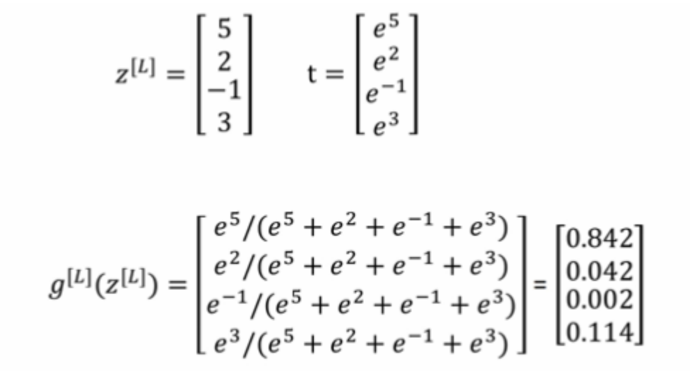

### 2.1.2 交叉熵损失

对于softmax回归（逻辑回归代价函数的推广，都可称之为交叉熵损失），它的代价函数公式为：

L(\hat y, y) = -\sum^C_{j=1}y_jlog\hat y_j*L*(*y*^,*y*)=−∑*j*=1*C**y**j**l**o**g**y*^*j*

总损失函数可以记为J = \frac{1}{m}\sum^m_{i=1}L(\hat y, y)*J*=*m*1∑*i*=1*m**L*(*y*^,*y*)

逻辑回归的损失也可以这样表示，：

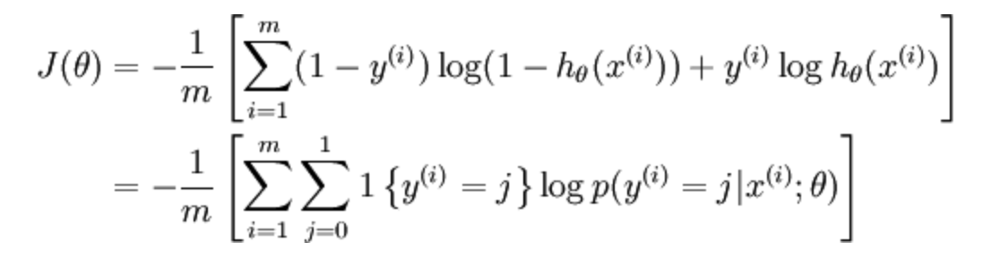

所以与softmax是一样的，一个二分类一个多分类衡量。

对于真实值会进行一个one-hot编码，每一个样本的所属类别都会在某个类别位置上标记。


上图改样本的损失值为：

0log(0.10)+0log(0.05)+0log(0.15)+0log(0.10)+0log(0.05)+0log(0.20)+1log(0.10)+0log(0.05)+0log(0.10)+0log(0.10)0*l**o**g*(0.10)+0*l**o**g*(0.05)+0*l**o**g*(0.15)+0*l**o**g*(0.10)+0*l**o**g*(0.05)+0*l**o**g*(0.20)+1*l**o**g*(0.10)+0*l**o**g*(0.05)+0*l**o**g*(0.10)+0*l**o**g*(0.10)

注：关于one_hot编码

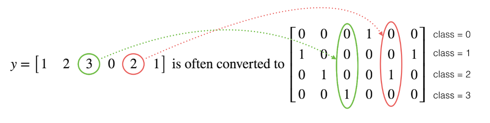

**框架使用**

- 便于编程：包括神经网络的开发和迭代、配置产品；
- 运行速度：特别是训练大型数据集时；

目前最火的深度学习框架大概是 Tensorflow 了。Tensorflow 框架内可以直接调用梯度下降算法，极大地降低了编程人员的工作量。例如以下代码：

### 2.1.3 案例：Mnist手写数字识别神经网络实现

#### 2.1.3.1 数据集介绍

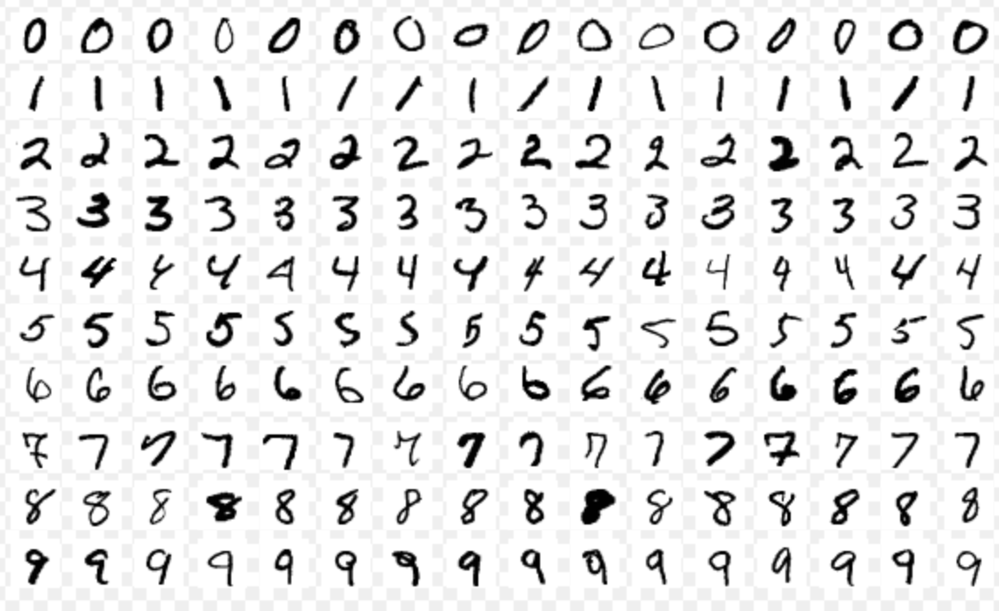

文件说明：

- train-images-idx3-ubyte.gz: training set images (9912422 bytes)
- train-labels-idx1-ubyte.gz: training set labels (28881 bytes)
- t10k-images-idx3-ubyte.gz: test set images (1648877 bytes)
- t10k-labels-idx1-ubyte.gz: test set labels (4542 bytes)

> 网址：http://yann.lecun.com/exdb/mnist/

#### 2.1.3.2 特征值

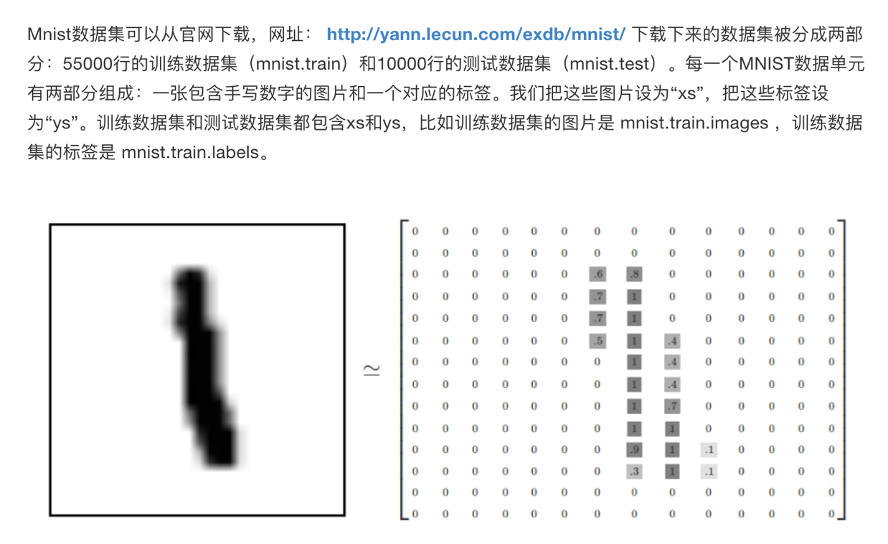

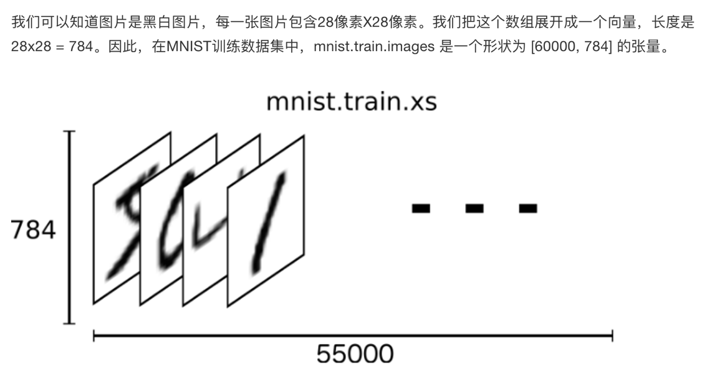

#### 2.1.3.3 目标值

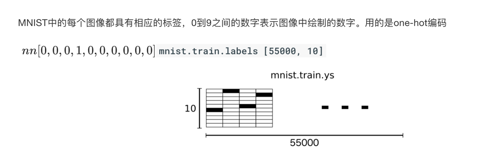

#### 2.1.3.4 Mnist数据获取API

TensorFlow框架自带了获取这个数据集的接口，所以不需要自行读取。

- from tensorflow.examples.tutorials.mnist import input_data
  - mnist = input_data.read_data_sets(FLAGS.data_dir, one_hot=True)
    - mnist.train.next_batch(100)(提供批量获取功能)
    - mnist.train.images、labels
    - mnist.test.images、labels

#### 2.1.3.5 网络设计

我们采取两个层，除了输入层之外。第一个隐层中64个神经元，最后一个输出层（全连接层）我们必须设置10个神经元的神经网络。

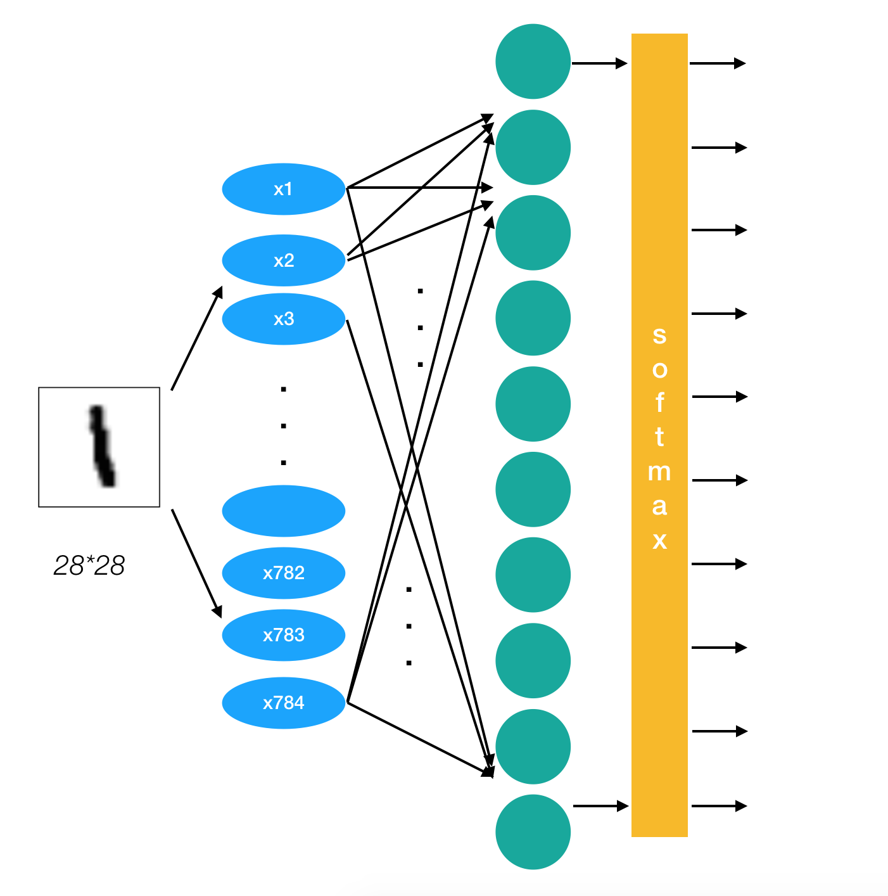

#### 2.1.3.6 全连接层计算

- tf.matmul(a, b,name=None)+bias
  - return:全连接结果，供交叉损失运算
- tf.train.GradientDescentOptimizer(learning_rate)
  - 梯度下降
  - learning_rate:学习率
  - method:
    - minimize(loss):最小优化损失

#### 2.1.3.7 前期确定事情与流程

- 确定网络结构以及形状
  - 第一层参数：输入：x [None, 784] 权重：[784, 64] 偏置[64],输出[None, 64]
  - 第二层参数：输入：[None, 64] 权重：[64, 10] 偏置[10]，输出[None, 10]
- 流程：
  - 获取数据
  - 前向传播：网络结构定义
  - 损失计算
  - 反向传播：梯度下降优化
- 功能完善
  - 准确率计算
  - 添加Tensorboard观察变量、损失变化
  - 训练模型保存、模型存在加载模型进行预测

#### 2.1.3.8 主网络搭建流程

- 获取数据

```
mnist = input_data.read_data_sets("./data/mnist/input_data/", one_hot=True)
```

- 定义数据占位符，Mnist数据实时提供给placeholder

```python
# 1、准备数据
# x [None, 784] y_true [None. 10]
with tf.variable_scope("mnist_data"):

    x = tf.placeholder(tf.float32, [None, 784])

    y_true = tf.placeholder(tf.int32, [None, 10])
```

- 两层神经元网络结果计算

```python
# 2、全连接层神经网络计算
    # 类别：10个类别  全连接层：10个神经元
    # 参数w: [784, 10]   b:[10]
    # 全连接层神经网络的计算公式：[None, 784] * [784, 10] + [10] = [None, 10]
    # 随机初始化权重偏置参数，这些是优化的参数，必须使用变量op去定义
    # 要进行全连接层的矩阵运算 [None, 784]*[784, 64] + [64] = [None,64]
    # [None, 64]*[64, 10] + [10] = [None,10]
    with tf.variable_scope("fc_model"):
         # 第一层：随机初始化权重和偏置参数，要使用变量OP 定义
        weight_1 = tf.Variable(tf.random_normal([784, 64], mean=0.0, stddev=1.0),
                             name="weightes_1")

        bias_1 = tf.Variable(tf.random_normal([64], mean=0.0, stddev=1.0),
                           name='biases_1')

        # 第二层：随机初始化权重和偏置参数，要使用变量OP 定义
        weight_2 = tf.Variable(tf.random_normal([64, 10], mean=0.0, stddev=1.0),
                             name="weightes_2")

        bias_2 = tf.Variable(tf.random_normal([10], mean=0.0, stddev=1.0),
                           name='biases_2')

        # 全连接层运算
        # 10个神经元
        # y_predict = [None,10]
        y1 = tf.matmul(x, weight_1) + bias_1

        y_predict = tf.matmul(y1, weight_2) + bias_2
```

- 损失计算与优化

```python
    # 3、softmax回归以及交叉熵损失计算
    with tf.variable_scope("softmax_crossentropy"):

        # labels:真实值 [None, 10]  one_hot
        # logits:全脸层的输出[None,10]
        # 返回每个样本的损失组成的列表
        loss = tf.reduce_mean(tf.nn.softmax_cross_entropy_with_logits(labels=y_true,
                                                                      logits=y_predict))

    # 4、梯度下降损失优化
    with tf.variable_scope("optimizer"):

        # 学习率
        train_op = tf.train.GradientDescentOptimizer(0.1).minimize(loss)
```

#### 2.1.3.9 完善模型功能

- 1、增加准确率计算
- 2、增加变量tensorboard显示
- 3、增加模型保存加载
- 4、增加模型预测结果输出

##### 如何计算准确率

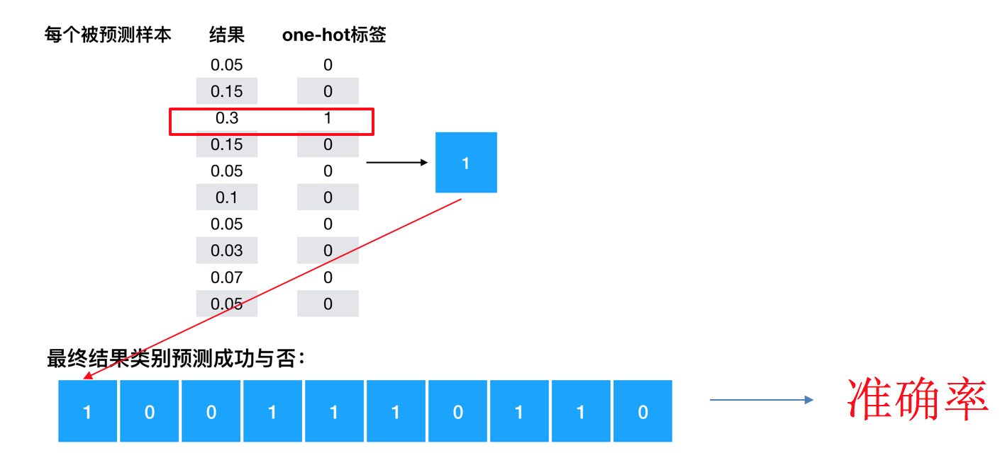

- equal_list = tf.equal(tf.argmax(y, 1), tf.argmax(y_label, 1))
- accuracy = tf.reduce_mean(tf.cast(equal_list, tf.float32))
- 模型评估（计算准确性）

```python
    # 5、得出每次训练的准确率（通过真实值和预测值进行位置比较，每个样本都比较）
    with tf.variable_scope("accuracy"):

        equal_list = tf.equal(tf.argmax(y_true, 1), tf.argmax(y_predict, 1))

        accuracy = tf.reduce_mean(tf.cast(equal_list, tf.float32))
```

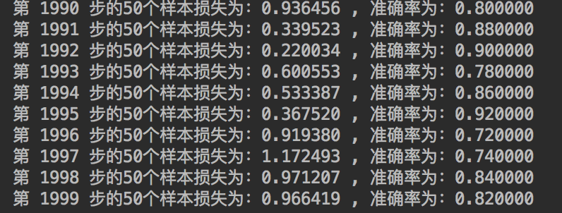

##### 增加变量tensorboard显示

- 在会话外当中增加以下代码

```python
 # (1)、收集要显示的变量
    # 先收集损失和准确率
    tf.summary.scalar("losses", loss)
    tf.summary.scalar("acc", accuracy)

    # 维度高的张量值
    tf.summary.histogram("w1", weight_1)
    tf.summary.histogram("b1", bias_1)
    # 维度高的张量值
    tf.summary.histogram("w2", weight_2)
    tf.summary.histogram("b2", bias_2)

    # 初始化变量op
    init_op = tf.global_variables_initializer()

    # （2）、合并所有变量op
    merged = tf.summary.merge_all()
```

- 在会话当中去创建文件写入每次的变量值

```python
# （1）创建一个events文件实例
file_writer = tf.summary.FileWriter("./tmp/summary/", graph=sess.graph)

# 运行合变量op，写入事件文件当中
summary = sess.run(merged, feed_dict={x: mnist_x, y_true: mnist_y})

file_writer.add_summary(summary, i)
```

##### 增加模型保存加载

创建Saver，然后保存

```python
# 创建模型保存和加载
saver = tf.train.Saver()

# 每隔100步保存一次模型
if i % 100 == 0:

    saver.save(sess, "./tmp/modelckpt/fc_nn_model")
```

在训练之前加载模型

```python
# 加载模型
if os.path.exists("./tmp/modelckpt/checkpoint"):

    saver.restore(sess, "./tmp/modelckpt/fc_nn_model")
```

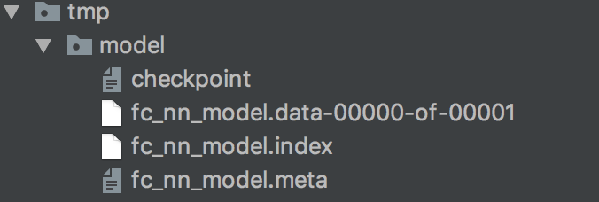

##### 增加模型预测结果输出

增加标志位

```python
tf.app.flags.DEFINE_integer("is_train", 1, "指定是否是训练模型，还是拿数据去预测")
FLAGS = tf.app.flags.FLAGS
```

然后判断是否训练，如果不是训练就直接预测，利用tf.argmax对样本的真实目标值y_true，和预测的目标值y_predict求出最大值的位置

```python
            # 如果不是训练，我们就去进行预测测试集数据
            for i in range(100):

                # 每次拿一个样本预测
                mnist_x, mnist_y = mnist.test.next_batch(1)

                print("第%d个样本的真实值为：%d, 模型预测结果为：%d" % (
                                                      i+1,
                                                      tf.argmax(sess.run(y_true, feed_dict={x: mnist_x, y_true: mnist_y}), 1).eval(),
                                                      tf.argmax(sess.run(y_predict, feed_dict={x: mnist_x, y_true: mnist_y}), 1).eval()
                                                      )
                                                      )
```

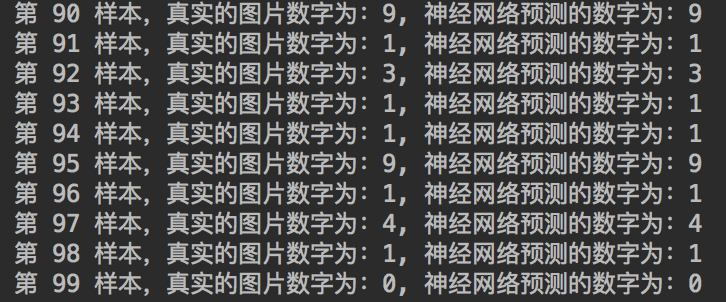

### 4.7.3.6 完整代码

```python
import tensorflow as tf
from tensorflow.examples.tutorials.mnist import input_data


# 定义一个是否训练、预测的标志
tf.app.flags.DEFINE_integer("is_train", 1, "训练or预测")

FLAGS = tf.app.flags.FLAGS


def full_connected_nn():
    """
    全连接层神经网络进行Mnist手写数字识别训练
    :return:
    """
    mnist = input_data.read_data_sets("./data/mnist/input_data/", one_hot=True)

    # 1、获取数据，定义特征之和目标值张量
    # x
    with tf.variable_scope("data"):

        # 定义特征值占位符
        x = tf.placeholder(tf.float32, [None, 784], name="feature")

        # 定义目标值占位符
        y_true = tf.placeholder(tf.int32, [None, 10], name="label")

    # 2、根据识别的类别数，建立全连接层网络
    # 手写数字10个类别
    # 设计了一层的神经网络，最后一层，10个神经元
    # 确定网络的参数weight [784, 10] bias[10]
    # 要进行全连接层的矩阵运算 [None, 784]*[784, 64] + [64] = [None,64]
    # [None, 64]*[64, 10] + [10] = [None,10]
    with tf.variable_scope("fc_model"):
        # 第一层：随机初始化权重和偏置参数，要使用变量OP 定义
        weight_1 = tf.Variable(tf.random_normal([784, 64], mean=0.0, stddev=1.0),
                             name="weightes_1")

        bias_1 = tf.Variable(tf.random_normal([64], mean=0.0, stddev=1.0),
                           name='biases_1')

        # 第二层：随机初始化权重和偏置参数，要使用变量OP 定义
        weight_2 = tf.Variable(tf.random_normal([64, 10], mean=0.0, stddev=1.0),
                             name="weightes_2")

        bias_2 = tf.Variable(tf.random_normal([10], mean=0.0, stddev=1.0),
                           name='biases_2')

        # 全连接层运算
        # 10个神经元
        # y_predict = [None,10]
        y1 = tf.matmul(x, weight_1) + bias_1

        y_predict = tf.matmul(y1, weight_2) + bias_2

    # 3、根据输出结果与真是结果建立softmax、交叉熵损失计算
    with tf.variable_scope("softmax_cross"):

        # 先进性网络输出的值的概率计算softmax,在进行交叉熵损失计算
        all_loss = tf.nn.softmax_cross_entropy_with_logits(labels=y_true,
                                                           logits=y_predict,
                                                           name="compute_loss")
        # 求出平均损失
        loss = tf.reduce_mean(all_loss)

    # 4、定义梯度下降优化器进行优化
    with tf.variable_scope("GD"):

        train_op = tf.train.GradientDescentOptimizer(0.1).minimize(loss)

    # 5、求出每次训练的准确率为
    with tf.variable_scope("accuracy"):
        # 求出每个样本是否相等的一个列表
        equal_list = tf.equal(tf.argmax(y_true, 1), tf.argmax(y_predict, 1))

        # 计算相等的样本的比例
        accuracy = tf.reduce_mean(tf.cast(equal_list, tf.float32))

    # 1、收集要在tensorboard观察的张量值
    # 数值型-->scalar 准确率，损失
    tf.summary.scalar("loss", loss)
    tf.summary.scalar("acc", accuracy)

    # 维度高的张量值
    tf.summary.histogram("w1", weight_1)
    tf.summary.histogram("b1", bias_1)
    # 维度高的张量值
    tf.summary.histogram("w2", weight_2)
    tf.summary.histogram("b2", bias_2)

    # 2、合并变量
    merged = tf.summary.merge_all()

    # 1、创建保存模型的OP
    saver = tf.train.Saver()

    # 开启会话进行训练
    with tf.Session() as sess:

        # 初始化变量OP
        sess.run(tf.global_variables_initializer())

        # 创建events文件
        file_writer = tf.summary.FileWriter("./tmp/summary/", graph=sess.graph)

        # 加载本地模型继续训练或者拿来进行预测测试集
        # 加载模型，从模型当中找出与当前训练的模型代码当中（名字一样的OP操作）,覆盖原来的值
        ckpt = tf.train.latest_checkpoint("./tmp/model/")

        # 判断模型是否存在
        if ckpt:
            saver.restore(sess, ckpt)

        if FLAGS.is_train == 1:

            # 循环训练
            for i in range(2000):

                # 每批次给50个样本
                mnist_x, mnist_y = mnist.train.next_batch(50)

                _, loss_run, acc_run, summary = sess.run([train_op, loss, accuracy, merged],
                                                feed_dict={x: mnist_x, y_true: mnist_y})

                print("第 %d 步的50个样本损失为：%f , 准确率为：%f" % (i, loss_run, acc_run))

                # 3、写入运行的结果到文件当中
                file_writer.add_summary(summary, i)

                # 每隔100步保存一次模型的参数
                if i % 100 == 0:

                    saver.save(sess, "./tmp/model/fc_nn_model")
        else:
            # 进行预测
            # 预测100个样本
            for i in range(100):

                # label [1, 10]
                image, label = mnist.test.next_batch(1)

                # 直接运行网络的输出预测结果
                print("第 %d 样本，真实的图片数字为：%d, 神经网络预测的数字为：%d " % (
                    i,
                    tf.argmax(label, 1).eval(),
                    tf.argmax(sess.run(y_predict, feed_dict={x: image, y_true: label}), 1).eval()
                    ))


    return None


if __name__ == '__main__':
    full_connected_nn()
```

### 4.7.4 调整学习率调整网络参数带来的问题

如果我们对网络当中的学习率进行修改，也就是一开始我们并不会知道学习率填哪些值，也并不知道调整网络的参数大小带来的影响（第一部分第四节）。

- 假设学习率调整到1，2
- 假设参数调整到比较大的值，几十、几百

总结：参数调整了之后可能没影响，是因为网络较小，可能并不会造成后面所介绍的梯度消失或者梯度爆炸

### 4.7.5总结

- 掌握softmax公式以及特点
- tensorflow.examples.tutorials.mnist.input_data 获取Mnist数据
- tf.matmul(a, b,name=None)实现全连接层计算
- tf.train.GradientDescentOptimizer(learning_rate).minimize(loss)实现梯度下降优化
