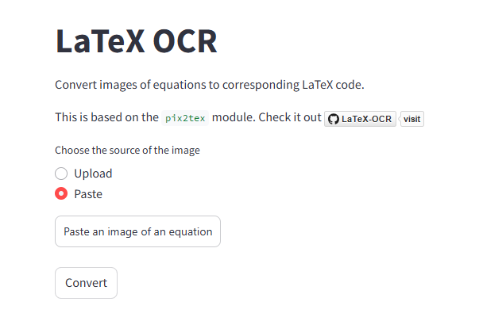
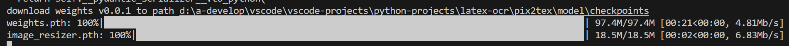
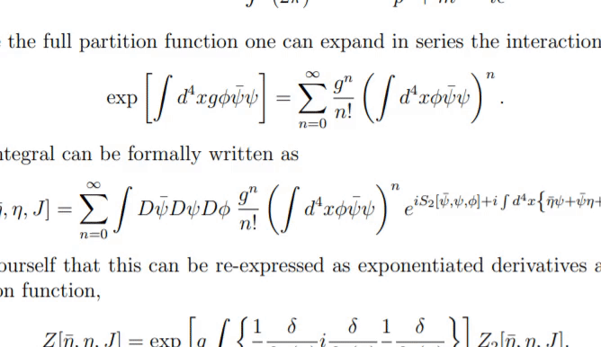

- 项目地址：[lukas-blecher/LaTeX-OCR: pix2tex: Using a ViT to convert images of equations into LaTeX code.](https://github.com/lukas-blecher/LaTeX-OCR)

##### 一、创建conda环境

```bash
conda create -n <env-name> python=3.11		#python>=3.7(经测试高点好)
```

> 注意：根据当前环境安装相应的pytorch

##### 二、安装pix2tex包

```bash
pip install "pix2tex[gui]"					#这个过程可能会有很多报错
```

##### 三、安装依赖

```bash
pip install -U "pix2tex[api]"				#也会有很多报错
```

##### 四、打开Streamlit流

```
python -m pix2tex.api.run
```

- 这里会显示一个界面，粘贴图片即可



##### 五、使用GUI

- 首次运行会下载权重如下图



```bash
latexocr
```

显示如下



##### 六、打包.exe

- 克隆仓库

```bash
git clone https://github.com/lukas-blecher/LaTeX-OCR.git
cd LaTeX-OCR
```

- 创建conda环境

```bash
conda create -n pix2tex python=3.9
conda activate pix2tex
```

- 安装依赖

> 如果你要同时使用 GUI + API + 模型训练，可以用：

```bash
#安装全部依赖（推荐）
pip install -e .[all]

# 安装基础依赖
pip install -e .[gui]
```

- 运行

```bash
latexocr
```

