### 安装步骤

#### 第1步

将软件安装包下载到电脑本地，使用解压工具进行解压打开（下载解压安装全程关闭

#### 第2步

打开Crack文件夹，复制SolidWorks_Flexnet_Server文件夹到电脑C盘根目录下

#### 第3步

鼠标右键以管理员身份运行“server install.bat”

#### 第4步

等待服务启动成功，显示启动成功则随意按键退出界面；如果提示服务无法启动，则关闭界面，先去运行一下server_remove.bat，再运行server_install.bat

#### 第5步

回到安装包Crack文件夹，双击运行“sw2025_network_serials_licensing.reg”，弹出对话框，点击是（一定要操作，要不然后面无法自动生成序列号）

#### 第6步

成功添加到注册表中，点击确定

#### 第7步

选择SolidWorks.2025.SP1.2.Premium.DVD.iso文件，鼠标右键点击{装载}。有装载就点击装载，没有装载就点击解压到

#### 第8步

将你电脑网络断开，然后鼠标右键以管理员身份运行setup安装程序

#### 第9步

点击确定

#### 第10步

开启安装管理程序...稍等

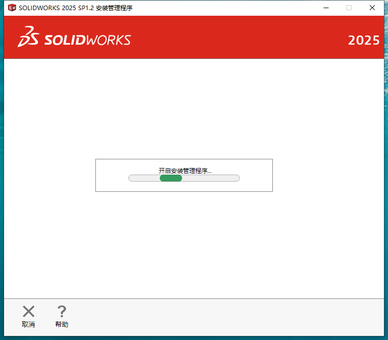

#### 第11步

欢迎使用SOLIDWORKS安装管理程序，直接下一步

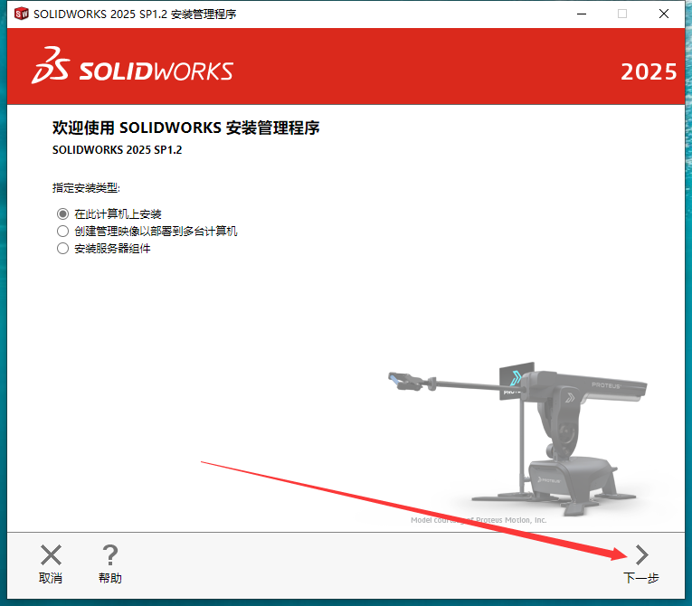

#### 第12步

自动生成序列号，点击下一步即可（如果你这步没有自动生成序列号的话，那么就是你前面步骤5-6没有操作正确，检查一下）

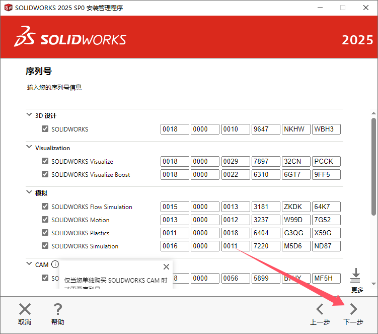

#### 第13步

连接到SOLIDWORKS...稍等

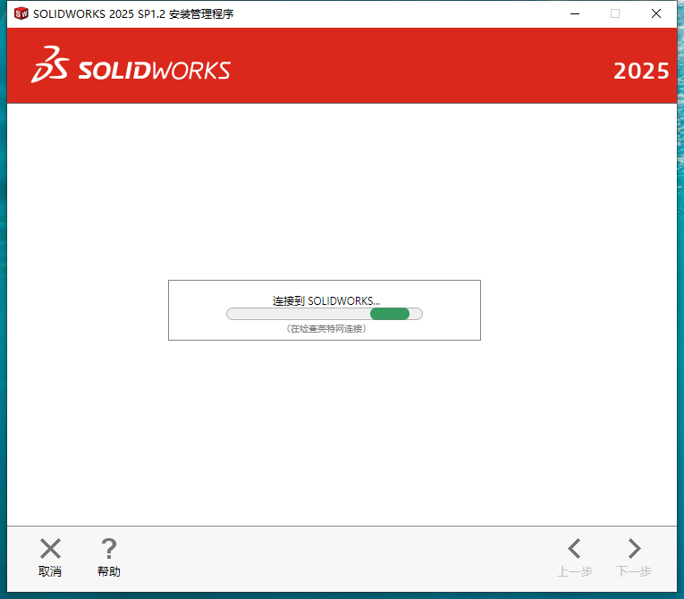

#### 第14步

无法连接到SOLIDWORKS服务器以确定您已授权安装哪些产品。点取消

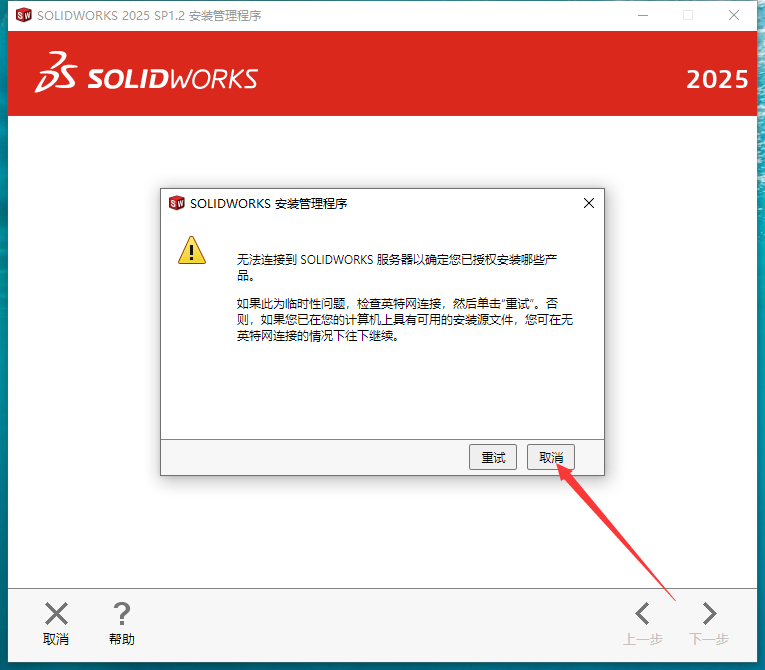

#### 第15步

点击【更改】进去将路径都更改一致，且更改路径不能带有中文或特殊符号。然后将接受条款的选项勾选，点击现在安装【安装位置更改后，请记一下，后面步骤用到】

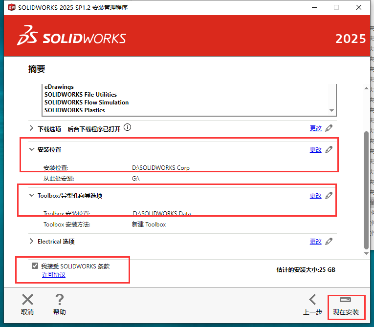

#### 第16步

确认端口为：25734@localhost，点击确定。如果下一步弹出【SOLIDWORKS Electrical 无法连接到 SOL Server。】，请操作：返回步骤15的产品，点击更改。进去将SOLIDWORKS Electrical 取消勾选即可

#### 第17步

弹出未检测到Microsoft Excel的有效版本，点击确定即可

#### 第18步

软件安装中，安装时间有点长，请耐心等候安装成功

#### 第19步

安装成功，将【为我显示…】取消勾选，选择【不，谢谢】，点击完成。

#### 第20步

复制Crack\SOLIDWORKS Corp里面所有的文件到软件安装目录下（步骤15更改的位置）替换

#### 第21步

如果弹出文件夹正在使用对话框，将界面暂时放在一旁先

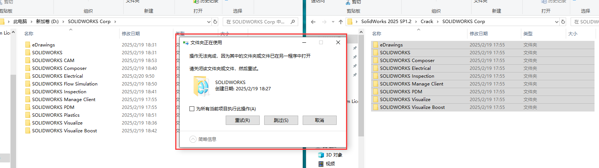

#### 第22步

打开电脑的任务管理器，找到有关SOLIDWORKS程序结束运行即可。然后再回到对话框里点击重试

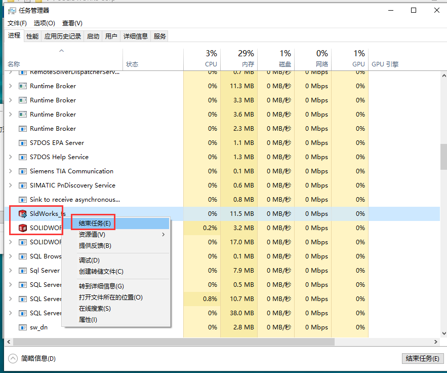

#### 第23步

双击运行SolidSQUADLoaderEnabler，点击是

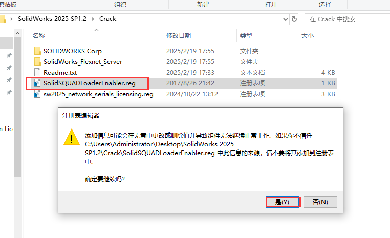

#### 第24步

成功添加到注册表，点击确定

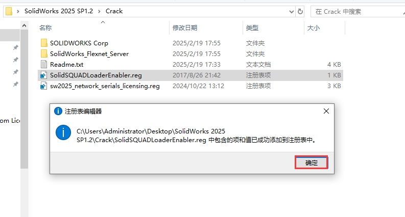

#### 第25步

在电脑桌面找到SOLIDWORKS 2025打开

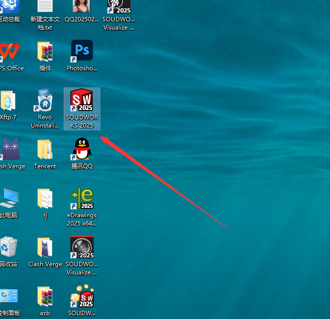

#### 第26步

正在加载中，稍等

#### 第27步

软件许可协议接受，点击接受

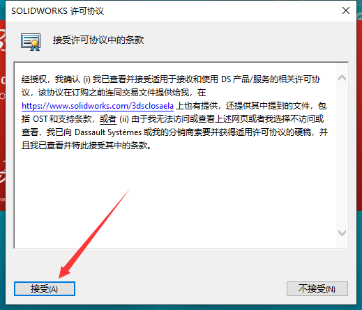

#### 第28步

进入软件界面，此时即可开始使用啦

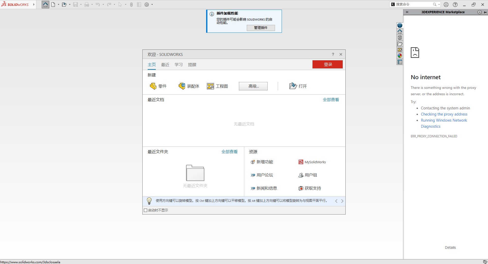