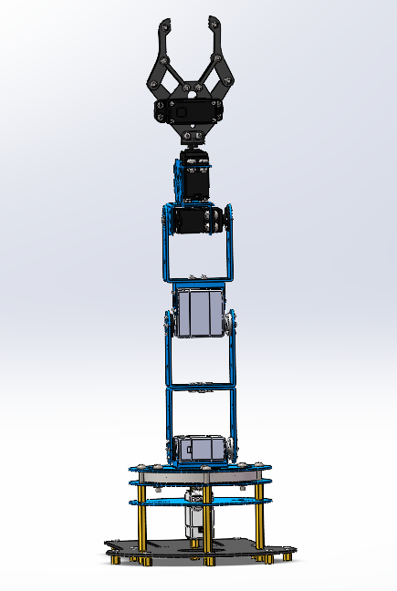

### 一、SW-rViz空间坐标对齐

基准点一般选择舵机的**旋转点**（**若是夹爪则是两片叶子**）

1.Z轴是旋转轴（与基准轴方向一致），在SW中选择的Z轴的那个面的方向在rviz中就是零件的朝向

2.每个关节的旋转范围一般为±90°，SW导出urdf设置角度时即为-1.57----+1.57

3.在SW配置坐标系时，base_link不需要设置基准轴，base_link即为固定在大地的一部分，无转动部分

4.有旋转的部分需要具备“基准点”——"基准轴"——“坐标系” 

**5.如果urdf的旋转方向与实际相反可以调整axis（0 0 -1）将-1改成+1，反之亦然**

### 二、LeArm-urdf参数对齐

#### 2.1 实体机参数

1. 旋转方向要一致，以及旋转速度的设置
2. pwm脉宽1500为90°，上下偏移90°
3. 实体机的电机定位是自夹爪开始依次向下为1-6号电机
4. 1号夹爪1500-0：爪子开口变大，1500为基本闭合，1500-2500：夹紧（力度）
5. 2号电机1500-0：向左旋转；1500-2500：向右旋转
6. 3号电机1500-0：向前旋转；1500-2500：向后旋转
7. 4号电机1500-0：向前旋转；1500-2500：向后旋转
8. 5号电机1500-0：向后旋转；1500-2500：向前旋转   **与3、4相反**
9. 6号电机1500-0：向左旋转；1500-2500：向右旋转

- 一般情况下urdf里边的角度是弧度值，比如-1.57——+1.57即为-90——+90，旋转速度的设置也要对齐    

> 以上参数对应视角朝向如下图所示（1500为基准态）

