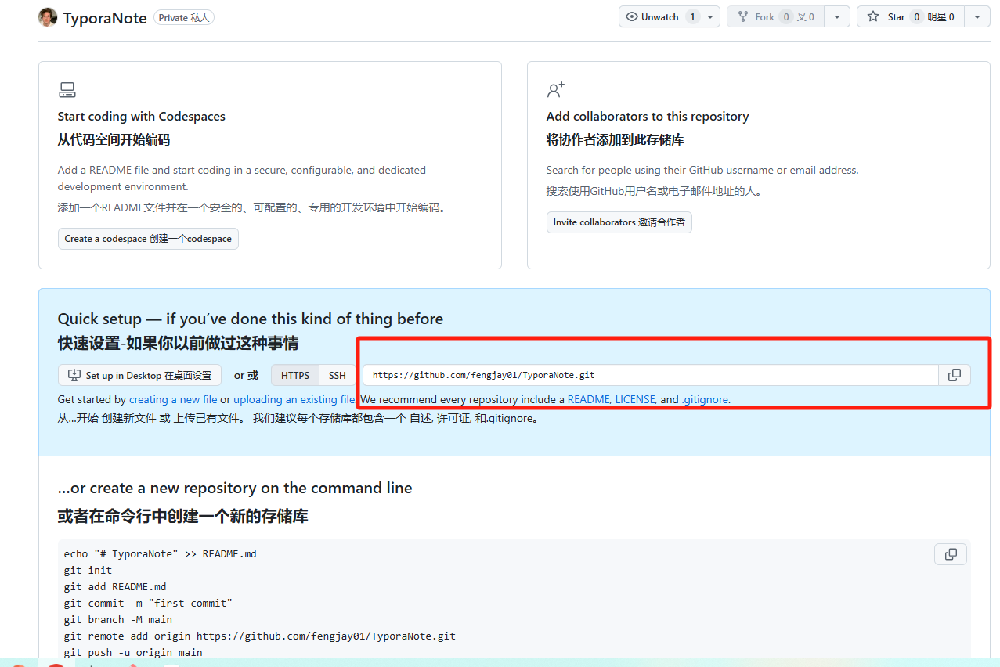
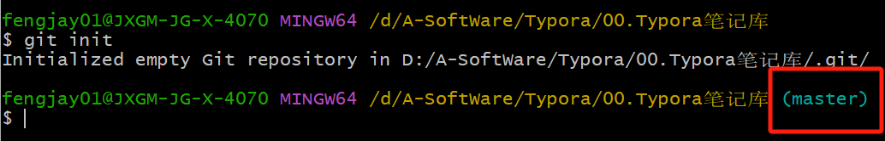
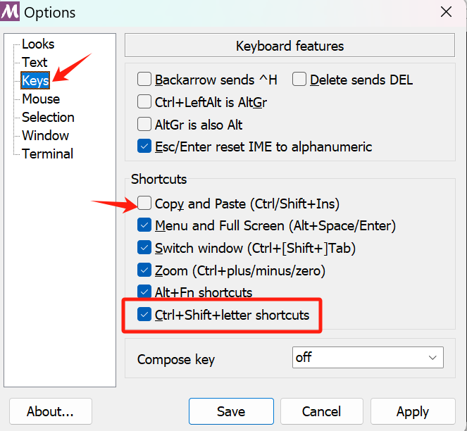

## 一、Git与Github

1.github创建项目，不要添加readme.md


2.复制地址



3.在想要上传的本地文件夹内，右键打开Git Bash，输入

```
git init
```



> 这个分支是master，github默认是main，第一次创建一般是master分支，可以改名字（仅限第一次）
>
> ```
> git branch -m main
> ```

3.添加要传的文件

```
#添加全部
git add .	

#添加单个文件
git add 文件名
# 示例：
git add main.py

#添加多个
git add 文件1 文件2 ...
# 示例：
git add main.py utils.py README.md

#添加整个目录
git add 路径/
# 示例：
git add src/
```


## 二、Git Bash快捷键

- 更改复制粘贴快捷键

